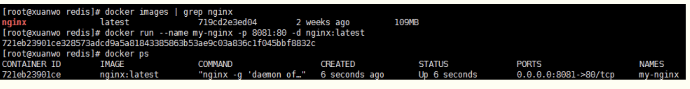
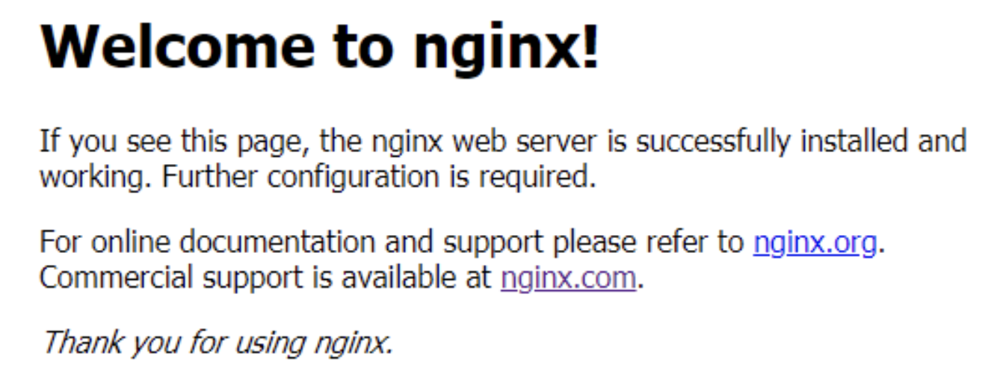
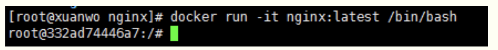
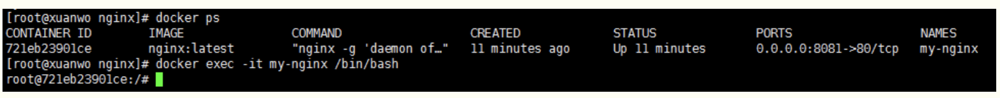
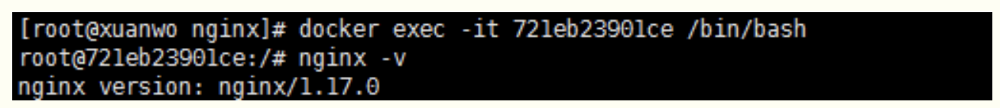

# **docker run 和 docker exec 的差异**

**docker run ：**根据镜像创建一个容器并运行一个命令，操作的对象是 **镜像**；

**docker exec ：**在运行的容器中执行命令，操作的对象是 **容器**。

------

 

## **docker run 命令**

### **语法**

```
docker run [OPTIONS] IMAGE [COMMAND] [ARG...]
```

OPTIONS说明：

- **-a stdin:** 指定标准输入输出内容类型，可选 STDIN/STDOUT/STDERR 三项；
- **-d:** 后台运行容器，并返回容器ID；
- **-i:** 以交互模式运行容器，通常与 -t 同时使用；
- **-P:** 随机端口映射，容器内部端口**随机**映射到主机的高端口
- **-p:** 指定端口映射，格式为：主机(宿主)端口:容器端口
- **-t:** 为容器重新分配一个伪输入终端，通常与 -i 同时使用；
- **--name="nginx-lb":** 为容器指定一个名称；
- **--dns 8.8.8.8:** 指定容器使用的DNS服务器，默认和宿主一致；
- **--dns-search example.com:** 指定容器DNS搜索域名，默认和宿主一致；
- **-h "mars":** 指定容器的hostname；
- **-e username="ritchie":** 设置环境变量；
- **--env-file=[]:** 从指定文件读入环境变量；
- **--cpuset="0-2" or --cpuset="0,1,2":** 绑定容器到指定CPU运行；
- **-m :**设置容器使用内存最大值；
- **--net="bridge":** 指定容器的网络连接类型，支持 bridge/host/none/container:<name|id> 四种类型；
- **--link=[]:** 添加链接到另一个容器；
- **--expose=[]:** 开放一个端口或一组端口；
- **--volume , -v:** 绑定一个卷

### 实例

使用docker镜像 nginx:latest 以后台模式启动一个容器，并将容器命名为my-nginx。

```
docker run --name my-nginx -p 8081:80 -d nginx:latest
```



 

浏览器访问 http://主机IP:8081，效果如下：



 

使用镜像 nginx:latest 以后台模式启动一个容器，并将容器的80端口映射到主机随机端口：

```
docker run -P -d nginx:latest
```

 

使用镜像 nginx:latest 以后台模式启动一个容器，将主机的 80 端口映射到容器的 80 端口，主机的目录 /data 映射到容器的 /data：

```
docker run -p 80:80 -v /data:/data -d nginx:latest
```

 

使用镜像 nginx:latest 以交互模式启动一个容器，在容器内执行/bin/bash命令：

```
docker run -it nginx:latest /bin/bash
```



------

 

## **docker exec 命令**

### **语法**

```
docker exec [OPTIONS] CONTAINER COMMAND [ARG...]
```

OPTIONS说明：

- **-d :** 分离模式: 在后台运行
- **-i :** 即使没有附加也保持STDIN 打开
- **-t :** 分配一个伪终端

 

在容器名称 my-nginx 中开启一个交互模式的终端：

```
docker exec -it my-nginx /bin/bash
```



 

或者使用容器ID 721eb23901ce 开启一个交互模式的终端：

```
docker exec -it 721eb23901ce /bin/bash
```

