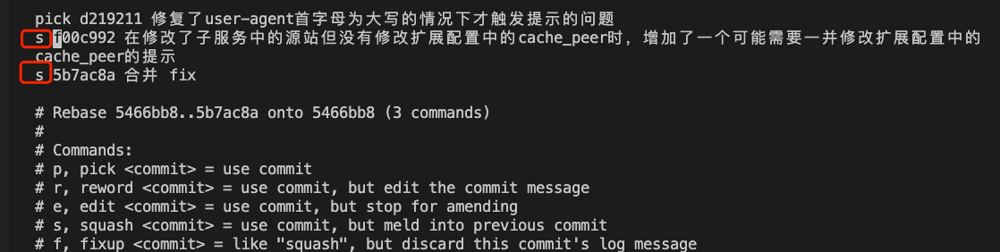

# git 基础

- Add 所以有改动的文件
  - git add -A .   

- Commit暂存区文件 ，并添加提示信息
  - git commit -m '动态加速及squid父配置检测 BSDEVOPS-946'  

- 切换并创建分支wmq_test_websocket_squid_20200909
  - git checkout -b wmq_test_websocket_squid_20200909

- 拉去并合并远程master的分支
  - git pull origin master  

- 提交到远程对应的分支
  - git push origin

- 提交并创建对应的远程分支
  - git push --set-upstream origin wmq_test_dynamic_sp_20200915

- git合并出错取消合并
  - git merge --abort

- git强行回退到某个版本
  - git reset --hard 139dcfaa558e3276b30b6b2e5cbbb9c00bbdca96 

- 版本回滚，（回生成一个新的版本）
  - git revert -n 版本号

- 强行使用远程的master版本
  - git reset --hard origin/master

- git rebase （合并commit）参考：https://mp.weixin.qq.com/s/qNqZvjy0RXC0MA5WdSUhAA

  - git rebase -i HEAD~3  （编辑最近三次合并）
  - 这里原来的pick 改成s，在wq退出
  - 
  - Git 确认新的base的名字
  - git log查看commit记录
  - git push --force origin 分支名    （ 强制退送到远程分支）

  

- 修改最近一次commit

  - git add .
  - git commit -- amend

  