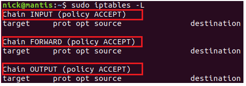
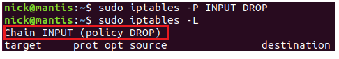
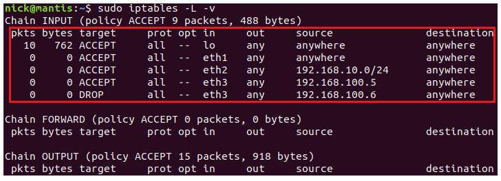
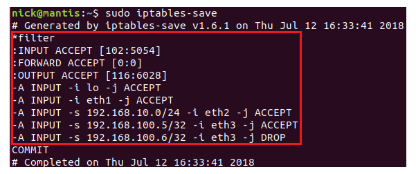

# 详解Linux iptables 命令

参考：https://www.jb51.net/article/144260.htm

iptables 是 Linux 管理员用来设置 IPv4 数据包过滤条件和 NAT 的命令行工具。这篇文章较详细的给大家介绍了Linux iptables 命令，非常不错，具有一定的参考借鉴价值，需要的朋友参考下吧

iptables 是 Linux 管理员用来设置 IPv4 数据包过滤条件和 NAT 的命令行工具。iptables 工具运行在用户态，主要是设置各种规则。而 netfilter 则运行在内核态，执行那些设置好的规则。

**查看 iptables 的链和规则**

查看规则的命令格式为：

```
iptables [-t tables] [-L] [-nv]
```

-t ：后面接 table ，例如 nat 或 filter ，若省略此项目，则使用默认的 filter
-L ：列出某个 table 的所有链或某个链的规则
-n ：直接显示 IP，速度会快很多
-v ：列出更多的信息，包括通过该规则的数据包总位数、相关的网络接口等

列出 filter table INPUT 链的规则：

```
$ sudo iptables -L INPUT
```

列出 nat table 三条链的规则：

```
$ sudo iptables -t nat -L -n
```

列出 filter table 三条链的规则：

```
$ sudo iptables -L
```



红框中的内容为链的名称及其默认策略，filter 表中所有链的默认策略都是 ACCEPT。红框下面的行代表什么呢？

target：代表进行的动作，ACCEPT 是放行，REJECT 是拒绝，DROP 则是丢弃数据包。
port：代表使用的协议，主要有 tcp、udp 和 icmp 三种。
opt：额外的选项说明。
source：规则针对的来源 IP。
destination：规则针对的目标 IP。

因为默认情况下没有添加自定义的规则，所以上图中这些行下面都是空的。

**清除本机防火墙规则**

清除规则的命令格式如下：

```
iptables [-t tables] [-FXZ]
```

-F：清除所有已制定的规则
-X：删除所有使用者自定义的 chain(其是 tables)
-Z：将所有的 chain 的计数与流量统计都清零

如果我们要制订一套防火墙规则，一般会先清除现有的规则，然后从头开始创建新的规则。下面让我们清除本机 filter 表中的所有规则：

```
$ ``sudo` `iptables -F``$ ``sudo` `iptables -X``$ ``sudo` `iptables -Z
```

**定义默认策略(policy)**

如果一个数据包没有匹配到一个链中的任何一个规则，那么将对该数据包执行这个链的默认策略(default policy)，默认策略可以是 ACCEPT 或 DROP。
链中默认策略的存在使得我们在设计防火墙时可以有两种选择：

设置默认策略 DROP 所有的数据包，然后添加规则接受(ACCEPT)来自可信 IP 地址的数据包，或访问我们的服务监听的端口的数据包，比如 bittorrent、FTP 服务器、Web 服务器、Samba 文件服务器等等。

设置默认策略 ACCEPT 所有的数据包，然后添加规则丢弃(DROP)特定的数据包。比如来自一些恶意 IP 的数据包，或访问某些端口的数据包，在这些端口上我们并没有提供公开的服务。

一般情况下，上面的第一个选项用于 INPUT 链，因为我们希望对访问的资源进行权限控制。而第二个选项常用于 OUTPUT 链，因为我们通常信任离开机器的数据包(该数据包来自本机)。

设置默认策略的命令格式如下：

```
iptables [-t table] -P [INPUT,OUTPUT,FORWARD] [ACCEPT,DROP]
```

-P 选项用来定义默认策略(Policy)。注意，这是大写字母 P。ACCEPT 表示接受数据包，DROP 表示丢弃数据包。

一般情况下，我们会把 filter 表的 INPUT 链的默认策略制订的严格一些，比如设为 DROP。而 FORWARD 和 OUTPUT 可以宽松些，设为 ACCEPT。比如我们可以通过下面的命令把 filter 表的 INPUT 链的默认策略设置为 DROP：

$ sudo iptables -P INPUT DROP



**添加规则**

我们可以通过规则来匹配数据包，具体的匹配条件包括 IP、网段、网络接口(interface)和传输协议(tcp、udp 等)。

添加规则的命令格式如下：

iptables [-AI chain] [-io interface] [-p 协议] [-s 来源 IP] [-d 目标 IP] -j [ACCEPT,DROP,REJECT,LOG]
-A：针对某个规则链添加一条规则，新添加的规则排在现有规则的后面。
-I：针对某个规则链插入一条规则，可以为新插入的规则指定在链中的序号。如果不指定序号，则新的规则会变成第一条规则。
-i：指定数据包进入的那个网络接口，比如 eth0、lo 等，需要与 INPUT 链配合使用。
-o: 指定传出数据包的那个网络接口，需要与 OUTPUT 链配合使用。
-p: 指定此规则适用于那种网络协议(常用的协议有 tcp、udp、icmp，all 指适用于所有的协议)。
-s：指定数据包的来源 IP/网段，可以指定单个 IP，如 192.168.1.100，也可以指定一个网段，如 192.168.1.0/24。还可以通过 ！表示非的意思，如 ! 192.168.1.0/24 表示除了 192.168.1.0/24 之外的数据包。
-d：指定数据包的目标 IP/网段，其它与 -s 选项相同。
-j：指定匹配成功后的行为，主要有 ACCEPT、DROP、REJECT 和 LOG。

下面我们来看几个例子。

放开本机接口 lo：

```
$ sudo iptables -A INPUT -i lo -j ACCEPT
```

上面的命令假设 lo 接口是可以信任的设备，所有进出该接口的数据包都会被接受。

注意，上面的命令中并没有设置 -s、-d 等参数，其实没有指定的参数表示该参数是任何值都可以被接受。

完全放开某个接口

和 lo 接口类似，如果你完全信任某个接口，可以像设置 lo 一样设置它：

```
$ sudo iptables -A INPUT -i eth1 -j ACCEPT
```

只接受来自内网中某个网段的数据包：

```
$ ``sudo` `iptables -A INPUT -i eth2 -s 192.168.10.0``/24` `-j ACCEPT
```

接受/丢弃来自指定 IP 的数据包：

```
$ ``sudo` `iptables -A INPUT -i eth3 -s 192.168.100.5 -j ACCEPT``$ ``sudo` `iptables -A INPUT -i eth3 -s 192.168.100.6 -j DROP
```

然后看看 filter 表的规则：

```
$ sudo iptables -L -v
```



iptables-save 命令提供了另外一种风格的输出：

```
$ sudo iptables-save
```



在规则中使用端口号

在我们添加的规则中，很多时候需要指定网络协议(tcp、udp 等)及相关的端口号，其基本命令格式如下：

iptables [-AI chain] [-io interface] [-p tcp,udp] [-s 来源 IP] [--sport 端口范围] [-d 目标 IP] [--dport 端口范围] -j [ACCEPT,DROP,REJECT]
--sport：限制来源的端口号，可以是单个端口，也可以是一个范围，如 1024:1050
--dport：限制目标的端口号。

**注意，因为只有 tcp 协议和 udp 协议使用了端口号，所以在使用 --sport 和 --dport 时，一定要指定协议的类型(-p tcp 或 -p udp)。**

下面来看几个例子。

丢弃所有通过 tcp 协议访问本机 21 端口的数据包：

```
$ ``sudo` `iptables -A INPUT -i eth0 -p tcp --dport 21 -j DROP
```

丢弃来自 192.168.1.0/24 的 1024:65535 端口的访问本机 ssh 端口的数据包：

```
$ ``sudo` `iptables -A INPUT -i eth0 -p tcp -s 192.168.1.0``/24` `--sport 1024:65535 --dport ``ssh` `-j DROP
```

常见的插件模块

在 linux kernel 2.2 以前使用 ipchains 管理防火墙时，必须针对数据包的进、出方向进行控制。

比如要连接到远程主机的 22 端口时，必须设置两条规则：

本机的 1024:65535 端口到远程的 22 端口必须放行(OUTPUT chain);
远程主机 22 端口到本机的 1024:65535 端口必须放行(INPUT chain);

这是很麻烦的，比如你要连接 10 台远程主机的 22 端口，即便你本机的 OUTPUT 设置为 ACCEPT，
你依然需要添加 10 条 INPUT ACCEPT 规则接受来自这 10 台远程主机的 22 端口的数据包(INPUT 的默认策略为 DROP)。

iptables 则解决了这个问题，它会通过一个状态模块来分析：这个想要进入的数据包是不是对自己已发送请求的响应？如果判断是对自己请求的响应，就放行这个数据包。

使用状态模块的基本命令格式如下：

iptables -A INPUT [-m state] [--state INVALID,ESTABLISHED,NEW,RELATED]
-m：指定 iptables 的插件模块，常见的模块有：
  state：状态模块
  mac：处理网卡硬件地址(hardware address)的模块
--state：指定数据包的状态，常见的状态有：
  INVALID：无效的数据包状态
  ESTABLISHED：已经连接成功的数据包状态
  NEW：想要新建立连接的数据包状态
  RELATED：这个最常用，它表示该数据包与我们主机发送出去的数据包有关

下面来看几个例子。

只要是已建立连接或相关的数据包接受：

```
$ ``sudo` `iptables -A INPUT -m state --state RELATED,ESTABLISHED -j ACCEPT
```

只要是不合法的数据包就丢弃：

```
$ ``sudo` `iptables -A INPUT -m state --state INVALID -j DROP
```

保存 iptables 的配置

注意，我们通过 iptables 命令设置的规则都保存在内存中，也就是说系统重启的话所有的配置都会丢失。

我们可以通过 iptables-save 命令把 iptables 的配置保存到文件中：

```
$ ``sudo` `touch` `/etc/iptables``.conf``$ ``sudo` `chmod` `666 ``/etc/iptables``.conf``$ ``sudo` `iptables-save > ``/etc/iptables``.conf
```

在需要时再通过 iptables-restore 命令把文件中的配置信息导入：

```
$ ``sudo` `iptables-restore < ``/etc/iptables``.conf
```

**总结**

iptables 是一个比较复杂的命令，本文只是介绍了一些最基本的用法。接下来我们会介绍如何通过 iptables 构建基本的防火墙配置以及 NAT 服务器。

参考：

[netfilter/iptables doc](https://netfilter.org/documentation/)

[iptables man page](https://netfilter.org/documentation/)

[Ubuntu IptablesHowTo](https://help.ubuntu.com/community/IptablesHowTo)

[Iptables Tutorial](https://www.frozentux.net/iptables-tutorial/iptables-tutorial.html)