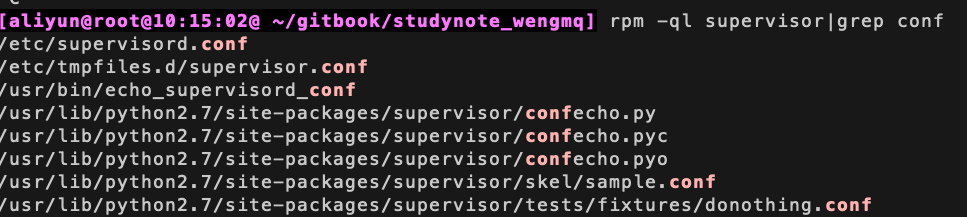

# supervisord部署和使用

## supervisor 安装：

```
sudo yum install supervisor
```

`rpm -ql supervisor|grep conf`命令查看supervisor的配置文件位置




## 全局配置文件说明

找到配置文件/etc/supervisord.conf

supervisor的配置参数较多，下面介绍一下常用的参数配置，详细的配置及说明，请参考官方文档介绍。注：分号（;）开头的配置表示注释

<details>
  <summary>默认配置如下</summary>

```python
  ; Sample supervisor config file.

[unix_http_server]
file=/var/run/supervisor/supervisor.sock   ; (the path to the socket file)
;chmod=0700                 ; sockef file mode (default 0700)
;chown=nobody:nogroup       ; socket file uid:gid owner
;username=user              ; (default is no username (open server))
;password=123               ; (default is no password (open server))

;[inet_http_server]         ; inet (TCP) server disabled by default
;port=127.0.0.1:9001        ; (ip_address:port specifier, *:port for all iface)
;username=user              ; (default is no username (open server))
;password=123               ; (default is no password (open server))

[supervisord]
logfile=/var/log/supervisor/supervisord.log  ; (main log file;default $CWD/supervisord.log)
logfile_maxbytes=50MB       ; (max main logfile bytes b4 rotation;default 50MB)
logfile_backups=10          ; (num of main logfile rotation backups;default 10)
loglevel=info               ; (log level;default info; others: debug,warn,trace)
pidfile=/var/run/supervisord.pid ; (supervisord pidfile;default supervisord.pid)
nodaemon=false              ; (start in foreground if true;default false)
minfds=1024                 ; (min. avail startup file descriptors;default 1024)
minprocs=200                ; (min. avail process descriptors;default 200)
;umask=022                  ; (process file creation umask;default 022)
;user=chrism                 ; (default is current user, required if root)
;identifier=supervisor       ; (supervisord identifier, default is 'supervisor')
;directory=/tmp              ; (default is not to cd during start)
;nocleanup=true              ; (don't clean up tempfiles at start;default false)
;childlogdir=/tmp            ; ('AUTO' child log dir, default $TEMP)
;environment=KEY=value       ; (key value pairs to add to environment)
;strip_ansi=false            ; (strip ansi escape codes in logs; def. false)

; the below section must remain in the config file for RPC
; (supervisorctl/web interface) to work, additional interfaces may be
; added by defining them in separate rpcinterface: sections
[rpcinterface:supervisor]
supervisor.rpcinterface_factory = supervisor.rpcinterface:make_main_rpcinterface

[supervisorctl]
serverurl=unix:///var/run/supervisor/supervisor.sock ; use a unix:// URL  for a unix socket
;serverurl=http://127.0.0.1:9001 ; use an http:// url to specify an inet socket
;username=chris              ; should be same as http_username if set
;password=123                ; should be same as http_password if set
;prompt=mysupervisor         ; cmd line prompt (default "supervisor")
;history_file=~/.sc_history  ; use readline history if available

; The below sample program section shows all possible program subsection values,
; create one or more 'real' program: sections to be able to control them under
; supervisor.

;[program:theprogramname]
;command=/bin/cat              ; the program (relative uses PATH, can take args)
;process_name=%(program_name)s ; process_name expr (default %(program_name)s)
;numprocs=1                    ; number of processes copies to start (def 1)
;directory=/tmp                ; directory to cwd to before exec (def no cwd)
;umask=022                     ; umask for process (default None)
;priority=999                  ; the relative start priority (default 999)
;autostart=true                ; start at supervisord start (default: true)
;autorestart=true              ; retstart at unexpected quit (default: true)
;startsecs=10                  ; number of secs prog must stay running (def. 1)
;startretries=3                ; max # of serial start failures (default 3)
;exitcodes=0,2                 ; 'expected' exit codes for process (default 0,2)
;stopsignal=QUIT               ; signal used to kill process (default TERM)
;stopwaitsecs=10               ; max num secs to wait b4 SIGKILL (default 10)
;user=chrism                   ; setuid to this UNIX account to run the program
;redirect_stderr=true          ; redirect proc stderr to stdout (default false)
;stdout_logfile=/a/path        ; stdout log path, NONE for none; default AUTO
;stdout_logfile_maxbytes=1MB   ; max # logfile bytes b4 rotation (default 50MB)
;stdout_logfile_backups=10     ; # of stdout logfile backups (default 10)
;stdout_capture_maxbytes=1MB   ; number of bytes in 'capturemode' (default 0)
;stdout_events_enabled=false   ; emit events on stdout writes (default false)
;stderr_logfile=/a/path        ; stderr log path, NONE for none; default AUTO
;stderr_logfile_maxbytes=1MB   ; max # logfile bytes b4 rotation (default 50MB)
;stderr_logfile_backups=10     ; # of stderr logfile backups (default 10)
;stderr_capture_maxbytes=1MB   ; number of bytes in 'capturemode' (default 0)
;stderr_events_enabled=false   ; emit events on stderr writes (default false)
;environment=A=1,B=2           ; process environment additions (def no adds)
;serverurl=AUTO                ; override serverurl computation (childutils)

; The below sample eventlistener section shows all possible
; eventlistener subsection values, create one or more 'real'
; eventlistener: sections to be able to handle event notifications
; sent by supervisor.

;[eventlistener:theeventlistenername]
;command=/bin/eventlistener    ; the program (relative uses PATH, can take args)
;process_name=%(program_name)s ; process_name expr (default %(program_name)s)
;numprocs=1                    ; number of processes copies to start (def 1)
;events=EVENT                  ; event notif. types to subscribe to (req'd)
;buffer_size=10                ; event buffer queue size (default 10)
;directory=/tmp                ; directory to cwd to before exec (def no cwd)
;umask=022                     ; umask for process (default None)
;priority=-1                   ; the relative start priority (default -1)
;autostart=true                ; start at supervisord start (default: true)
;autorestart=unexpected        ; restart at unexpected quit (default: unexpected)
;startsecs=10                  ; number of secs prog must stay running (def. 1)
;startretries=3                ; max # of serial start failures (default 3)
;exitcodes=0,2                 ; 'expected' exit codes for process (default 0,2)
;stopsignal=QUIT               ; signal used to kill process (default TERM)
;stopwaitsecs=10               ; max num secs to wait b4 SIGKILL (default 10)
;user=chrism                   ; setuid to this UNIX account to run the program
;redirect_stderr=true          ; redirect proc stderr to stdout (default false)
;stdout_logfile=/a/path        ; stdout log path, NONE for none; default AUTO
;stdout_logfile_maxbytes=1MB   ; max # logfile bytes b4 rotation (default 50MB)
;stdout_logfile_backups=10     ; # of stdout logfile backups (default 10)
;stdout_events_enabled=false   ; emit events on stdout writes (default false)
;stderr_logfile=/a/path        ; stderr log path, NONE for none; default AUTO
;stderr_logfile_maxbytes=1MB   ; max # logfile bytes b4 rotation (default 50MB)
;stderr_logfile_backups        ; # of stderr logfile backups (default 10)
;stderr_events_enabled=false   ; emit events on stderr writes (default false)
;environment=A=1,B=2           ; process environment additions
;serverurl=AUTO                ; override serverurl computation (childutils)

; The below sample group section shows all possible group values,
; create one or more 'real' group: sections to create "heterogeneous"
; process groups.

;[group:thegroupname]
;programs=progname1,progname2  ; each refers to 'x' in [program:x] definitions
;priority=999                  ; the relative start priority (default 999)

; The [include] section can just contain the "files" setting.  This
; setting can list multiple files (separated by whitespace or
; newlines).  It can also contain wildcards.  The filenames are
; interpreted as relative to this file.  Included files *cannot*
; include files themselves.

[include]
files = supervisord.d/*.ini
```
</details>

## 配置管理进程

进程管理配置参数，不建议全都写在supervisord.conf文件中，应该每个进程写一个配置文件放在include指定的目录下包含进，全局配置了files = supervisord.d/*.ini，可以在/etc/supervisor/目录下配置对应的ini文件启动的时候就会自动加载进去了。


```
[include]
files = supervisord.d/*.ini
```

例如创建/etc/supervisord.d/studynote_wengmq.ini文件，配置项说明如下

```
[aliyun@root@15:29:18@ ~] cat /etc/supervisord.d/studynote_wengmq.ini
[program:studynote_wengmq_gitbook]
command=/usr/local/src/node-v10.9.0-linux-x64/bin/gitbook serve
;程序启动命令
directory=/root/gitbook/studynote_wengmq
; 执行命令的路径
autostart=true
; 在supervisord启动的时候也自动启动
startsecs=10
; 启动10秒后没有异常退出，就表示进程正常启动了，默认为1秒
autorestart=true
; 程序退出后自动重启,可选值：[unexpected,true,false]，默认为unexpected，表示进程意外杀死后才重启
startretries=20
; 启动失败自动重试次数，默认是3
user=root
; 用哪个用户启动进程，默认是root
priority=999
; 进程启动优先级，默认999，值小的优先启动
redirect_stderr=false
; 把stderr重定向到stdout，默认false
stdout_logfile_maxbytes=50MB
; stdout 日志文件大小，默认50MB
stdout_logfile_backups = 10
; stdout 日志文件备份数，默认是10
;stdout 日志文件，需要注意当指定目录不存在时无法正常启动，所以需要手动创建目录（supervisord 会自动创建日志文件）
stdout_logfile=/var/log/supervisord/studynote_wengmq_gitbook.log
stderr_logfile=/var/log/supervisord/studynote_wengmq_gitbook.log
loglevel=info
;日志的级别
stopasgroup=false
;默认为false,进程被杀死时，是否向这个进程组发送stop信号，包括子进程
killasgroup=false
```


## 启动Supervisor服务

```
supervisord -c /etc/supervisord.conf
```


## 控制进程

supervisord启动成功后，可以通过supervisorctl客户端控制进程，启动、停止、重启。运行supervisorctl命令，不加参数，会进入supervisor客户端的交互终端，并会列出当前所管理的所有进程

```
supervisorctl status
supervisorctl stop tomcat
supervisorctl start tomcat
supervisorctl restart tomcat
supervisorctl reread
supervisorctl update
```

