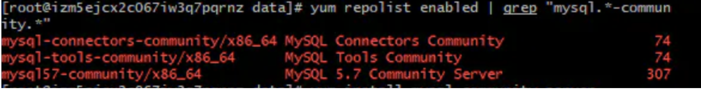

# [wordpress](https://wordpress.org/)搭建


## 阿里云centOS7上MySQL的安装与配置

参考博文：https://www.jianshu.com/p/3cf566658ad6
**1.在MySQL官网中下载YUM源rpm安装包：**

```
wget http://dev.mysql.com/get/mysql57-community-release-el7-8.noarch.rpm
```

**2.安装mysql源**

```
yum localinstall mysql57-community-release-el7-8.noarch.rpm
```

**3.检查mysql源是否安装成功**

```
yum repolist enabled | grep "mysql.*-community.*"
```


**4.安装MySQL**

```
yum install mysql-community-server
```

**5.启动MySQL服务**

```
systemctl start mysqld
```

**6.开机启动**

```
systemctl enable mysqld
systemctl daemon-reload
```

**7.使用root用户登录**

```
mysql -uroot -p 
```

如果无法登录，可以使用如下步骤，请注意，我这里的密码Q1W2E3R4T5#$%qwe只是示例，请修改成你自己的密码.：

```
sudo mysql
ALTER USER 'root'@'localhost' IDENTIFIED WITH mysql_native_password BY 'Q1W2E3R4T5#$%qwe';
FLUSH PRIVILEGES;
exit
```

**8.修改mysql默认字符集**

```
vi /etc/my.cnf #根据个人配置找到相应文件
```

加入

```
[mysqld]
character-set-server=utf8mb4
collation-server=utf8mb4_unicode_ci

[client]
default-character-set = utf8mb4

[mysql]
default-character-set = utf8mb4
123456789
```

重启MySQL

```
systemctl restart mysqld
```