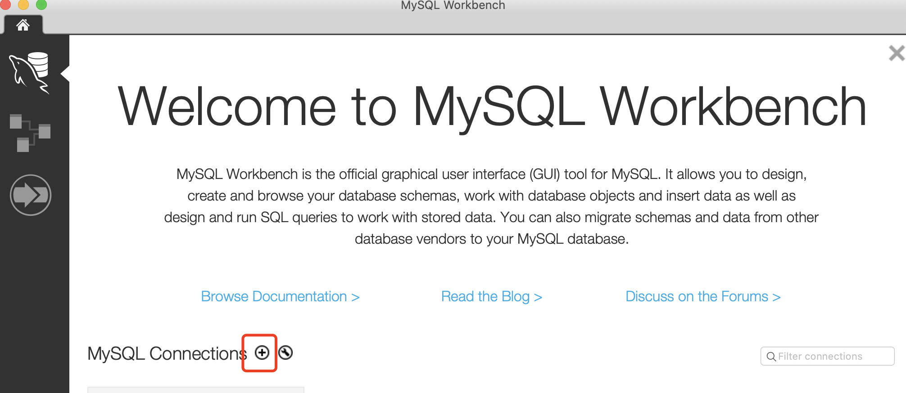
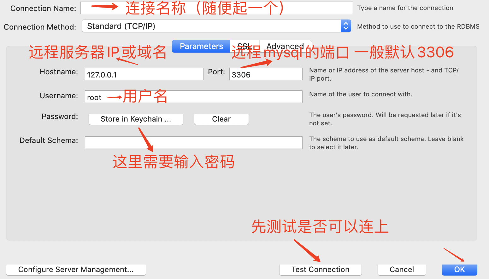

# workbench连接远程服务器mysql 


## 一、创建远程登陆用户并授权

参考：https://blog.csdn.net/qq_44249833/article/details/106362650


**首先在你的远程服务器进入你的mysql终端**

```
[aliyun@root@00:14:36@ ~] mysql -uroot -p
```


***查看目前权限，user为登录用户，host为允许登录的ip地址***

```
mysql> select user, host from mysql.user;
+---------------+-----------+
| user          | host      |
+---------------+-----------+
| djangoblog    | localhost |
| mysql.session | localhost |
| mysql.sys     | localhost |
| root          | localhost |
+---------------+-----------+
5 rows in set (0.00 sec)
```


***设置root用户登录权限，也可以是别的用户*** 

***root为mysql中用户名 '@' 后跟的 '%' 代表任何IP*** 

**在 '111 中表示用户密码**

```
mysql> GRANT ALL PRIVILEGES ON *.* TO 'root'@'%' IDENTIFIED BY '111' WITH GRANT OPTION;
Query OK, 0 rows affected, 1 warning (0.00 sec)

mysql> flush privileges;
Query OK, 0 rows affected (0.01 sec)

mysql> exit
```


**之前在CentOS安装完MySQL设置密码时出现了如下错误:**

```shell
ERROR 1819 (HY000): Your password does not satisfy the current policy requirements
```

**原因是因为密码设置的过于简单会报错,MySQL有密码设置的规范，具体是与validate_password_policy的值有关,下图表明该值规则**

**如果想要查看MySQL完整的初始密码规则,登陆后执行以下命令**

```shell
SHOW VARIABLES LIKE 'validate_password%';
```

**密码的长度是由validate_password_length决定的,但是可以通过以下命令修改**

**validate_password_policy决定密码的验证策略,默认等级为MEDIUM(中等),可通过以下命令修改为LOW(低)**

```
mysql> set global validate_password_length=4;
Query OK, 0 rows affected (0.00 sec)

mysql> set global validate_password_policy=0;
Query OK, 0 rows affected (0.00 sec)
```


**这时再查看用户信息就已经多了一行| root          | %         |**

```
mysql> select user, host from mysql.user;
+---------------+-----------+
| user          | host      |
+---------------+-----------+
| root          | %         |
| djangoblog    | localhost |
| mysql.session | localhost |
| mysql.sys     | localhost |
| root          | localhost |
+---------------+-----------+
5 rows in set (0.00 sec)
```


## 二、使用workbench连接远程mysql


**1.下载安装workbench ，并打开workbench**


**2.点击加号，创建连接**




**3.设置连接**




**4.成功连接（连接失败可能是你没有创建远程登陆用户并授权）**


