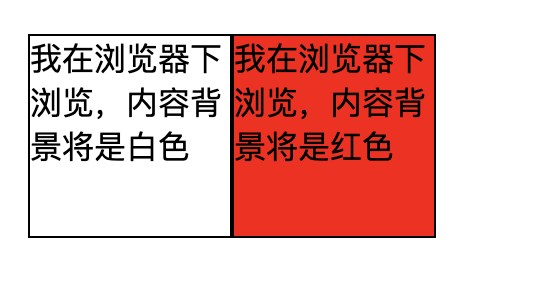

## [CSS中的class与id区别及用法](http://www.divcss5.com/rumen/r3.shtml)

我们平常在用[DIV CSS](http://www.divcss5.com/)制作Xhtml网页页面时，常会用到class 和id来选择调用[CSS样式](http://www.divcss5.com/rumen/r29.shtml)属性。对学习[CSS](http://www.divcss5.com/)的新手来说class和id可能比较模糊，同时不知道什么时候该用class，什么时候又用id，以及它们用法与限制是怎么样的。接下来我们就来详细了解CLASS与ID基本属性及用法。

**Class 在程序中称“类”**，同时在CSS中也书面语也叫“类”。在CSS样式中以小写的“点”及“.”来命名如： .css5{属性：属性值;} ,而在html页面里则以class="css5" 来选择调用,命名好的CSS又叫css选择器。如： .css5{属性：属性值;} 选择器在html调用为“<div class="css5">我是class例子</div> ”如果不知道怎么引用CSS，那就可以了解下[css引用](http://www.divcss5.com/rumen/r56.shtml)。

而且class(类)在**同一个html网页页面可以无数次的调用相同的class类**，在这里例子里则可以在对应的网页里可以无数次调用选择“css5”。这也说明class一般是用来调用css中的预配制属性的，比如说有一个预配制属性为如这里的“.class01{属性：属性值;} ”，这样就可以像调用函数一样不用再一个网页页面里重复的配置一个“类”属性，而只需要写上一个class类选择，就可以在同一个页面里任何位置调用选择具有相同的CLASS类。

**ID是表示着标签的身份**，在JS脚本中会用到id，当JS要修改一个标签的属性时，JS会将id名作为该标签的唯一标识进行操作。也就是说ID只是页面元素的标识，供其他元素脚本等引用。假如你的页面里出现了两个ID那JS效果特性较出现逻辑错误不知道依据哪个ID来改变其标签属性。 在CSS里的ID不一定为JS而设置的，但是**同样ID在页面里也只能出现一次，并且是唯一性**。虽然可能我们才学[DIV+CSS](http://www.divcss5.com/)爱好者在一个页面里同时调用相同的ID多次但是仍然没有出现页面混乱错误，但是我们为了[W3C](http://www.divcss5.com/w3c/)及各个标准我们也要遵循ID在一个页面里唯一性。以免出现浏览器兼容问题。

**Div css 页面中的ID是怎么个用法呢？**
通常我们在CSS样式定义的时候 以“#”来开头命名id名称如：#css5{属性:属性值;} 这个也有点像class的定义，只是class是以小写句号“.”开头命名，而ID是以“#”好开头定义。那id是怎么个用法呢？ Css里的ID用法与class用法一样，只是把class换成id。如例子：在CSS样式定义ID --- #css5{height:25px;width: 200px;} ,调用ID --- <div id="css5">我是ID例子</div>。


```
 <!DOCTYPE html PUBLIC "-//W3C//DTD XHTML 1.0 Transitional//EN"
 "http://www.w3.org/TR/xhtml1/DTD/xhtml1-transitional.dtd"> 
<html xmlns="http://www.w3.org/1999/xhtml"> 
<head> 
<meta http-equiv="Content-Type" content="text/html; charset=gb2312" /> 
<title>DIV CSS中CLASS与ID实例 - -DIV+CSS-www.divcss5.com</title> 
<style> 
.css5{ width:100px; height:100px; border:1px solid #000; float:left; } 
.css5_class{ background:#FFF;} /* 背景白色 */ 
#css5_id{ background:#FF0000;} /* 背景红色 */ 
</style> 
</head> 
<body> 
<div class="css5 css5_class">我在浏览器下浏览，内容背景将是白色</div>  
<div class="css5" id="css5_id">我在浏览器下浏览，内容背景将是红色</div>  
</body> 
</html> 
```

效果：



接下来我们分析一下以上实例：class="css5 css5_class" 怎么是这样的？这里是相当于调用选择了class类css5与css5_class 。class="css5" id="css5_id" grep hostname -rl .这里同样是选择调用了class类 :css5和id :css5_id 。

本页通过[CSS实例](http://www.divcss5.com/shili/)与CLASS类和ID分别的讲解，相信您能从此深刻认识和区分它们并且灵活。特别注意：在命名id和class类的时候特别要注意大小写，ID和class是对大小写非常敏感的，最好以英文开头，不要用中文命名CSS类名。欢迎来到[DIVCSS5](http://www.divcss5.com/)希望本页对你有帮助！ 