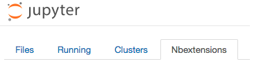
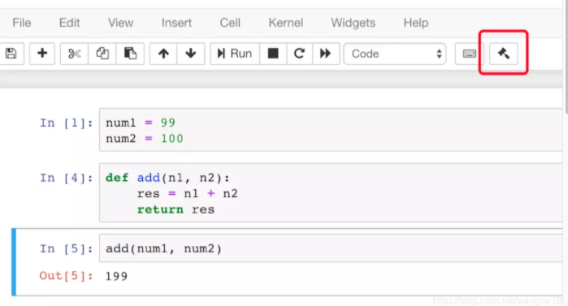

# Jupyter notebook安装扩展插件

1. 安装Jupyter Notebook

```shell
pip install jupyter 
```

1. 安装Jypyter Notebook扩展包

```shell
pip install jupyter_contrib_nbextensions
jupyter contrib nbextension install --user
```

1. 启动Jupyter Notebook
   jupyter notebook
   在浏览器中输入http://localhost:8888，进入notebook首页，会发现菜单栏中多了一个Nbextensions，如下图所示。
   
   然后就可以看到茫茫多的插件了。

推荐以下几个插件：

- Code prettify，对代码进行格式化；
- Collapsible Headings，可以根据headings折叠区域；
- Codefolding，可以对代码块进行折叠；
- ScrollDown，当代码输出内容过长，自动下拉滚动条；
- Table of Contents (2)，根据markdown的标题栏自动生成目录，有个按钮，可以自动添加数字编号！！！；

代码整齐很重要！
对于Python来说混乱的代码格式可能是致命的！
这里介绍安装code-pretty自动格式化插件，先执行命令开启：

```shell
jupyter nbextension enable code_prettify/code_prettify
```

依照官方说明还需要执行另外一个命令安装必要的第三方功能模块：

```shell
conda install yapf
```

然后就可以看到Notebook如下图出现一个小锤头工具。点击它就能把当前cell的代码自动格式化变整齐了，也可以使用快捷键Ctrl+L（苹果下也是ctrl不是Command）

