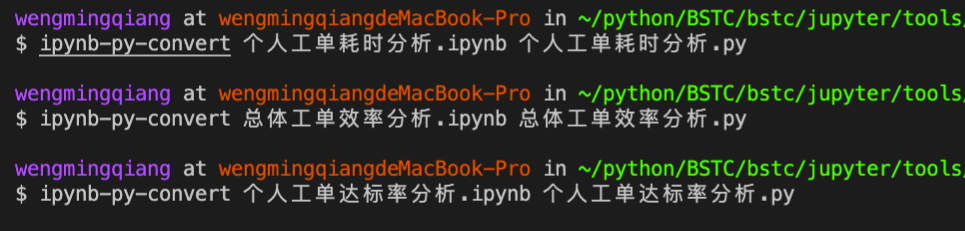

# ipynb-py-convert

### 简介

由于ipynb文件git无法管理（无法git add 和git commit），所以需要把ipynb文件转换成py文件再提交git，ipynb-py-convert工具可以帮助我们转换格式

### 安装

- pip install ipynb-py-convert

### 转化

- ipynb-py-convert xxx.ipynb xxx.py

### 结果

- 将转化后的py文件上传jypyter会直接生成对应的ipynb文件

