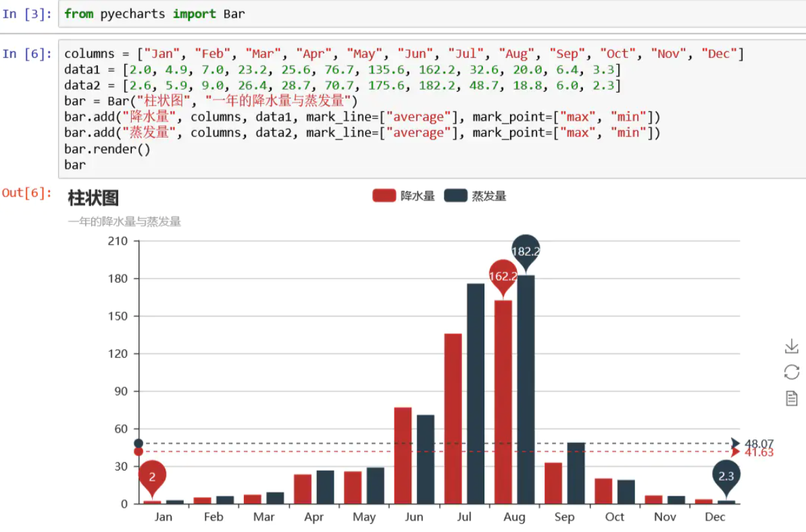
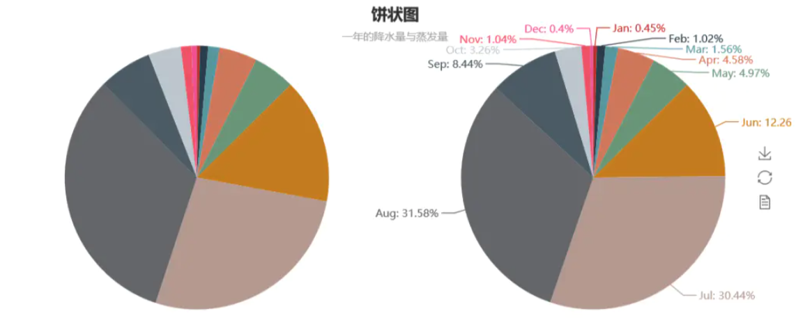
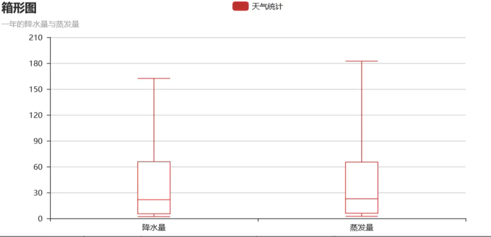
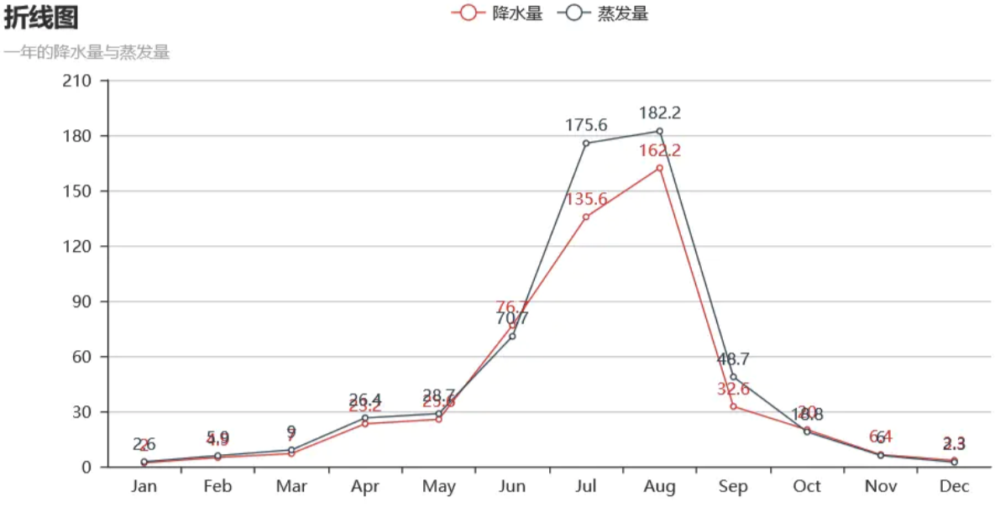
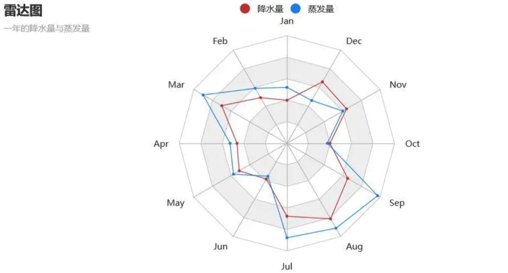
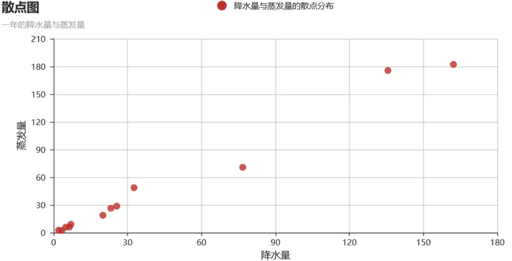
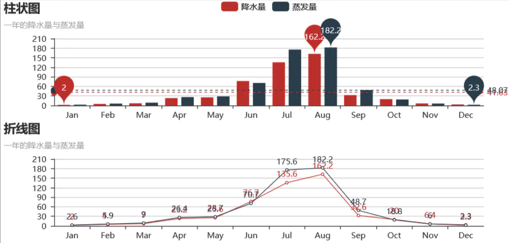
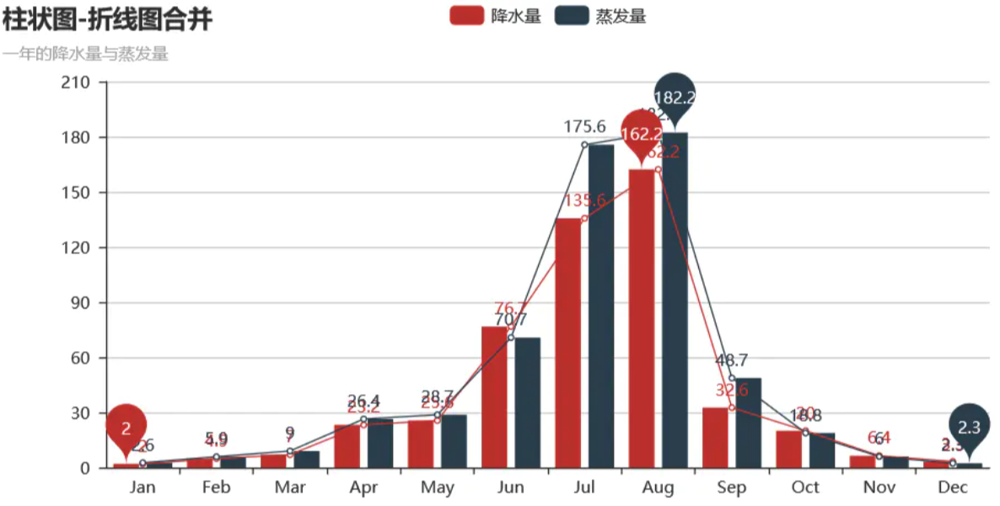

# Python可视化神器——pyecharts+jupyter

### **前言**

我们都知道python上的一款可视化工具matplotlib,而前些阵子做一个Spark项目的时候用到了百度开源的一个可视化JS工具-Echarts，可视化类型非常多，但是得通过导入js库在Java Web项目上运行，平时用Python比较多，于是就在想有没有Python与Echarts结合的轮子。Google后，找到一个国人开发的一个Echarts与Python结合的轮子：pyecharts

官网示例：https://pyecharts.org/#/zh-cn/intro

### **安装**

```
pip install -i https://pypi.tuna.tsinghua.edu.cn/simple pyecharts
```

注意：

> 使用之前我们要强调一点：就是python2.x和python3.x的编码问题，在python3.x中你可以把它看做默认是unicode编码，但在python2.x中并不是默认的，原因就在它的bytes对象定义的混乱，而pycharts是使用unicode编码来处理字符串和文件的，所以当你使用的是python2.x时，请务必在上方插入此代码：
>
> from **future** import unicode_literals


### **柱状图-Bar**

```csharp
//导入柱状图-Bar
from pyecharts import Bar
//设置行名
columns = ["Jan", "Feb", "Mar", "Apr", "May", "Jun", "Jul", "Aug", "Sep", "Oct", "Nov", "Dec"]
//设置数据
data1 = [2.0, 4.9, 7.0, 23.2, 25.6, 76.7, 135.6, 162.2, 32.6, 20.0, 6.4, 3.3]
data2 = [2.6, 5.9, 9.0, 26.4, 28.7, 70.7, 175.6, 182.2, 48.7, 18.8, 6.0, 2.3]
//设置柱状图的主标题与副标题
bar = Bar("柱状图", "一年的降水量与蒸发量")
//添加柱状图的数据及配置项
bar.add("降水量", columns, data1, mark_line=["average"], mark_point=["max", "min"])
bar.add("蒸发量", columns, data2, mark_line=["average"], mark_point=["max", "min"])
//生成本地文件（默认为.html文件）
bar.render()
```

运行结果如下：




### **饼图-Pie**

```python
//导入饼图Pie
from pyecharts import Pie
//设置主标题与副标题，标题设置居中，设置宽度为900
pie = Pie("饼状图", "一年的降水量与蒸发量",title_pos='center',width=900)
//加入数据，设置坐标位置为【25，50】，上方的colums选项取消显示
pie.add("降水量", columns, data1 ,center=[25,50],is_legend_show=False)
//加入数据，设置坐标位置为【75，50】，上方的colums选项取消显示，显示label标签
pie.add("蒸发量", columns, data2 ,center=[75,50],is_legend_show=False,is_label_show=True)
//保存图表
pie.render()
```




### **箱体图-Boxplot**

```python
//导入箱型图Boxplot
from pyecharts import Boxplot 
boxplot = Boxplot("箱形图", "一年的降水量与蒸发量")
x_axis = ['降水量','蒸发量']
y_axis = [data1,data2]
//prepare_data方法可以将数据转为嵌套的 [min, Q1, median (or Q2), Q3, max]
yaxis = boxplot.prepare_data(y_axis)       
boxplot.add("天气统计", x_axis, _yaxis)
boxplot.render()
```




### **折线图-Line**

```python
from pyecharts import Line
line = Line("折线图","一年的降水量与蒸发量")
//is_label_show是设置上方数据是否显示
line.add("降水量", columns, data1, is_label_show=True)
line.add("蒸发量", columns, data2, is_label_show=True)
line.render()
```




### **雷达图-Rader**

```
from pyecharts import Radar
radar = Radar("雷达图", "一年的降水量与蒸发量")
//由于雷达图传入的数据得为多维数据，所以这里需要做一下处理
radar_data1 = [[2.0, 4.9, 7.0, 23.2, 25.6, 76.7, 135.6, 162.2, 32.6, 20.0, 6.4, 3.3]]
radar_data2 = [[2.6, 5.9, 9.0, 26.4, 28.7, 70.7, 175.6, 182.2, 48.7, 18.8, 6.0, 2.3]]
//设置column的最大值，为了雷达图更为直观，这里的月份最大值设置有所不同
schema = [ 
    ("Jan", 5), ("Feb",10), ("Mar", 10),
    ("Apr", 50), ("May", 50), ("Jun", 200),
    ("Jul", 200), ("Aug", 200), ("Sep", 50),
    ("Oct", 50), ("Nov", 10), ("Dec", 5)
]
//传入坐标
radar.config(schema)
radar.add("降水量",radar_data1)
//一般默认为同一种颜色，这里为了便于区分，需要设置item的颜色
radar.add("蒸发量",radar_data2,item_color="#1C86EE")
radar.render()
```




### **散点图-scatter**

```python
from pyecharts import Scatter
scatter = Scatter("散点图", "一年的降水量与蒸发量")
//xais_name是设置横坐标名称，这里由于显示问题，还需要将y轴名称与y轴的距离进行设置
scatter.add("降水量与蒸发量的散点分布", data1,data2,xaxis_name="降水量",yaxis_name="蒸发量",
            yaxis_name_gap=40)
scatter.render()
```




### 图表布局 Grid

由于标题与图表是属于两个不同的控件，所以这里必须对下方的图表Line进行标题位置设置，否则会出现标题重叠的bug。

```python
from pyecharts import Grid
//设置折线图标题位置
line = Line("折线图","一年的降水量与蒸发量",title_top="45%")
line.add("降水量", columns, data1, is_label_show=True)
line.add("蒸发量", columns, data2, is_label_show=True)
grid = Grid()
//设置两个图表的相对位置
grid.add(bar, grid_bottom="60%")
grid.add(line, grid_top="60%")
grid.render()
```




### 柱状图-状线图合并

```python
from pyecharts import Overlap
overlap = Overlap()
bar = Bar("柱状图-折线图合并", "一年的降水量与蒸发量")
bar.add("降水量", columns, data1, mark_point=["max", "min"])
bar.add("蒸发量", columns, data2, mark_point=["max", "min"])
overlap.add(bar)
overlap.add(line)
overlap.render()
```

