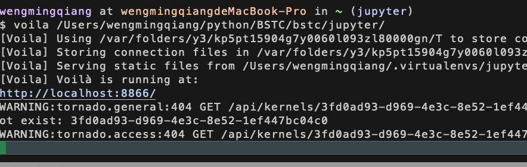
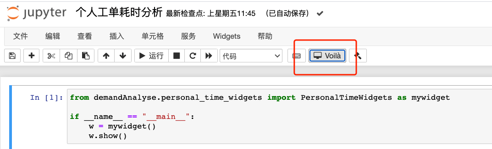
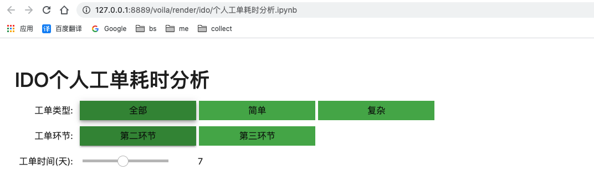

# Voilà

### 简介

作用：直接渲染ipynb文件为独立的页面

官网地址：https://voila.readthedocs.io/en/stable/install.html


### 安装

```
pip install voila
```


### 启动

```
voila <path-to-notebook> <options>
```

voila其实也是后端的一个服务，监听在某个端口，在执行notebook的时候会去调用voila的服务，这里的voila启动的时候可以选择jupyter服务器notebook的路径




这样打开juyter 的时候就会新增了voila这个插件




重启下jupyter voila就可以生效了，点击Voila就可以出现对应的界面了

