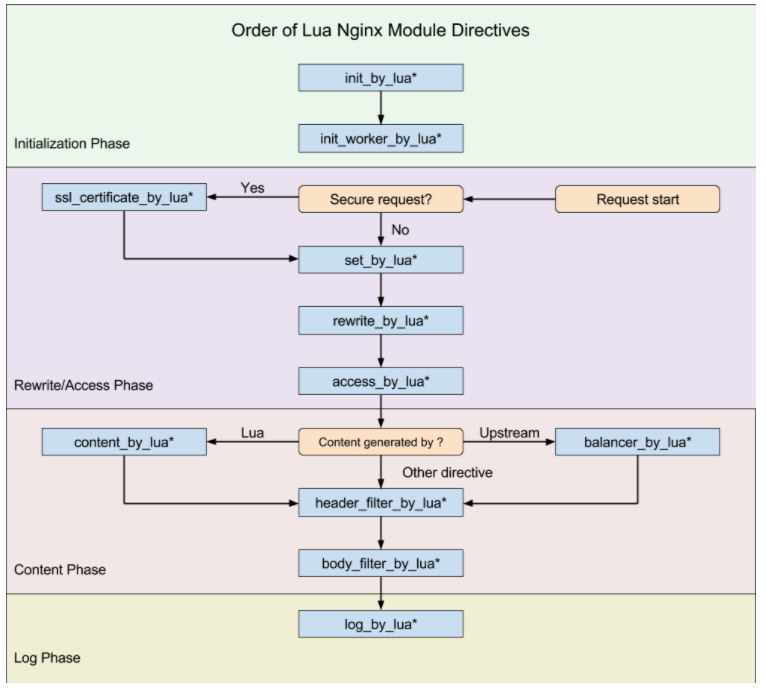
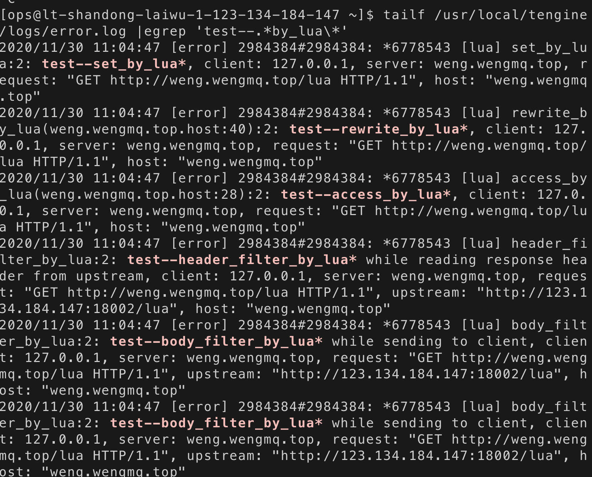

# lua执行阶段

OpenResty 处理一个请求，它的处理流程请参考下图（从 Request start 开始）：



我们在这里做个测试，示例代码如下：

```lua
location /lua {

log_by_lua_block {
        ngx.log(ngx.ERR, "log_by_lua*")
    } 
body_filter_by_lua_block {
        ngx.log(ngx.ERR, "test--body_filter_by_lua*")
    }
access_by_lua_block {
        ngx.log(ngx.ERR, "test--access_by_lua*")
    }
header_filter_by_lua_block {
        ngx.log(ngx.ERR, "test--header_filter_by_lua*")
    }
content_by_lua_block {
        ngx.log(ngx.ERR, "test--content_by_lua*")
    }
set_by_lua_block $a {
        ngx.log(ngx.ERR, "test--set_by_lua*")
    }
rewrite_by_lua_block {
        ngx.log(ngx.ERR, "test--rewrite_by_lua*")
    }
      
    proxy_pass http://defaultServers;
}
```


结果如下：



```
set_by_lua*
rewrite_by_lua*
access_by_lua*
content_by_lua*
header_filter_by_lua*
body_filter_by_lua*
log_by_lua*
```

