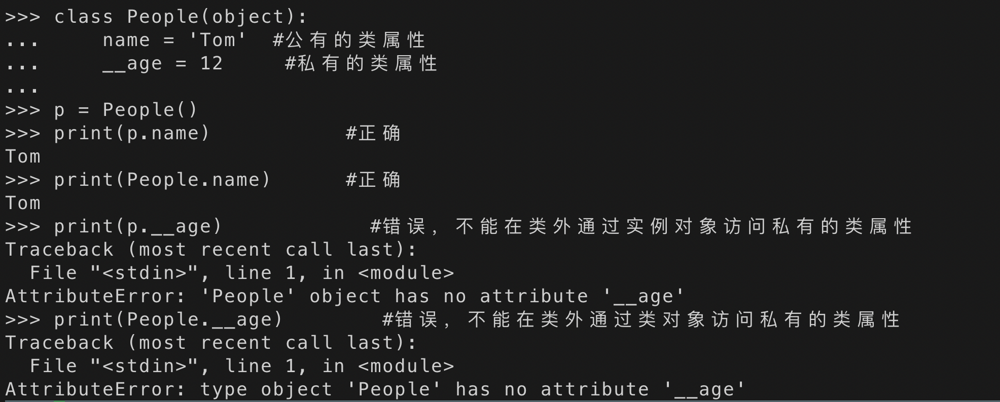
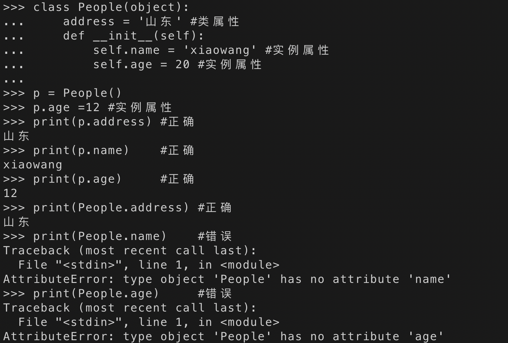
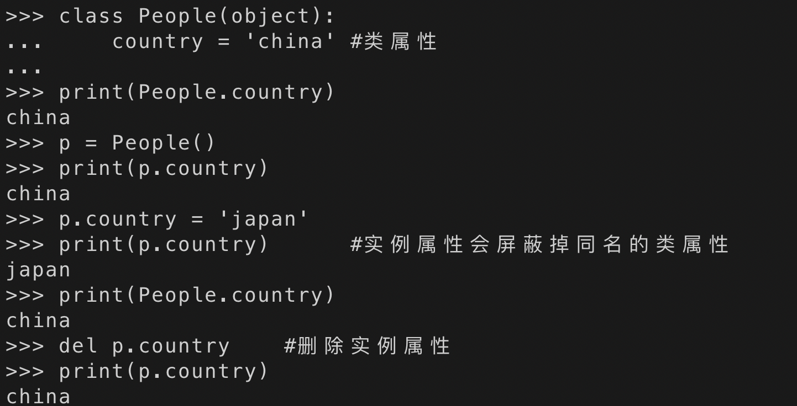

# Python 类属性和对象属性

在了解了类基本的东西之后，下面看一下 python 中这几个概念的区别

先来谈一下`类属性`和`实例属性`

在前面的例子中我们接触到的就是实例属性（对象属性），顾名思义，类属性就是`类对象`所拥有的属性，它被所有`类对象`的`实例对象`所共有，在内存中只存在一个副本，这个和 C++中类的静态成员变量有点类似。对于公有的类属性，在类外可以通过`类对象`和`实例对象`访问

## 类属性

```
class People(object):
    name = 'Tom'  #公有的类属性
    __age = 12     #私有的类属性

p = People()
print(p.name)           #正确
print(People.name)      #正确
print(p.__age)            #错误，不能在类外通过实例对象访问私有的类属性
print(People.__age)        #错误，不能在类外通过类对象访问私有的类属性

```



## 实例属性(对象属性)

```
class People(object):
    address = '山东' #类属性
    def __init__(self):
        self.name = 'xiaowang' #实例属性
        self.age = 20 #实例属性

p = People()
p.age =12 #实例属性
print(p.address) #正确
print(p.name)    #正确
print(p.age)     #正确
print(People.address) #正确
print(People.name)    #错误
print(People.age)     #错误

```



## 通过实例(对象)去修改类属性

```
class People(object):
    country = 'china' #类属性

print(People.country)
p = People()
print(p.country)
p.country = 'japan'
print(p.country)      #实例属性会屏蔽掉同名的类属性
print(People.country)
del p.country    #删除实例属性
print(p.country)

```



##### 从上面这里例子我们可以知道：

> 对于类属性我们可以通过类名及实例对象去访问，即：
>
> - 类名.类属性，
> - 实例.类属性
>   `两种方式访问`

## 属性分类说明

- ##### 实例属性：

  > 在**init**(self,…)中初始化
  > 内部调用时都需要加上 self.
  > 外部调用时用实例化对象.属性名

- ##### 类属性：

  > 在**init**()外初始化
  > 在内部用类名.类属性名调用
  > 外部既可以用类名.类属性名又可以用实例化对象.类属性名来调用

- ##### 私有属性：

  > - 单下划线\_开头：只是告诉别人这是私有属性，外部依然可以访问更改
  > - 双下划线\*\_开头：外部不可通过实例化对象.属性名来访问或者更改
  >   实际将其转化为了*类名*属性名，只是在内部将变量名修改了，我们仍让可以通过.\*类名\_属性名访问

# 总结

> 如果需要在类外修改类属性，必须通过类对象去引用然后进行修改。如果通过实例对象去引用，会产生一个同名的实例属性，这种方式修改的是实例属性，不会影响到类属性，并且之后如果通过实例对象去引用该名称的属性，实例属性会强制屏蔽掉类属性，即引用的是实例属性，除非删除了该实例属性。
