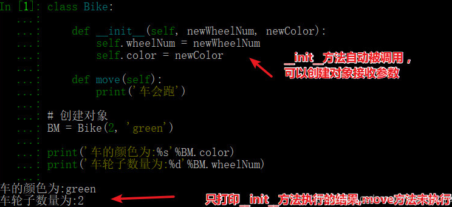
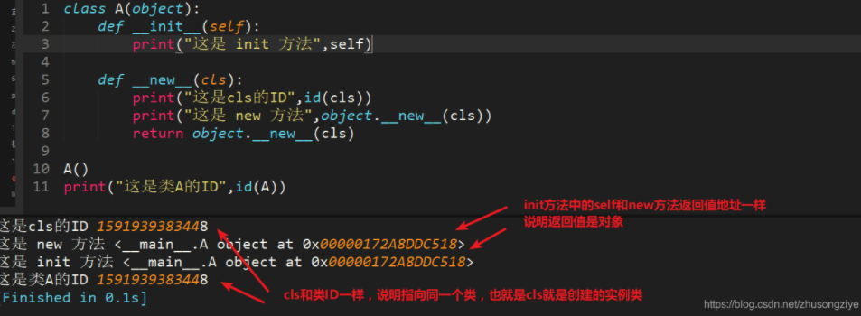

# python QA

<details>
    <summary>简述面向对象中__new__和__init__区别</summary>
__init__是初始化方法，创建对象后，就立刻被默认调用了，可接收参数，如图



1、__new__至少要有一个参数cls，代表当前类，此参数在实例化时由Python解释器自动识别

2、__new__必须要有返回值，返回实例化出来的实例，这点在自己实现__new__时要特别注意，可以return父类（通过super(当前类名, cls)）__new__出来的实例，或者直接是object的__new__出来的实例

3、__init__有一个参数self，就是这个__new__返回的实例，__init__在__new__的基础上可以完成一些其它初始化的动作，__init__不需要返回值

4、如果__new__创建的是当前类的实例，会自动调用__init__函数，通过return语句里面调用的__new__函数的第一个参数是cls来保证是当前类实例，如果是其他类的类名，；那么实际创建返回的就是其他类的实例，其实就不会调用当前类的__init__函数，也不会调用其他类的__init__函数。


  </details>


<details>
  <summary>这个是标题</summary>
  内容

```python
  if __name__ == "__main__": 
    w = mywidget()
    w.show()
```

</details>