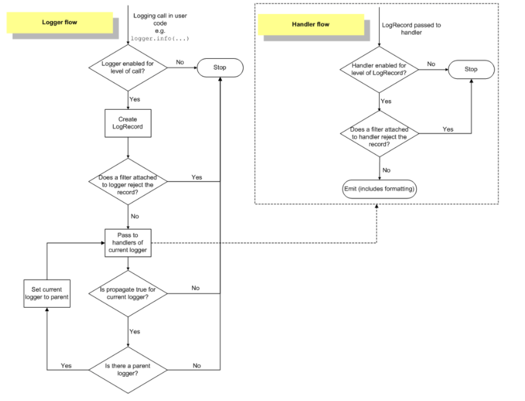

# [python 日志处理(logging)](https://www.cnblogs.com/yyds/p/6901864.html)

## 一、日志相关概念

---

日志是一种可以追踪某些软件运行时所发生事件的方法。软件开发人员可以向他们的代码中调用日志记录相关的方法来表明发生了某些事情。一个事件可以用一个可包含可选变量数据的消息来描述。此外，事件也有重要性的概念，这个重要性也可以被称为严重性级别（level）。

### 1.日志的作用

通过 log 的分析，可以方便用户了解系统或软件、应用的运行情况；如果你的应用 log 足够丰富，也可以分析以往用户的操作行为、类型喜好、地域分布或其他更多信息；如果一个应用的 log 同时也分了多个级别，那么可以很轻易地分析得到该应用的健康状况，及时发现问题并快速定位、解决问题，补救损失。
简单来讲就是，我们通过记录和分析日志可以了解一个系统或软件程序运行情况是否正常，也可以在应用程序出现故障时快速定位问题。比如，做运维的同学，在接收到报警或各种问题反馈后，进行问题排查时通常都会先去看各种日志，大部分问题都可以在日志中找到答案。再比如，做开发的同学，可以通过 IDE 控制台上输出的各种日志进行程序调试。对于运维老司机或者有经验的开发人员，可以快速的通过日志定位到问题的根源。可见，日志的重要性不可小觑。日志的作用可以简单总结为以下 3 点：

- 程序调试
- 了解软件程序运行情况，是否正常
- 软件程序运行故障分析与问题定位

如果应用的日志信息足够详细和丰富，还可以用来做用户行为分析，如：分析用户的操作行为、类型洗好、地域分布以及其它更多的信息，由此可以实现改进业务、提高商业利益。

### 2.日志的等级

我们先来思考下下面的两个问题：

- 作为开发人员，在开发一个应用程序时需要什么日志信息？在应用程序正式上线后需要什么日志信息？
- 作为应用运维人员，在部署开发环境时需要什么日志信息？在部署生产环境时需要什么日志信息？

在软件开发阶段或部署开发环境时，为了尽可能详细的查看应用程序的运行状态来保证上线后的稳定性，我们可能需要把该应用程序所有的运行日志全部记录下来进行分析，这是非常耗费机器性能的。当应用程序正式发布或在生产环境部署应用程序时，我们通常只需要记录应用程序的异常信息、错误信息等，这样既可以减小服务器的 I/O 压力，也可以避免我们在排查故障时被淹没在日志的海洋里。那么，怎样才能在不改动应用程序代码的情况下实现在不同的环境记录不同详细程度的日志呢？这就是日志等级的作用了，我们通过配置文件指定我们需要的日志等级就可以了。

不同的应用程序所定义的日志等级可能会有所差别，分的详细点的会包含以下几个等级：

- DEBUG
- INFO
- NOTICE
- WARNING
- ERROR
- CRITICAL
- ALERT
- EMERGENCY

### 3.日志字段信息与日志格式

本节开始问题提到过，一条日志信息对应的是一个事件的发生，而一个事件通常需要包括以下几个内容：

- 事件发生时间
- 事件发生位置
- 事件的严重程度--日志级别
- 事件内容

上面这些都是一条日志记录中可能包含的字段信息，当然还可以包括一些其他信息，如进程 ID、进程名称、线程 ID、线程名称等。日志格式就是用来定义一条日志记录中包含那些字段的，且日志格式通常都是可以自定义的。

> **_说明：_**
>
> 输出一条日志时，日志内容和日志级别是需要开发人员明确指定的。对于而其它字段信息，只需要是否显示在日志中就可以了。

### 4.日志功能的实现

几乎所有开发语言都会内置日志相关功能，或者会有比较优秀的第三方库来提供日志操作功能，比如：log4j，log4php 等。它们功能强大、使用简单。Python 自身也提供了一个用于记录日志的标准库模块--logging。

## 二、logging 模块简介

---

logging 模块定义的函数和类为应用程序和库的开发实现了一个灵活的事件日志系统。logging 模块是 Python 的一个标准库模块，由标准库模块提供日志记录 API 的关键好处是所有 Python 模块都可以使用这个日志记录功能。所以，你的应用日志可以将你自己的日志信息与来自第三方模块的信息整合起来。

### 1. logging 模块的日志级别

logging 模块默认定义了以下几个日志等级，它允许开发人员自定义其他日志级别，但是这是不被推荐的，尤其是在开发供别人使用的库时，因为这会导致日志级别的混乱。

| 日志等级（level） | 描述                                                                                         |
| ----------------- | -------------------------------------------------------------------------------------------- |
| DEBUG             | 最详细的日志信息，典型应用场景是 问题诊断                                                    |
| INFO              | 信息详细程度仅次于 DEBUG，通常只记录关键节点信息，用于确认一切都是按照我们预期的那样进行工作 |
| WARNING           | 当某些不期望的事情发生时记录的信息（如，磁盘可用空间较低），但是此时应用程序还是正常运行的   |
| ERROR             | 由于一个更严重的问题导致某些功能不能正常运行时记录的信息                                     |
| CRITICAL          | 当发生严重错误，导致应用程序不能继续运行时记录的信息                                         |

开发应用程序或部署开发环境时，可以使用 DEBUG 或 INFO 级别的日志获取尽可能详细的日志信息来进行开发或部署调试；应用上线或部署生产环境时，应该使用 WARNING 或 ERROR 或 CRITICAL 级别的日志来降低机器的 I/O 压力和提高获取错误日志信息的效率。日志级别的指定通常都是在应用程序的配置文件中进行指定的。

> **_说明：_**
>
> - 上面列表中的日志等级是从上到下依次升高的，即：DEBUG < INFO < WARNING < ERROR < CRITICAL，而日志的信息量是依次减少的；
> - 当为某个应用程序指定一个日志级别后，应用程序会记录所有日志级别大于或等于指定日志级别的日志信息，而不是仅仅记录指定级别的日志信息，nginx、php 等应用程序以及这里要提高的 python 的 logging 模块都是这样的。同样，logging 模块也可以指定日志记录器的日志级别，只有级别大于或等于该指定日志级别的日志记录才会被输出，小于该等级的日志记录将会被丢弃。

### 2. logging 模块的使用方式介绍

logging 模块提供了两种记录日志的方式：

- 第一种方式是使用 logging 提供的模块级别的函数
- 第二种方式是使用 Logging 日志系统的四大组件

其实，logging 所提供的模块级别的日志记录函数也是对 logging 日志系统相关类的封装而已。

##### logging 模块定义的模块级别的常用函数

| 函数                                      | 说明                                   |
| ----------------------------------------- | -------------------------------------- |
| logging.debug(msg, \*args, \*\*kwargs)    | 创建一条严重级别为 DEBUG 的日志记录    |
| logging.info(msg, \*args, \*\*kwargs)     | 创建一条严重级别为 INFO 的日志记录     |
| logging.warning(msg, \*args, \*\*kwargs)  | 创建一条严重级别为 WARNING 的日志记录  |
| logging.error(msg, \*args, \*\*kwargs)    | 创建一条严重级别为 ERROR 的日志记录    |
| logging.critical(msg, \*args, \*\*kwargs) | 创建一条严重级别为 CRITICAL 的日志记录 |
| logging.log(level, \*args, \*\*kwargs)    | 创建一条严重级别为 level 的日志记录    |
| logging.basicConfig(\*\*kwargs)           | 对 root logger 进行一次性配置          |

其中`logging.basicConfig(**kwargs)`函数用于指定“要记录的日志级别”、“日志格式”、“日志输出位置”、“日志文件的打开模式”等信息，其他几个都是用于记录各个级别日志的函数。

##### logging 模块的四大组件

| 组件       | 说明                                                                                   |
| ---------- | -------------------------------------------------------------------------------------- |
| loggers    | 提供应用程序代码直接使用的接口                                                         |
| handlers   | 用于将日志记录发送到指定的目的位置                                                     |
| filters    | 提供更细粒度的日志过滤功能，用于决定哪些日志记录将会被输出（其它的日志记录将会被忽略） |
| formatters | 用于控制日志信息的最终输出格式                                                         |

> **_说明：_** logging 模块提供的模块级别的那些函数实际上也是通过这几个组件的相关实现类来记录日志的，只是在创建这些类的实例时设置了一些默认值。

## 三、使用 logging 提供的模块级别的函数记录日志

---

回顾下前面提到的几个重要信息：

- 可以通过 logging 模块定义的模块级别的方法去完成简单的日志记录
- 只有级别大于或等于日志记录器指定级别的日志记录才会被输出，小于该级别的日志记录将会被丢弃。

### 1.最简单的日志输出

先来试着分别输出一条不同日志级别的日志记录：

```
import logging

logging.debug("This is a debug log.")
logging.info("This is a info log.")
logging.warning("This is a warning log.")
logging.error("This is a error log.")
logging.critical("This is a critical log.")
```

也可以这样写：

```
logging.log(logging.DEBUG, "This is a debug log.")
logging.log(logging.INFO, "This is a info log.")
logging.log(logging.WARNING, "This is a warning log.")
logging.log(logging.ERROR, "This is a error log.")
logging.log(logging.CRITICAL, "This is a critical log.")
```

输出结果：

```
WARNING:root:This is a warning log.
ERROR:root:This is a error log.
CRITICAL:root:This is a critical log.
```

### 2. 那么问题来了

##### 问题 1：为什么前面两条日志没有被打印出来？

这是因为 logging 模块提供的日志记录函数所使用的日志器设置的日志级别是`WARNING`，因此只有`WARNING`级别的日志记录以及大于它的`ERROR`和`CRITICAL`级别的日志记录被输出了，而小于它的`DEBUG`和`INFO`级别的日志记录被丢弃了。

##### 问题 2：打印出来的日志信息中各字段表示什么意思？为什么会这样输出？

上面输出结果中每行日志记录的各个字段含义分别是：

```
日志级别:日志器名称:日志内容
```

之所以会这样输出，是因为 logging 模块提供的日志记录函数所使用的日志器设置的日志格式默认是 BASIC_FORMAT，其值为：

```
"%(levelname)s:%(name)s:%(message)s"
```

##### 问题 3：如果将日志记录输出到文件中，而不是打印到控制台？

因为在 logging 模块提供的日志记录函数所使用的日志器设置的处理器所指定的日志输出位置默认为:
`sys.stderr`。

##### 问题 4：我是怎么知道这些的？

查看这些日志记录函数的实现代码，可以发现：当我们没有提供任何配置信息的时候，这些函数都会去调用`logging.basicConfig(**kwargs)`方法，且不会向该方法传递任何参数。继续查看`basicConfig()`方法的代码就可以找到上面这些问题的答案了。

##### 问题 5：怎么修改这些默认设置呢？

其实很简单，在我们调用上面这些日志记录函数之前，手动调用一下 basicConfig()方法，把我们想设置的内容以参数的形式传递进去就可以了。

### 3. logging.basicConfig()函数说明

该方法用于为 logging 日志系统做一些基本配置，方法定义如下：

```
logging.basicConfig(**kwargs)
```

该函数可接收的关键字参数如下：

| 参数名称 | 描述                                                                                                                                                                                                                                                             |
| -------- | ---------------------------------------------------------------------------------------------------------------------------------------------------------------------------------------------------------------------------------------------------------------- |
| filename | 指定日志输出目标文件的文件名，指定该设置项后日志信心就不会被输出到控制台了                                                                                                                                                                                       |
| filemode | 指定日志文件的打开模式，默认为'a'。需要注意的是，该选项要在 filename 指定时才有效                                                                                                                                                                                |
| format   | 指定日志格式字符串，即指定日志输出时所包含的字段信息以及它们的顺序。logging 模块定义的格式字段下面会列出。                                                                                                                                                       |
| datefmt  | 指定日期/时间格式。需要注意的是，该选项要在 format 中包含时间字段%(asctime)s 时才有效                                                                                                                                                                            |
| level    | 指定日志器的日志级别                                                                                                                                                                                                                                             |
| stream   | 指定日志输出目标 stream，如 sys.stdout、sys.stderr 以及网络 stream。需要说明的是，stream 和 filename 不能同时提供，否则会引发 `ValueError`异常                                                                                                                   |
| style    | Python 3.2 中新添加的配置项。指定 format 格式字符串的风格，可取值为'%'、'{'和'$'，默认为'%'                                                                                                                                                                      |
| handlers | Python 3.3 中新添加的配置项。该选项如果被指定，它应该是一个创建了多个 Handler 的可迭代对象，这些 handler 将会被添加到 root logger。需要说明的是：filename、stream 和 handlers 这三个配置项只能有一个存在，不能同时出现 2 个或 3 个，否则会引发 ValueError 异常。 |

### 4. logging 模块定义的格式字符串字段

我们来列举一下 logging 模块中定义好的可以用于 format 格式字符串中字段有哪些：

| 字段/属性名称   | 使用格式            | 描述                                                                              |
| --------------- | ------------------- | --------------------------------------------------------------------------------- |
| asctime         | %(asctime)s         | 日志事件发生的时间--人类可读时间，如：2003-07-08 16:49:45,896                     |
| created         | %(created)f         | 日志事件发生的时间--时间戳，就是当时调用 time.time()函数返回的值                  |
| relativeCreated | %(relativeCreated)d | 日志事件发生的时间相对于 logging 模块加载时间的相对毫秒数（目前还不知道干嘛用的） |
| msecs           | %(msecs)d           | 日志事件发生事件的毫秒部分                                                        |
| levelname       | %(levelname)s       | 该日志记录的文字形式的日志级别（'DEBUG', 'INFO', 'WARNING', 'ERROR', 'CRITICAL'） |
| levelno         | %(levelno)s         | 该日志记录的数字形式的日志级别（10, 20, 30, 40, 50）                              |
| name            | %(name)s            | 所使用的日志器名称，默认是'root'，因为默认使用的是 rootLogger                     |
| message         | %(message)s         | 日志记录的文本内容，通过 `msg % args`计算得到的                                   |
| pathname        | %(pathname)s        | 调用日志记录函数的源码文件的全路径                                                |
| filename        | %(filename)s        | pathname 的文件名部分，包含文件后缀                                               |
| module          | %(module)s          | filename 的名称部分，不包含后缀                                                   |
| lineno          | %(lineno)d          | 调用日志记录函数的源代码所在的行号                                                |
| funcName        | %(funcName)s        | 调用日志记录函数的函数名                                                          |
| process         | %(process)d         | 进程 ID                                                                           |
| processName     | %(processName)s     | 进程名称，Python 3.1 新增                                                         |
| thread          | %(thread)d          | 线程 ID                                                                           |
| threadName      | %(thread)s          | 线程名称                                                                          |

### 5.经过配置的日志输出

##### 先简单配置下日志器的日志级别

```
logging.basicConfig(level=logging.DEBUG)

logging.debug("This is a debug log.")
logging.info("This is a info log.")
logging.warning("This is a warning log.")
logging.error("This is a error log.")
logging.critical("This is a critical log.")
```

输出结果：

```
DEBUG:root:This is a debug log.
INFO:root:This is a info log.
WARNING:root:This is a warning log.
ERROR:root:This is a error log.
CRITICAL:root:This is a critical log.
```

所有等级的日志信息都被输出了，说明配置生效了。

##### 在配置日志器日志级别的基础上，在配置下日志输出目标文件和日志格式

```
LOG_FORMAT = "%(asctime)s - %(levelname)s - %(message)s"
logging.basicConfig(filename='my.log', level=logging.DEBUG, format=LOG_FORMAT)

logging.debug("This is a debug log.")
logging.info("This is a info log.")
logging.warning("This is a warning log.")
logging.error("This is a error log.")
logging.critical("This is a critical log.")
```

此时会发现控制台中已经没有输出日志内容了，但是在 python 代码文件的相同目录下会生成一个名为'my.log'的日志文件，该文件中的内容为：

```
2017-05-08 14:29:53,783 - DEBUG - This is a debug log.
2017-05-08 14:29:53,784 - INFO - This is a info log.
2017-05-08 14:29:53,784 - WARNING - This is a warning log.
2017-05-08 14:29:53,784 - ERROR - This is a error log.
2017-05-08 14:29:53,784 - CRITICAL - This is a critical log.
```

##### 在上面的基础上，我们再来设置下日期/时间格式

```
LOG_FORMAT = "%(asctime)s - %(levelname)s - %(message)s"
DATE_FORMAT = "%m/%d/%Y %H:%M:%S %p"

logging.basicConfig(filename='my.log', level=logging.DEBUG, format=LOG_FORMAT, datefmt=DATE_FORMAT)

logging.debug("This is a debug log.")
logging.info("This is a info log.")
logging.warning("This is a warning log.")
logging.error("This is a error log.")
logging.critical("This is a critical log.")
```

此时会在 my.log 日志文件中看到如下输出内容：

```
05/08/2017 14:29:04 PM - DEBUG - This is a debug log.
05/08/2017 14:29:04 PM - INFO - This is a info log.
05/08/2017 14:29:04 PM - WARNING - This is a warning log.
05/08/2017 14:29:04 PM - ERROR - This is a error log.
05/08/2017 14:29:04 PM - CRITICAL - This is a critical log.
```

掌握了上面的内容之后，已经能够满足我们平时开发中需要的日志记录功能。

### 6. 其他说明

##### 几个要说明的内容：

- `logging.basicConfig()`函数是一个一次性的简单配置工具使，也就是说只有在第一次调用该函数时会起作用，后续再次调用该函数时完全不会产生任何操作的，多次调用的设置并不是累加操作。
- 日志器（Logger）是有层级关系的，上面调用的 logging 模块级别的函数所使用的日志器是`RootLogger`类的实例，其名称为'root'，它是处于日志器层级关系最顶层的日志器，且该实例是以单例模式存在的。
- 如果要记录的日志中包含变量数据，可使用一个格式字符串作为这个事件的描述消息（logging.debug、logging.info 等函数的第一个参数），然后将变量数据作为第二个参数\*args 的值进行传递，如:`logging.warning('%s is %d years old.', 'Tom', 10)`，输出内容为`WARNING:root:Tom is 10 years old.`
- logging.debug(), logging.info()等方法的定义中，除了 msg 和 args 参数外，还有一个\*\*kwargs 参数。它们支持 3 个关键字参数: `exc_info, stack_info, extra`，下面对这几个关键字参数作个说明。

##### 关于 exc_info, stack_info, extra 关键词参数的说明:

- **_exc_info：_** 其值为布尔值，如果该参数的值设置为 True，则会将异常异常信息添加到日志消息中。如果没有异常信息则添加 None 到日志信息中。
- **_stack_info：_** 其值也为布尔值，默认值为 False。如果该参数的值设置为 True，栈信息将会被添加到日志信息中。
- **_extra：_** 这是一个字典（dict）参数，它可以用来自定义消息格式中所包含的字段，但是它的 key 不能与 logging 模块定义的字段冲突。

##### 一个例子：

在日志消息中添加 exc_info 和 stack_info 信息，并添加两个自定义的字端 ip 和 user

```
LOG_FORMAT = "%(asctime)s - %(levelname)s - %(user)s[%(ip)s] - %(message)s"
DATE_FORMAT = "%m/%d/%Y %H:%M:%S %p"

logging.basicConfig(format=LOG_FORMAT, datefmt=DATE_FORMAT)
logging.warning("Some one delete the log file.", exc_info=True, stack_info=True, extra={'user': 'Tom', 'ip':'47.98.53.222'})
```

输出结果：

```
05/08/2017 16:35:00 PM - WARNING - Tom[47.98.53.222] - Some one delete the log file.
NoneType
Stack (most recent call last):
  File "C:/Users/wader/PycharmProjects/LearnPython/day06/log.py", line 45, in <module>
    logging.warning("Some one delete the log file.", exc_info=True, stack_info=True, extra={'user': 'Tom', 'ip':'47.98.53.222'})
```

## 四、logging 模块日志流处理流程

---

在介绍 logging 模块的高级用法之前，很有必要对 logging 模块所包含的重要组件以及其工作流程做个全面、简要的介绍，这有助于我们更好的理解我们所写的代码（将会触发什么样的操作）。

### 1. logging 日志模块四大组件

在介绍 logging 模块的日志流处理流程之前，我们先来介绍下 logging 模块的四大组件：

| 组件名称 | 对应类名  | 功能描述                                                         |
| -------- | --------- | ---------------------------------------------------------------- |
| 日志器   | Logger    | 提供了应用程序可一直使用的接口                                   |
| 处理器   | Handler   | 将 logger 创建的日志记录发送到合适的目的输出                     |
| 过滤器   | Filter    | 提供了更细粒度的控制工具来决定输出哪条日志记录，丢弃哪条日志记录 |
| 格式器   | Formatter | 决定日志记录的最终输出格式                                       |

logging 模块就是通过这些组件来完成日志处理的，上面所使用的 logging 模块级别的函数也是通过这些组件对应的类来实现的。

##### 这些组件之间的关系描述：

- 日志器（logger）需要通过处理器（handler）将日志信息输出到目标位置，如：文件、sys.stdout、网络等；
- 不同的处理器（handler）可以将日志输出到不同的位置；
- 日志器（logger）可以设置多个处理器（handler）将同一条日志记录输出到不同的位置；
- 每个处理器（handler）都可以设置自己的过滤器（filter）实现日志过滤，从而只保留感兴趣的日志；
- 每个处理器（handler）都可以设置自己的格式器（formatter）实现同一条日志以不同的格式输出到不同的地方。

简单点说就是：日志器（logger）是入口，真正干活儿的是处理器（handler），处理器（handler）还可以通过过滤器（filter）和格式器（formatter）对要输出的日志内容做过滤和格式化等处理操作。

### 2. logging 日志模块相关类及其常用方法介绍

下面介绍下与 logging 四大组件相关的类：Logger, Handler, Filter, Formatter。

##### Logger 类

Logger 对象有 3 个任务要做：

- 1）向应用程序代码暴露几个方法，使应用程序可以在运行时记录日志消息；
- 2）基于日志严重等级（默认的过滤设施）或 filter 对象来决定要对哪些日志进行后续处理；
- 3）将日志消息传送给所有感兴趣的日志 handlers。

Logger 对象最常用的方法分为两类：配置方法 和 消息发送方法

最常用的配置方法如下：

| 方法                                          | 描述                                          |
| --------------------------------------------- | --------------------------------------------- |
| Logger.setLevel()                             | 设置日志器将会处理的日志消息的最低严重级别    |
| Logger.addHandler() 和 Logger.removeHandler() | 为该 logger 对象添加 和 移除一个 handler 对象 |
| Logger.addFilter() 和 Logger.removeFilter()   | 为该 logger 对象添加 和 移除一个 filter 对象  |

> **_关于 Logger.setLevel()方法的说明：_**
>
> 内建等级中，级别最低的是 DEBUG，级别最高的是 CRITICAL。例如 setLevel(logging.INFO)，此时函数参数为 INFO，那么该 logger 将只会处理 INFO、WARNING、ERROR 和 CRITICAL 级别的日志，而 DEBUG 级别的消息将会被忽略/丢弃。

logger 对象配置完成后，可以使用下面的方法来创建日志记录：

| 方法                                                                               | 描述                                                |
| ---------------------------------------------------------------------------------- | --------------------------------------------------- |
| Logger.debug(), Logger.info(), Logger.warning(), Logger.error(), Logger.critical() | 创建一个与它们的方法名对应等级的日志记录            |
| Logger.exception()                                                                 | 创建一个类似于 Logger.error()的日志消息             |
| Logger.log()                                                                       | 需要获取一个明确的日志 level 参数来创建一个日志记录 |

> **_说明：_**
>
> - Logger.exception()与 Logger.error()的区别在于：Logger.exception()将会输出堆栈追踪信息，另外通常只是在一个 exception handler 中调用该方法。
> - Logger.log()与 Logger.debug()、Logger.info()等方法相比，虽然需要多传一个 level 参数，显得不是那么方便，但是当需要记录自定义 level 的日志时还是需要该方法来完成。

那么，怎样得到一个 Logger 对象呢？一种方式是通过 Logger 类的实例化方法创建一个 Logger 类的实例，但是我们通常都是用第二种方式--logging.getLogger()方法。

logging.getLogger()方法有一个可选参数 name，该参数表示将要返回的日志器的名称标识，如果不提供该参数，则其值为'root'。若以相同的 name 参数值多次调用 getLogger()方法，将会返回指向同一个 logger 对象的引用。

> **_关于 logger 的层级结构与有效等级的说明：_**
>
> - logger 的名称是一个以'.'分割的层级结构，每个'.'后面的 logger 都是'.'前面的 logger 的 children，例如，有一个名称为 foo 的 logger，其它名称分别为 foo.bar, foo.bar.baz 和 foo.bam 都是 foo 的后代。
> - logger 有一个"有效等级（effective level）"的概念。如果一个 logger 上没有被明确设置一个 level，那么该 logger 就是使用它 parent 的 level;如果它的 parent 也没有明确设置 level 则继续向上查找 parent 的 parent 的有效 level，依次类推，直到找到个一个明确设置了 level 的祖先为止。需要说明的是，root logger 总是会有一个明确的 level 设置（默认为 WARNING）。当决定是否去处理一个已发生的事件时，logger 的有效等级将会被用来决定是否将该事件传递给该 logger 的 handlers 进行处理。
> - child loggers 在完成对日志消息的处理后，默认会将日志消息传递给与它们的祖先 loggers 相关的 handlers。因此，我们不必为一个应用程序中所使用的所有 loggers 定义和配置 handlers，只需要为一个顶层的 logger 配置 handlers，然后按照需要创建 child loggers 就可足够了。我们也可以通过将一个 logger 的 propagate 属性设置为 False 来关闭这种传递机制。

##### Handler 类

Handler 对象的作用是（基于日志消息的 level）将消息分发到 handler 指定的位置（文件、网络、邮件等）。Logger 对象可以通过 addHandler()方法为自己添加 0 个或者更多个 handler 对象。比如，一个应用程序可能想要实现以下几个日志需求：

- 1）把所有日志都发送到一个日志文件中；
- 2）把所有严重级别大于等于 error 的日志发送到 stdout（标准输出）；
- 3）把所有严重级别为 critical 的日志发送到一个 email 邮件地址。
  这种场景就需要 3 个不同的 handlers，每个 handler 复杂发送一个特定严重级别的日志到一个特定的位置。

一个 handler 中只有非常少数的方法是需要应用开发人员去关心的。对于使用内建 handler 对象的应用开发人员来说，似乎唯一相关的 handler 方法就是下面这几个配置方法：

| 方法                                          | 描述                                          |
| --------------------------------------------- | --------------------------------------------- |
| Handler.setLevel()                            | 设置 handler 将会处理的日志消息的最低严重级别 |
| Handler.setFormatter()                        | 为 handler 设置一个格式器对象                 |
| Handler.addFilter() 和 Handler.removeFilter() | 为 handler 添加 和 删除一个过滤器对象         |

需要说明的是，应用程序代码不应该直接实例化和使用 Handler 实例。因为 Handler 是一个基类，它只定义了素有 handlers 都应该有的接口，同时提供了一些子类可以直接使用或覆盖的默认行为。下面是一些常用的 Handler：

| Handler                                   | 描述                                                                                                                                          |
| ----------------------------------------- | --------------------------------------------------------------------------------------------------------------------------------------------- |
| logging.StreamHandler                     | 将日志消息发送到输出到 Stream，如 std.out, std.err 或任何 file-like 对象。                                                                    |
| logging.FileHandler                       | 将日志消息发送到磁盘文件，默认情况下文件大小会无限增长                                                                                        |
| logging.handlers.RotatingFileHandler      | 将日志消息发送到磁盘文件，并支持日志文件按大小切割                                                                                            |
| logging.hanlders.TimedRotatingFileHandler | 将日志消息发送到磁盘文件，并支持日志文件按时间切割                                                                                            |
| logging.handlers.HTTPHandler              | 将日志消息以 GET 或 POST 的方式发送给一个 HTTP 服务器                                                                                         |
| logging.handlers.SMTPHandler              | 将日志消息发送给一个指定的 email 地址                                                                                                         |
| logging.NullHandler                       | 该 Handler 实例会忽略 error messages，通常被想使用 logging 的 library 开发者使用来避免'No handlers could be found for logger XXX'信息的出现。 |

##### Formater 类

Formater 对象用于配置日志信息的最终顺序、结构和内容。与 logging.Handler 基类不同的是，应用代码可以直接实例化 Formatter 类。另外，如果你的应用程序需要一些特殊的处理行为，也可以实现一个 Formatter 的子类来完成。

Formatter 类的构造方法定义如下：

```
logging.Formatter.__init__(fmt=None, datefmt=None, style='%')
```

可见，该构造方法接收 3 个可选参数：

- fmt：指定消息格式化字符串，如果不指定该参数则默认使用 message 的原始值
- datefmt：指定日期格式字符串，如果不指定该参数则默认使用"%Y-%m-%d %H:%M:%S"
- style：Python 3.2 新增的参数，可取值为 '%', '{'和 '$'，如果不指定该参数则默认使用'%'

##### Filter 类

Filter 可以被 Handler 和 Logger 用来做比 level 更细粒度的、更复杂的过滤功能。Filter 是一个过滤器基类，它只允许某个 logger 层级下的日志事件通过过滤。该类定义如下：

```
class logging.Filter(name='')
    filter(record)
```

比如，一个 filter 实例化时传递的 name 参数值为'A.B'，那么该 filter 实例将只允许名称为类似如下规则的 loggers 产生的日志记录通过过滤：'A.B'，'A.B,C'，'A.B.C.D'，'A.B.D'，而名称为'A.BB', 'B.A.B'的 loggers 产生的日志则会被过滤掉。如果 name 的值为空字符串，则允许所有的日志事件通过过滤。

filter 方法用于具体控制传递的 record 记录是否能通过过滤，如果该方法返回值为 0 表示不能通过过滤，返回值为非 0 表示可以通过过滤。

> **_说明：_**
>
> - 如果有需要，也可以在 filter(record)方法内部改变该 record，比如添加、删除或修改一些属性。
> - 我们还可以通过 filter 做一些统计工作，比如可以计算下被一个特殊的 logger 或 handler 所处理的 record 数量等。

### 3. logging 日志流处理流程

下面这个图描述了日志流的处理流程：



我们来描述下上面这个图的日志流处理流程：

- 1）（在用户代码中进行）日志记录函数调用，如：logger.info(...)，logger.debug(...)等；
- 2）判断要记录的日志级别是否满足日志器设置的级别要求（要记录的日志级别要大于或等于日志器设置的级别才算满足要求），如果不满足则该日志记录会被丢弃并终止后续的操作，如果满足则继续下一步操作；
- 3）根据日志记录函数调用时掺入的参数，创建一个日志记录（LogRecord 类）对象；
- 4）判断日志记录器上设置的过滤器是否拒绝这条日志记录，如果日志记录器上的某个过滤器拒绝，则该日志记录会被丢弃并终止后续的操作，如果日志记录器上设置的过滤器不拒绝这条日志记录或者日志记录器上没有设置过滤器则继续下一步操作--将日志记录分别交给该日志器上添加的各个处理器；
- 5）判断要记录的日志级别是否满足处理器设置的级别要求（要记录的日志级别要大于或等于该处理器设置的日志级别才算满足要求），如果不满足记录将会被该处理器丢弃并终止后续的操作，如果满足则继续下一步操作；
- 6）判断该处理器上设置的过滤器是否拒绝这条日志记录，如果该处理器上的某个过滤器拒绝，则该日志记录会被当前处理器丢弃并终止后续的操作，如果当前处理器上设置的过滤器不拒绝这条日志记录或当前处理器上没有设置过滤器测继续下一步操作；
- 7）如果能到这一步，说明这条日志记录经过了层层关卡允许被输出了，此时当前处理器会根据自身被设置的格式器（如果没有设置则使用默认格式）将这条日志记录进行格式化，最后将格式化后的结果输出到指定位置（文件、网络、类文件的 Stream 等）；
- 8）如果日志器被设置了多个处理器的话，上面的第 5-8 步会执行多次；
- 9）这里才是完整流程的最后一步：判断该日志器输出的日志消息是否需要传递给上一级 logger（之前提到过，日志器是有层级关系的）的处理器，如果 propagate 属性值为 1 则表示日志消息将会被输出到处理器指定的位置，同时还会被传递给 parent 日志器的 handlers 进行处理直到当前日志器的 propagate 属性为 0 停止，如果 propagate 值为 0 则表示不向 parent 日志器的 handlers 传递该消息，到此结束。

可见，一条日志信息要想被最终输出需要依次经过以下几次过滤：

- 日志器等级过滤；
- 日志器的过滤器过滤；
- 日志器的处理器等级过滤；
- 日志器的处理器的过滤器过滤；

> **_需要说明的是：_** 关于上面第 9 个步骤，如果 propagate 值为 1，那么日志消息会直接传递交给上一级 logger 的 handlers 进行处理，此时上一级 logger 的日志等级并不会对该日志消息进行等级过滤。

## 五、使用 logging 四大组件记录日志

---

现在，我们对 logging 模块的重要组件及整个日志流处理流程都应该有了一个比较全面的了解，下面我们来看一个例子。

### 1. 需求

现在有以下几个日志记录的需求：

- 1）要求将所有级别的所有日志都写入磁盘文件中
- 2）all.log 文件中记录所有的日志信息，日志格式为：日期和时间 - 日志级别 - 日志信息
- 3）error.log 文件中单独记录 error 及以上级别的日志信息，日志格式为：日期和时间 - 日志级别 - 文件名[:行号] - 日志信息
- 4）要求 all.log 在每天凌晨进行日志切割

### 2. 分析

- 1）要记录所有级别的日志，因此日志器的有效 level 需要设置为最低级别--DEBUG;
- 2）日志需要被发送到两个不同的目的地，因此需要为日志器设置两个 handler；另外，两个目的地都是磁盘文件，因此这两个 handler 都是与 FileHandler 相关的；
- 3）all.log 要求按照时间进行日志切割，因此他需要用 logging.handlers.TimedRotatingFileHandler; 而 error.log 没有要求日志切割，因此可以使用 FileHandler;
- 4）两个日志文件的格式不同，因此需要对这两个 handler 分别设置格式器；

### 3. 代码实现

```
import logging
import logging.handlers
import datetime

logger = logging.getLogger('mylogger')
logger.setLevel(logging.DEBUG)

rf_handler = logging.handlers.TimedRotatingFileHandler('all.log', when='midnight', interval=1, backupCount=7, atTime=datetime.time(0, 0, 0, 0))
rf_handler.setFormatter(logging.Formatter("%(asctime)s - %(levelname)s - %(message)s"))

f_handler = logging.FileHandler('error.log')
f_handler.setLevel(logging.ERROR)
f_handler.setFormatter(logging.Formatter("%(asctime)s - %(levelname)s - %(filename)s[:%(lineno)d] - %(message)s"))

logger.addHandler(rf_handler)
logger.addHandler(f_handler)

logger.debug('debug message')
logger.info('info message')
logger.warning('warning message')
logger.error('error message')
logger.critical('critical message')
```

all.log 文件输出

```
2017-05-13 16:12:40,612 - DEBUG - debug message
2017-05-13 16:12:40,612 - INFO - info message
2017-05-13 16:12:40,612 - WARNING - warning message
2017-05-13 16:12:40,612 - ERROR - error message
2017-05-13 16:12:40,613 - CRITICAL - critical message
```

error.log 文件输出

```
2017-05-13 16:12:40,612 - ERROR - log.py[:81] - error message
2017-05-13 16:12:40,613 - CRITICAL - log.py[:82] - critical message
```

## 六、配置 logging 的几种方式

---

作为开发者，我们可以通过以下 3 中方式来配置 logging:

- 1）使用 Python 代码显式的创建 loggers, handlers 和 formatters 并分别调用它们的配置函数；
- 2）创建一个日志配置文件，然后使用`fileConfig()`函数来读取该文件的内容；
- 3）创建一个包含配置信息的 dict，然后把它传递个`dictConfig()`函数；

具体说明请参考另一篇博文[ 《python 之配置日志的几种方式》](http://www.cnblogs.com/yyds/p/6885182.html)

## 七、向日志输出中添加上下文信息

---

除了传递给日志记录函数的参数外，有时候我们还想在日志输出中包含一些额外的上下文信息。比如，在一个网络应用中，可能希望在日志中记录客户端的特定信息，如：远程客户端的 IP 地址和用户名。这里我们来介绍以下几种实现方式：

- 通过向日志记录函数传递一个`extra`参数引入上下文信息
- 使用 LoggerAdapters 引入上下文信息
- 使用 Filters 引入上下文信息

具体说明请参考另一篇博文[ 《Python 之向日志输出中添加上下文信息》](http://www.cnblogs.com/yyds/p/6897964.html)

关于 Python logging 的更多高级用法，请参考文档[<< Logging CookBook >>](https://docs.python.org/3.5/howto/logging-cookbook.html)。

## 八、参考文档

---

- https://docs.python.org/3.5/howto/logging.html
- https://docs.python.org/3.5/library/logging.config.html
- https://docs.python.org/3.5/howto/logging-cookbook.html

> #### 问题交流群：666948590
