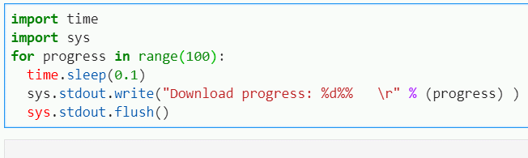

# python 的 20 个小技巧

Python 有非常多有趣使用的技巧，下面列举 20 个短小精炼的用法，其中既包含常规语法，又有第三方库的妙用，体现了 python 简单即美的编程哲学。

### 1.快速实现字频统计

```python
from collections import Counter

words = '''我明白你的意思，你的意思就是想意思意思，但是你不明白我的意思，我的意思是你不用意思意思。'''
word_counts = Counter(words)
top_three = word_counts.most_common(3)
print(top_three)

# 输出：[('意', 8), ('思', 8), ('你', 4)]
```

### 2.汉字转拼音

```python
import pypinyin
words = "床前明月光"
pypinyin.pinyin(words)

# 输出：[['chuáng'], ['qián'], ['míng'], ['yuè'], ['guāng']]
```

### 3.查看某个文件夹里是否有 python 文件（或其他格式文件）

```python
import os
files = os.listdir("E:\\testfile\\")
if any(name.endswith('.py') for name in files):
    print(1)
```

### 4.快速打印字符串

```python
row = ["我", "爱", "python"]
print(*row,sep="")

# 输出：我爱python
```

### 5.计算两个日期间隔天数

```python
from datetime import date
d1 = date(2020,1,1)
d2 = date(2020,9,13)
print(abs(d2-d1).days)

# 输出：256
```

### 6.字符串拆解为键值对

比如'x=11,y=20'拆解成{'x': 42.0, 'y': 1.0}

```python
kvp = lambda elem,t,i: t(elem.split('=')[i])
parse_kvp_str = lambda args : dict([(kvp(elem,str,0), kvp(elem,float,1)) for elem in args.split(',')])
parse_kvp_str('x=11,y=20')

# 输出：{'x': 42.0, 'y': 1.0}
```

### 7.变量值交换

```python
a = 1
b = 2
a, b = b, a
```

### 8.将值追加到字典某个键下的列表中

```python
d = {}
d.setdefault(2, []).append(23)
d.setdefault(2, []).append(11)
d[2]

# 输出：[23, 11]
```

### 9.返回列表中出现次数最多的元素

```python
test = [1, 2, 3, 5, 2, 2, 3, 1, 2, 6, 2]
print(max(set(test), key = test.count))

# 输出：2
```

### 10.查看某个变量占用内存大小

```python
import sys
x = 1
print(sys.getsizeof(x))

# 输出：28
```

### 11.随机返回几个字母组成的单词

```python
import string, random
randword = lambda n: "".join([random.choice(string.ascii_letters) for i in range(n)])

# 输出：'qsNWZF'
```

### 12.从混乱的字符串中分解出单词

```python
words = lambda text: ''.join(c if c.isalnum() else ' ' for c in text).split()
words('Johnny.Appleseed!is:a*good&farmer')

# 输出：['Johnny', 'Appleseed', 'is', 'a', 'good', 'farmer']
```

### 13.打印进度条

```python
import time
import sys
for progress in range(100):
  time.sleep(0.1)
  sys.stdout.write("Download progress: %d%%   \r" % (progress) )
  sys.stdout.flush()
```



### 14.快速反转字符串

```python
a = 'Python is a powerful languange.'
print(a[::-1])

# 输出：.egnaugnal lufrewop a si nohtyP
```

### 15.找出两个列表中不一样的元素

```python
list1 = ['Scott', 'Eric', 'Kelly', 'Emma', 'Smith']
list2 = ['Scott', 'Eric', 'Kelly']

set1 = set(list1)
set2 = set(list2)

list3 = list(set1.symmetric_difference(set2))
print(list3)

# 输出：['Emma', 'Smith']
```

### 16.删除列表中的重复项

```python
listNumbers = [20, 22, 24, 26, 28, 28, 20, 30, 24]
list(set(listNumbers))

# 输出：[20, 22, 24, 26, 28, 30]
```

### 17.将两个列表变为字典

```python
ItemId = [54, 65, 76]
names = ["Hard Disk", "Laptop", "RAM"]
itemDictionary = dict(zip(ItemId, names))
print(itemDictionary)

# 输出：{54: 'Hard Disk', 65: 'Laptop', 76: 'RAM'}
```

### 18.移除字符串中的标点

```python
punctuations = '''!()-[]{};:'"\,<>./?@#$%^&*_~，。！？'''
my_str = "你好，!!我的网名叫作：隔-壁-老-王。"

# 移除标点
no_punct = ""
for char in my_str:
   if char not in punctuations:
       no_punct = no_punct + char

print(no_punct)

# 输出：你好我的名字叫作：隔壁老王
```

### 19.创建一个文件（如果该文件不存在）

```python
import os

MESSAGE = '该文件已经存在.'
TESTDIR = 'testdir'
try:
    home = os.path.expanduser("~")
    print(home)

    if not os.path.exists(os.path.join(home, TESTDIR)):
        os.makedirs(os.path.join(home, TESTDIR))
    else:
        print(MESSAGE)
except Exception as e:
    print(e)
```

### 20.从函数中返回多个值

```python
def f():
    return 1,2,3,4

a,b,c,d = f()
print(a,b,c,d)

# 输出：1,2,3,4
```

### ref：

- https://www.jianshu.com/p/ca078514be7a
