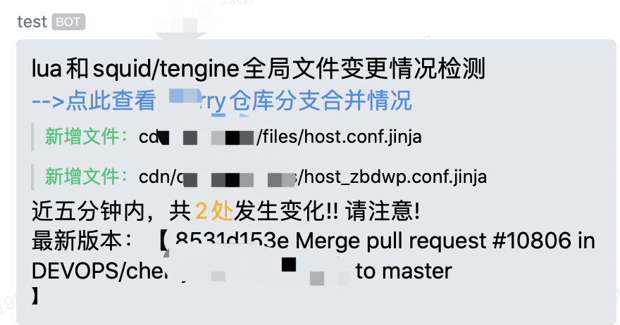

# python 检测 git 仓库文件变更

crontab 定时执行 python 脚本来，定时检查远程的 git 仓库的文件变更，并且将变更的信息 post 到企业微信机器人，机器人自动发生消息到群里。

效果如下：



## 直接上代码：file_check.py

- 相关的依赖自己 pip 安装下
- 第一次执行会在 file_check.py 的同级目录生成 file_check.db 的文件
- 需要将远程的 git 仓库先 clone 到本地的目录

<details>
  <summary>点击展开file_check.py代码</summary>

```python
#!/usr/bin/env python
# -*- coding:utf-8 -*-
# Fixed Time: 2021.11
# author: wengmq

import hashlib
import os
import glob
from sys import path
import time
from typing import Iterable
import sqlite3
from WorkWeixinRobot.work_weixin_robot import WWXRobot
import re

# 获取文件的md5值
def get_md5(file_path):
    md5 = None
    if os.path.isfile(file_path):
        f = open(file_path, 'rb')
        md5_obj = hashlib.md5()
        md5_obj.update(f.read())
        hash_code = md5_obj.hexdigest()
        f.close()
        md5 = str(hash_code).lower()
    return md5

# 获取目录下的所有文件列表（会递归查找该目录下的子文件夹的文件）
def penetrate(root: os.path) -> Iterable:
    for ele in glob.glob(os.path.join(root, '*')):
        if os.path.isdir(ele):
            yield ele
            yield from penetrate(os.path.abspath(ele))
        else:
            yield ele

# 从远程仓库强制拉取文件
def git_pull_file(git_pull_path_root):
    flag = True
    cmd = f'cd {git_pull_path_root} && git checkout -f master && git fetch --all && git reset --hard origin/master'
    print(cmd)
    r = os.system(cmd)
    if r != 0:
        flag = False
    return flag

# 获取最近一次commit信息
def get_last_commit_msg(git_pull_path_root):
    cmd = f'cd {git_pull_path_root} && git log --oneline |head -1'
    process = os.popen(cmd)
    output = process.read()
    process.close()
    return output

# 文件变更检测类
class FIleCheck():
    def __init__(self, wx_robot_key, git_pull_path_root, check_path_root, post_content_list,
                is_debug=False, datebase_name="file_check.db", table_name="stocks"):
        self.is_debug = is_debug
        self.datebase_name = datebase_name
        self.table_name = table_name
        self.change_count = 0
        self.wx_robot_key = wx_robot_key
        self.git_pull_path_root  = git_pull_path_root
        if self.is_debug:
            self.git_pull_path_root = "debug使用的本地仓库绝对路径"
            self.wx_robot_key = "debug使用的企业微信机器人的id"
        self.check_path_root = { self.git_pull_path_root + item[0] : item[1] for item in check_path_root.items() }
        self.post_content_list = post_content_list

    # 判断数据库中是否已经存在tbl_name表
    def table_exists(self, cur, tbl_name):
        sql = f"SELECT count(*) FROM sqlite_master WHERE type='table' AND name='{tbl_name}';"
        cur.execute(sql)
        data = cur.fetchall()
        if data[0][0] > 0:
            return True
        else:
            return False

    # 数据表初始化
    def table_init(self, path_set, cur):
        cur.execute(f'''CREATE TABLE {self.table_name}
                    (path text, md5 text, lastmodify text)''')
        for path in path_set:
            lastmodify = str(time.ctime(os.path.getmtime(path)))
            md5 = get_md5(path)
            if not md5:
                continue
            ins_str = f"INSERT INTO {self.table_name} VALUES ('{path}', '{md5}','{lastmodify}')"
            cur.execute(ins_str)

    # 获取数据库表的所有数据
    def get_all_db_data(self, cur, tbl_name):
        sql = f"select * from {tbl_name};"
        cur.execute(sql)
        data = cur.fetchall()
        return list(data)

    # 获取数据库中指定文件的md5值
    def get_db_md5(self, file_path, all_data):
        for data in all_data:
            if data[0] == file_path:
                return data[1]

    # 企业微信机器人发送数据
    def send_msg_to_wx_rot(self):
        rbt = WWXRobot(key=self.wx_robot_key)
        # 三分钟为crontab定时执行的时间间隔
        self.post_content_list.append(f'### 近三分钟内，共<font color="warning">{self.change_count}处</font>发生变化!! 请注意!')
        self.post_content_list.append("### 最新版本：【 " + str(get_last_commit_msg(self.git_pull_path_root)) + " 】")
        content = '\n'.join(self.post_content_list)
        if self.is_debug:
            print(content)
            print("本地测试，数据监控成功！！")
        rbt.send_markdown(content=content)
        print("企业微信机器人数据发送成功！！")

    # 文件变更检测
    def run(self):
        print(time.strftime("%Y-%m-%d-%H:%M:%S", time.localtime()))
        # 拉取远程master分支
        if not git_pull_file(self.git_pull_path_root):
            print("拉取远程git仓库失败！")

        # 连接数据库
        con = sqlite3.connect(self.datebase_name)
        cur = con.cursor()

        # 检测的目录下的所有文件集合，并且初始化到数据库表中
        path_set = set()
        for path_root, regex in self.check_path_root.items():
            path_set_tmp = set(penetrate(path_root))
            for path in path_set_tmp.copy():
                if not re.match(regex, path):
                    path_set_tmp.remove(path)
            path_set = path_set | path_set_tmp
        is_table_exist = self.table_exists(cur, self.table_name)
        if not is_table_exist:
            self.table_init(path_set, cur)
            con.commit()
            print("table init successed ")

        # 获取数据库所有数据，以及所有文件路径的信息
        all_data = self.get_all_db_data(cur, self.table_name)
        db_paths = [i[0] for i in all_data]

        # 检测新增文件和修改文件
        for file_path in path_set:
            current_file_md5 = get_md5(file_path)
            lastmodify = time.ctime(os.path.getmtime(file_path))
            # 当前目录下的文件，不在数据库记录的文件列表中，说明新增该文件
            if file_path not in db_paths:
                if current_file_md5: # 文件夹不提示
                    ins_str = f"INSERT INTO {self.table_name} VALUES ('{file_path}', '{current_file_md5}','{lastmodify}')"
                    cur.execute(ins_str)
                    self.change_count += 1
                    self.post_content_list.append("><font color=\"green\">新增文件：</font>" + str(file_path).replace(self.git_pull_path_root,"")+ "\n")
                    continue
            # 当前文件的的md5值和数据库中记录的文件的md5值不一样说明文件被修改
            db_file_md5 = self.get_db_md5(file_path, all_data)
            if current_file_md5 and current_file_md5 != db_file_md5:
                upd_str = f"UPDATE {self.table_name} SET md5 = '{current_file_md5}', lastmodify = '{lastmodify}' WHERE path = '{file_path}'"
                cur.execute(upd_str)
                self.change_count += 1
                self.post_content_list.append("><font color=\"#4169E1\">修改文件：</font>" + str(file_path).replace(self.git_pull_path_root,"") + " ，文件最后修改时间：" + str(lastmodify) + "\n")

        # 检测文件是否被删除
        for file_path in db_paths:
            # 数据库记录的文件不在当前文件夹下的文件列表，说明该文件被删除
            if file_path not in path_set:
                del_str = f"DELETE FROM {self.table_name} WHERE path = '{file_path}'"
                cur.execute(del_str)
                self.change_count += 1
                self.post_content_list.append("><font color=\"red\">删除文件：</font>" + str(file_path).replace(self.git_pull_path_root,"") + "\n")

        # 发生文件变更，则企业微信机器人发送消息
        if self.change_count > 0:
            self.send_msg_to_wx_rot()
        else:
            print('没有数据发生变更！！')

        # 保存数据库修改，并且关闭
        con.commit()
        con.close()


if __name__ == "__main__":
    # 相对于git_pull_path_root的相对路径目录
    # key：获取的文件的目录（会递归查找子目录的文件path）
    # value：匹配文件的正则（path匹配上的才会check）
    check_path_root = {
        "cdn/cfg/tengine/" : '.*(lua|vlua|tengine)/[^/]+\.(lua|so|jinja)$',
        "cdn/cfg/squid/" : '.*(squid|files)/[^/]+\.jinja$'
    }
    remote_merge_url = "远程仓库合并信息展示的地址"
    post_content_list = [
            '## xxxx文件变更情况检测',
            f'### [-->点此查看web仓库分支合并情况]({remote_merge_url})',
        ]
    fc = FIleCheck(is_debug = False,
        wx_robot_key = "企业微信机器人的id",
        git_pull_path_root = "本地仓库绝对路径如：/root/wengmq/web/",
        check_path_root = check_path_root,
        post_content_list = post_content_list,
    )
    fc.run()


```

</details>

## 增加执行权限

$ chmod +x file_check.py

## 增加 crontab 任务

- 执行`crontab -e` 修改 crontab
  - 例如每三分钟执行下脚本，并且输出到/var/log/file_check.log 日志，加入下面内容
    - `*/3 * * * * /root/.virtualenvs/p3/bin/python3 /root/wengmq/file_check/file_check.py >> /var/log/file_check.log`
