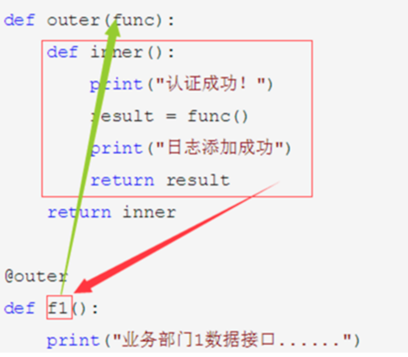

# 装饰器

参考：https://www.liujiangblog.com/course/python/39

### 一、简介

作为许多语言都存在的高级语法之一，装饰器是你必须掌握的知识点。

装饰器（Decorator）：从字面上理解，就是装饰对象的器件。可以在不修改原有代码的情况下，为被装饰的对象增加新的功能或者附加限制条件或者帮助输出。装饰器有很多种，有函数的装饰器，也有类的装饰器。装饰器在很多语言中的名字也不尽相同，它体现的是设计模式中的装饰模式，强调的是开放封闭原则。装饰器的语法是将@装饰器名，放在被装饰对象上面。

简单来说，在调用func()函数的时候，会先将func()函数作为函数传递给dec这个函数的，并执行。

```
@dec
def func():
    pass
```


### 二、装饰器使用的虚拟场景

有一个大公司，下属的基础平台部负责内部应用程序及API的开发。另外还有上百个业务部门负责不同的业务，这些业务部门各自调用基础平台部提供的不同函数，也就是API处理自己的业务，情况如下：

```
# 基础平台部门开发了上百个函数API
def f1():
    print("业务部门1的数据接口......")
def f2():
    print("业务部门2的数据接口......")
def f3():
    print("业务部门3的数据接口......")
def f100():
    print("业务部门100的数据接口......")

#各部门分别调用自己需要的API
f1()
f2()
f3()
f100()
```

公司还在创业初期时，基础平台部就开发了这些函数。由于各种原因，比如时间紧，比如人手不足，比如架构缺陷，比如考虑不周等等，没有为函数的调用进行安全认证。现在，公司发展壮大了，不能再像初创时期的“草台班子”一样将就下去了，基础平台部主管决定弥补这个缺陷，于是就可以用到python的装饰器机制。


## 三、装饰器机制分析

下面以f1函数为例，对装饰器的运行机制进行分析：

```
def outer(func):
    def inner():
        print("认证成功！")
        result = func()
        print("日志添加成功")
        return result
    return inner

@outer
def f1():
    print("业务部门1数据接口......")
```

1. 程序开始运行，从上往下解释，读到`def outer(func):`的时候，发现这是个“一等公民”函数，于是把函数体加载到内存里，然后过。
2. 读到@outer的时候，程序被@这个语法糖吸引住了，知道这是个装饰器，按规矩要立即执行的，于是程序开始运行@后面那个名字outer所定义的函数。
3. 程序返回到outer函数，开始执行装饰器的语法规则。规则是：**被装饰的函数的名字会被当作参数传递给装饰函数。装饰函数执行它自己内部的代码后，会将它的返回值赋值给被装饰的函数**。原来的f1函数被当做参数传递给了func，而f1这个函数名之后会指向inner函数。



注意：@outer和@outer()有区别，没有括号时，outer函数依然会被执行，这和传统的用括号才能调用函数不同，需要特别注意！

另外，是f1这个函数名（而不是f1()这样被调用后）当做参数传递给装饰函数outer，也就是：`func = f1`，`@outer`等于`outer(f1)`,实际上传递了f1的函数体，而不是执行f1后的返回值。

还有，outer函数return的是inner这个函数名，而不是inner()这样被调用后的返回值。

4.程序开始执行outer函数内部的内容，一开始它又碰到了一个函数inner，inner函数定义块被程序观察到后不会立刻执行，而是读入内存中（这是默认规则）。

5.再往下，碰到`return inner`，返回值是个函数名，并且这个函数名会被赋值给f1这个被装饰的函数，也就是`f1 = inner`。根据前面的知识，我们知道，此时f1函数被新的函数inner覆盖了（实际上是f1这个函数名更改成指向inner这个函数名指向的函数体内存地址，f1不再指向它原来的函数体的内存地址），再往后调用f1的时候将执行inner函数内的代码，而不是先前的函数体。那么先前的函数体去哪了？还记得我们将f1当做参数传递给func这个形参么？func这个变量保存了老的函数在内存中的地址，通过它就可以执行老的函数体，你能在inner函数里看到`result = func()`这句代码，它就是这么干的！

6.接下来，还没有结束。当业务部门，依然通过f1()的方式调用f1函数时，执行的就不再是旧的f1函数的代码，而是inner函数的代码。在本例中，它首先会打印个“认证成功”的提示，很显然你可以换成任意的代码，这只是个示例；然后，它会执行func函数并将返回值赋值给变量result，这个func函数就是旧的f1函数；接着，它又打印了“日志保存”的提示，这也只是个示例，可以换成任何你想要的；最后返回result这个变量。我们在业务部门的代码上可以用`r = f1()`的方式接受result的值。

7.以上流程走完后，你应该看出来了，在没有对业务部门的代码和接口调用方式做任何修改的同时，也没有对基础平台部原有的代码做内部修改，仅仅是添加了一个装饰函数，就实现了我们的需求，在函数调用前进行认证，调用后写入日志。这就是装饰器的最大作用。


### 四、装饰器执行结果

装饰器执行结果：

```
In [1]: def outer(func):
   ...:     def inner():
   ...:         print("认证成功！")
   ...:         result = func()
   ...:         print("日志添加成功")
   ...:         return result
   ...:     return inner
   ...:

In [2]: @outer
   ...: def f1():
   ...:     print("业务部门1数据接口......")
   ...:

In [3]: f1()
认证成功！
业务部门1数据接口......
日志添加成功
```


 上面装饰器执行结果和下面不用装饰器执行结果是一致的：

```
In [1]: def outer(func):
   ...:     def inner():
   ...:         print("认证成功！")
   ...:         result = func()
   ...:         print("日志添加成功")
   ...:         return result
   ...:     return inner
   ...:

In [2]: def f2():
   ...:     print("业务部门2数据接口......")
   ...:

In [3]: outer(f2)()
认证成功！
业务部门2数据接口......
日志添加成功
```


