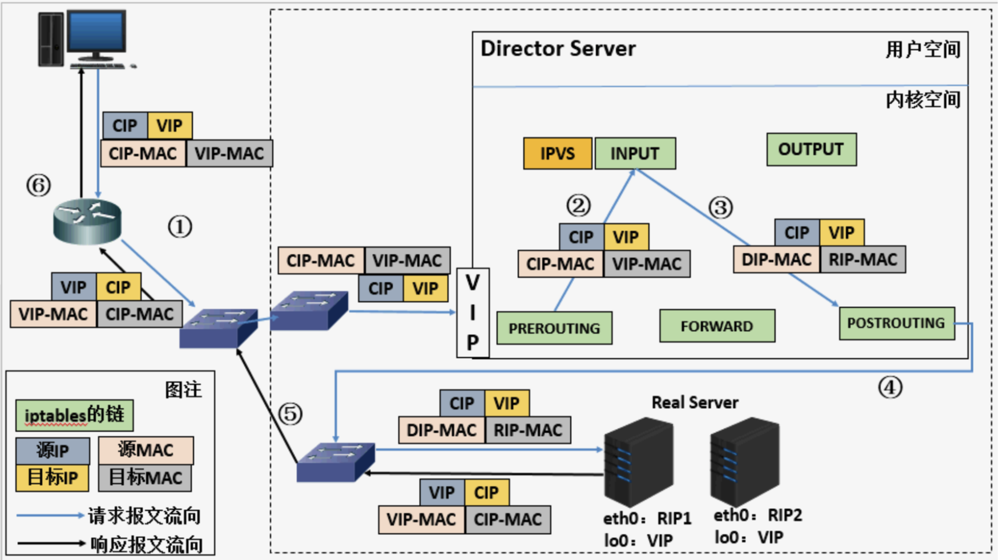
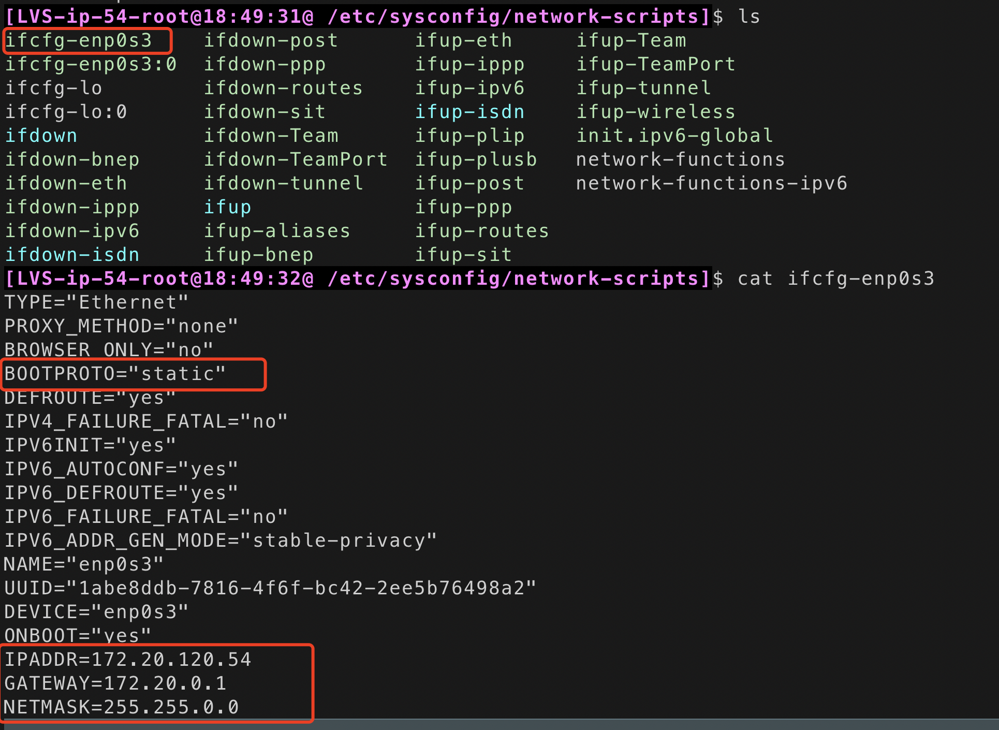
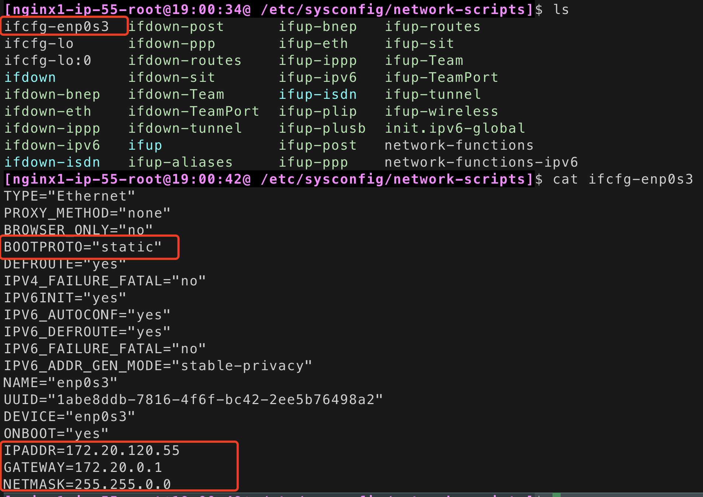
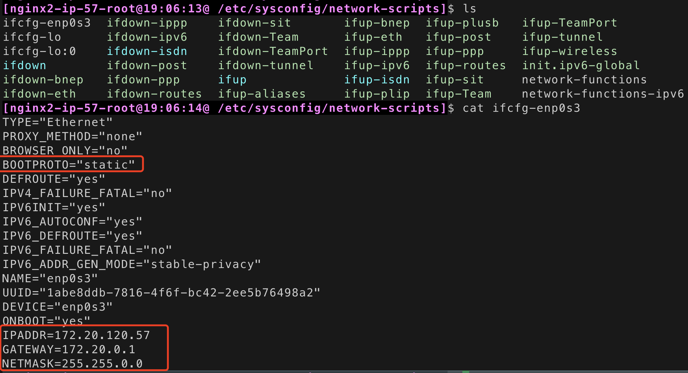
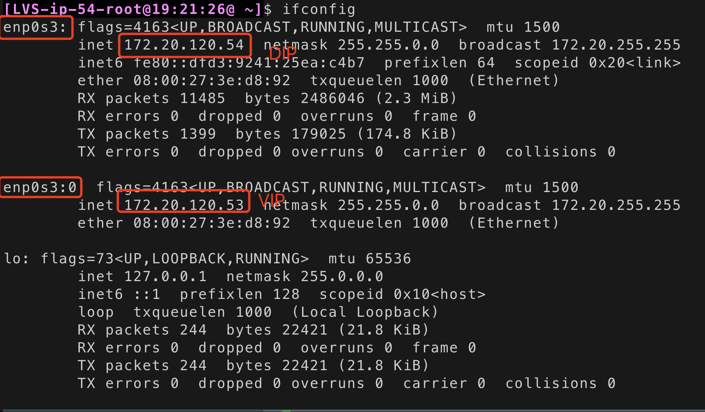
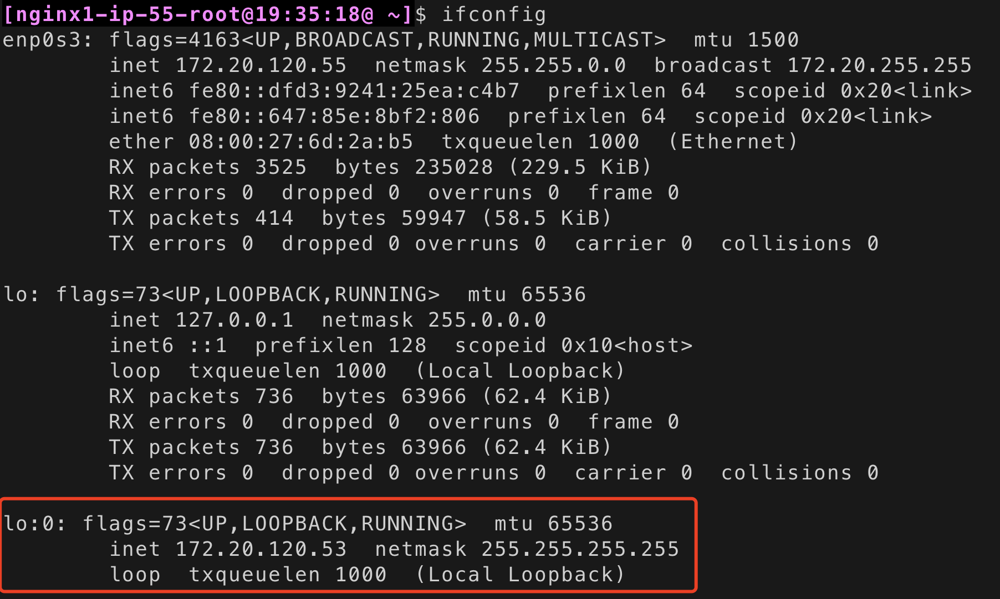
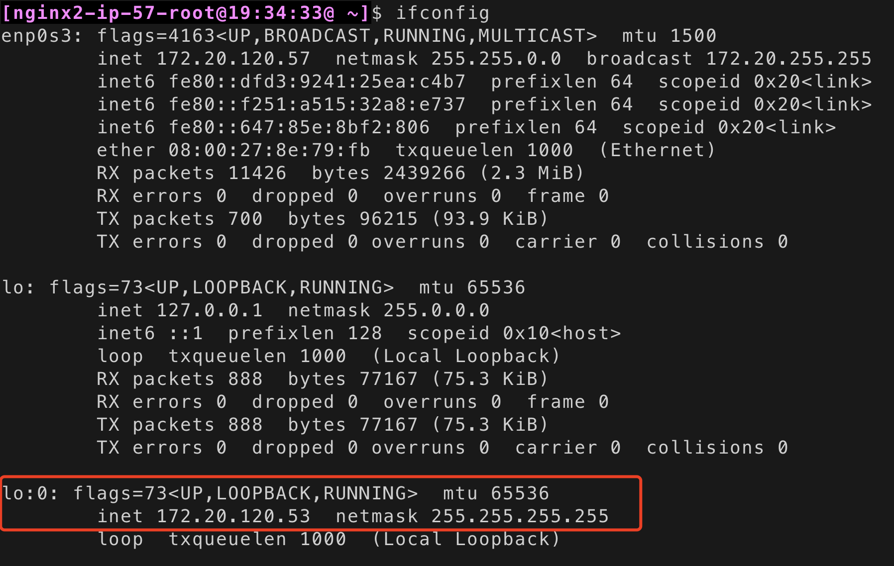
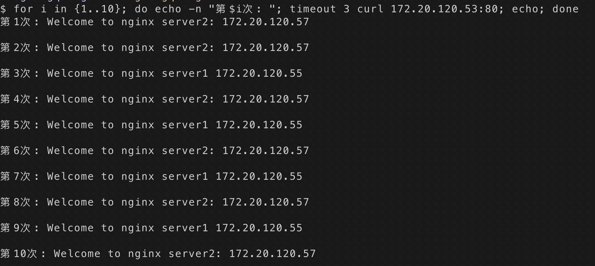

# LVS 之DR模式-实验

## 一、基础概念

**LVS**：Linux Virtual Server的简写，即Linux虚拟服务器。是一个虚拟的服务器集群。 LVS是一个负载均衡的开源软件，工作在四层，传输层。

**LVS的体系结构**：client访问lvs，lvs根据调度算法转发请求给后端服务器，在不同的工作模式下，服务器响应给client的方式也不一样。

**LVS的工作模式**：四种工作模式分别为NAT、TUN、DR和FULLNAT。常用的工作模式为NAT和DR（最常用）。

 **DR工作模式：**

- 首先用户用CIP请求VIP。
- 根据下图可以看到,不管是Director Server还是Real Server上都需要配置相同的VIP,那么当用户请求到达我们的集群网络的前端路由器的时候,请求数据包的源地址为CIP目标地址为VIP,此时路由器会发广播问谁是VIP,那么我们集群中所有的节点都配置有VIP,此时谁先响应路由器那么路由器就会将用户请求发给谁,这样一来我们的集群系统是不是没有意义了,那我们可以在网关路由器上配置静态路由指定VIP就是Director Server,或者使用一种机制不让Real Server 接收来自网络中的ARP地址解析请求,这样一来用户的请求数据包都会经过Director Servrer。
- 当用户请求到达Director Server，此时请求的数据报文会先到内核空间的PREROUTING链。 此时报文的源IP为CIP，目标IP为VIP。
-  PREROUTING检查发现数据包的目标IP是本机，将数据包送至INPUT链。
-  IPVS比对数据包请求的服务是否为集群服务，若是，将请求报文中的源MAC地址修改为DIP的MAC地址，将目标MAC地址修改RIP的MAC地址，然后将数据包发至POSTROUTING链。 此时的源IP和目的IP均未修改，仅修改了源MAC地址为DIP的MAC地址，目标MAC地址为RIP的MAC地址
-  由于DS和RS在同一个网络中，所以是通过二层来传输。POSTROUTING链检查目标MAC地址为RIP的MAC地址，那么此时数据包将会发至Real Server。
-  RS发现请求报文的MAC地址是自己的MAC地址，就接收此报文。处理完成之后，将响应报文通过lo接口传送给eth0网卡然后向外发出。 此时的源IP地址为VIP，目标IP为CIP
- 响应报文最终送达至客户端。




**LVS的调度算法**：

- 静态：rr（轮询）、wrr（加权轮询）、sh（源哈希）、dh（目标地址哈希）
- 动态：lc（最少连接）、wlc（默认调度算法，加权最少连接）、sed（初始连接高权重优先，最短期望延迟，基于wlc算法）、nq（第一轮均匀分配，后续SED，永不排队。）、lblc（动态的DH算法，使用场景：根据负载状态实现正向代理，基于举报的最少连接）、lblcr（带复制功能的LBLC，解决LBLC负载不均衡问题，从负载重的复制到负载轻的RS。）


## 二、LVS之DR模式 实验流程

- #### 环境说明（建议在虚拟机上面操作）

| **LVS服务器(DS)**     | **DIP：172.20.120.54** | **VIP：172.20.120.53** |
| --------------------- | ---------------------- | ---------------------- |
| **nginx1服务器(RS1)** | **RIP：172.20.120.55** | **VIP：172.20.120.53** |
| **nginx2服务器(RS2)** | **RIP：172.20.120.57** | **VIP：172.20.120.53** |
| **测试机**            | **IP：172.20.120.50**  |                        |

- #### 这三台机器分别配置了对应的本地静态地址DIP和RIP，VIP稍后配置。

  - LVS的DIP设置：设置``/etc/sysconfig/network-scripts``目录下的``ifcfg-enp0s3文件``，设置为静态IP，网口enp0s3的DIP为：172.20.120.54 ，以及设置对应的网关和子网掩码。文件保存之后，需要：``service network restart`` 重启网络，生效的内网IP可以通过可以通过``ifconfig|grep net``查看
    - 
  - RS1和RS2的RIP设置同理：
    - 
    - 
  - LVS和RS的需要在同一个内网，修改完静态ip之后可以互相ping下看是否可以通

- #### 搭建http服务

  - 我这边RS机器都是搭建openresty，直接用yum命令按照，安装过程自行网上查找。
  - 安装好之后，开启openresty（默认监听80端口）并且修改对呀首页响应数据（为了区分不同RS的）
    - 
    - 

- #### LVS服务器设置

  - LVS是被编译进内核中，主要分为两部分ipvs和ipvsadm，ipvs是LVS软件核心，是运行在LB上的，这是个基于ip层的负载均衡；ipvsadm是用户空间的集群管理工具。

  - ```
    yum install -y ipvsadm
    # 安装用户管理工具
    
    lsmod |grep ip_vs
    # 确保内核加载了lvs模块
    ```

  - 要想起到负载均衡效果，那么所有请求报文必须发往LVS服务器(DS)，然后DS根据指定算法分发到后端服务器上，因此DS必须配置VIP地址，VIP是与公网client通信地址，这样DS才能接受到请求报文进行分发。这里的LVS服务器的VIP可以使用一个临时的ip，直接使用ifconfig命令设置：``ifconfig enp0s3:0 172.20.120.53``  （机器重启之后就失效）

    

    

  - IPVS规则设置：

  - ```
    # 添加虚拟服务，指定IP、端口、-s rr 表示负载均衡算法为轮询
    ipvsadm -A -t 172.20.120.53:80 -s rr
    
    # 添加nginx服务器，指定DR模式，指定权重为1 (-g表示使用DR模式，-w指定权重)
    ipvsadm -a -t 172.20.120.53:80 -r 172.20.120.55 -g -w 1
    ipvsadm -a -t 172.20.120.53:80 -r 172.20.120.57 -g -w 1
    
    ```

- #### RS服务器设置

  - DR模式只是针对源和目标MAC地址做出修改，源和目标IP还是不变；当请求报文由LVS服务器处理后发送到后端服务器RS上，RS拆封报文时会发现目标MAC是自己的MAC地址，但是目标IP是VIP，与本地IP地址不符合，那么RS就会认为不是发给自己的报文，所以此时需要在RS上配置VIP，这样RS就可以接受目标地址为VIP的请求报文了。

  - 如果将VIP设置在RS的网卡上，假设有多台RS并且每台RS上都配置了VIP，在这个网络中发出VIP的ARP请求，就有多个RS响应，这样肯定是不可以；因此就把VIP配置到回环地址lo网卡上，然后让lo网卡忽略所有ARP请求，eth0网卡正常响应ARP请求，这样网络中就不会收到RS关于VIP的响应；还有一个问题就是当本地网卡响应ARP请求时，也有可能通过lo网卡回应，然后把VIP作为ARP请求的源IP通告出去，那么就必须禁止VIP作为ARP请求的源IP，这个问题可以通过修改arp_announce参数解决。

  - 由于客户端发起的请求报文源IP为CIP，目标IP为VIP；所以客户端收到的响应报文源IP必须为VIP，目标IP必须为CIP，因此在RS发送的响应报文必须由VIP的lo网卡发出，这就需要在RS上指定一条路由，目标IP为VIP的数据包使用lo网卡发出，然后经由eth0转发到网关再到公网客户端。

  - **这里需要操作的是添加IP地址为VIP的虚拟网卡lo:0**

  - ```
    cp /etc/sysconfig/network-scripts/ifcfg-lo /etc/sysconfig/network-scripts/ifcfg-lo:0
    
    vim /etc/sysconfig/network-scripts/ifcfg-lo:0
    ```

  - 修改IPADDR 为VIP：172.20.120.53，NETMASK为：255.255.255.255，DEVICE为：lo:0

    具体配置如下：

    ```
    DEVICE=lo:0
    IPADDR=172.20.120.53
    NETMASK=255.255.255.255
    NETWORK=127.0.0.0
    # If you're having problems with gated making 127.0.0.0/8 a martian,
    # you can change this to something else (255.255.255.255, for example)
    BROADCAST=127.255.255.255
    ONBOOT=yes
    NAME=loopback
    ```

  - 重启网络：service network restart ，这时可以看到

  - 

  - 

  - 将对应网卡设置为只回应目标IP为自身接口地址的ARP请求；将ARP请求的源IP设置为eth0上的IP，也就是RIP；添加一条路由，目标IP为VIP的数据包使用lo接口发送，这样响应报文的源IP就会为VIP。按顺序执行下列操作：

    - ```
      # 将对应网卡设置为只回应目标IP为自身接口地址的ARP请求
      echo "1" > /proc/sys/net/ipv4/conf/lo/arp_ignore
      echo "1" > /proc/sys/net/ipv4/conf/all/arp_ignore
      
      # 将ARP请求的源IP设置为eth0上的IP，也就是RIP
      echo "2" > /proc/sys/net/ipv4/conf/lo/arp_announce
      echo "2" > /proc/sys/net/ipv4/conf/all/arp_announce
      
      # 必须完成以上设置，才可继续
      # 添加一条路由，目标IP为VIP的数据包使用lo接口发送，这样响应报文的源IP就会为VIP
      route add -host 172.20.120.53 dev lo:0
      ```

      

## 三、测试

在本地的测试机（172.20.120.50）对着vip发起多次请求，可以看到请求会轮询走到后端的RS服务器上

```
 for i in {1..10}; do echo -n "第$i次: "; timeout 3 curl 172.20.120.53:80; echo; done
```




## 四、参考

- http://jr.baishancloud.com:8090/pages/viewpage.action?pageId=126157717

  