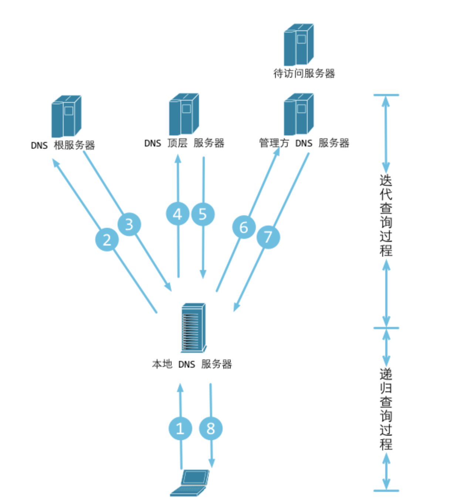

## 一、DNS 简介

### 什么是 DNS？

**域名系统**（英文：Domain Name System，[缩写](https://baike.baidu.com/item/缩写)：**DNS**）是[互联网](https://baike.baidu.com/item/互联网)的一项服务。它作为将[域名](https://baike.baidu.com/item/域名)和[IP 地址](https://baike.baidu.com/item/IP地址)相互[映射](https://baike.baidu.com/item/映射)的一个[分布式数据库](https://baike.baidu.com/item/分布式数据库)，能够使人更方便地访问[互联网](https://baike.baidu.com/item/互联网)。DNS 使用[UDP](https://baike.baidu.com/item/UDP)[端口](https://baike.baidu.com/item/端口)53。**用户使用域名地址，该系统就会自动把域名地址转为 IP 地址**。域名服务是运行域名系统的 Internet 工具。执行域名服务的服务器称之为 DNS 服务器，通过 DNS 服务器来应答域名服务的查询。

### 为什么需要 DNS？

域名系统(Domain Name System,[DNS](https://baike.baidu.com/item/DNS))是[Internet](https://baike.baidu.com/item/Internet)上解决网上机器命名的一种系统。就像拜访朋友要先知道别人家怎么走一样，Internet 上当一台[主机](https://baike.baidu.com/item/主机)要访问另外一台主机时，必须首先获知其地址，[TCP](https://baike.baidu.com/item/TCP)/IP 中的[IP 地址](https://baike.baidu.com/item/IP地址)是由四段以“.”分开的数字组成(此处以 IPv4 的地址为例，IPv6 的地址同理)，记起来总是不如名字那么方便，所以，就采用了域名系统来管理名字和 IP 的对应关系。

虽然因特网上的节点都可以用 IP 地址唯一标识，并且可以通过 IP 地址被访问，但即使是将 32 位的二进制 IP 地址写成 4 个 0 ～ 255 的十位数形式，也依然太长、太难记。因此，人们发明了域名(Domain Name)，域名可将一个 IP 地址关联到一组有意义的字符上去。用户访问一个网站的时候，既可以输入该网站的 IP 地址，也可以输入其域名，对访问而言，两者是等价的。例如：微软公司的 Web 服务器的 IP 地址是 207.46.230.229，其对应的域名是www.microsoft.com，不管用户在浏览器中输入的是207.46.230.229还是www.microsoft.com，都可以访问其Web网站。

一个公司的 Web 网站可看作是它在网上的门户，而域名就相当于其门牌地址，通常域名都使用该公司的名称或简称。例如上面提到的微软公司的域名，类似的还有：IBM 公司的域名是www.ibm.com、Oracle公司的域名是www.oracle.com、Cisco公司的域名是www.cisco.com等。当人们要访问一个公司的Web网站，又不知道其确切域名的时候，也总会首先输入其公司名称作为试探。但是，由一个公司的名称或简称构成的域名，也有可能会被其他公司或个人抢注。甚至还有一些公司或个人恶意抢注了大量由知名公司的名称构成的域名，然后再高价转卖给这些公司，以此牟利。已经有一些域名注册纠纷的仲裁措施，但要从源头上控制这类现象，还需要有一套完整的限制机制，这个还没有。所以，尽早注册由自己名称构成的域名应当是任何一个公司或机构，特别是那些著名企业必须重视的事情。有的公司已经对由自己著名品牌构成的域名进行了保护性注册。

## 二、域名解析过程

- 1.在浏览器中输入www.qq.com域名，操作系统会先检查自己本地的hosts文件是否有这个网址映射关系，如果有，就先调用这个IP地址映射，完成域名解析。

- 2.如果 hosts 里没有这个域名的映射，则查找本地 DNS 解析器缓存，是否有这个网址映射关系，如果有，直接返回，完成域名解析。

- 3.如果 hosts 与本地 DNS 解析器缓存都没有相应的网址映射关系，首先会找 TCP/IP 参数中设置的首选 DNS 服务器，在此我们叫它本地 DNS 服务器（虽然叫做本地 DNS 但是并不在本地，而是由各运营商维护的远程服务器），此服务器收到查询时，如果要查询的域名，包含在本地配置区域资源中，则返回解析结果给客户机，完成域名解析，此解析具有权威性。

- 4.如果要查询的域名，不由本地 DNS 服务器区域解析，但该服务器已缓存了此网址映射关系，则调用这个 IP 地址映射，完成域名解析，此解析不具有权威性。

- 5.如果本地 DNS 服务器本地区域文件与缓存解析都失效，则根据本地 DNS 服务器的设置（是否设置转发器）进行查询，如果未用转发模式，本地 DNS 就把请求发至 “根 DNS 服务器”，“根 DNS 服务器”收到请求后会判断这个域名(.com)是谁来授权管理，并会返回一个负责该顶级域名服务器的一个 IP。本地 DNS 服务器收到 IP 信息后，将会联系负责.com 域的这台服务器。这台负责.com 域的服务器收到请求后，如果自己无法解析，它就会找一个管理.com 域的下一级 DNS 服务器地址(qq.com)给本地 DNS 服务器。当本地 DNS 服务器收到这个地址后，就会找 qq.com 域服务器，重复上面的动作，进行查询，直至找到www.qq.com主机。

- 6.如果用的是转发模式，此 DNS 服务器就会把请求转发至上一级 DNS 服务器，由上一级服务器进行解析，上一级服务器如果不能解析，或找根 DNS 或把转请求转至上上级，以此循环。不管是本地 DNS 服务器用是是转发，还是根提示，最后都是把结果返回给本地 DNS 服务器，由此 DNS 服务器再返回给客户机。

## 三、递归查询与迭代查询

### 递归查询：

- 主机向本地域名服务器的查询一般都是采用递归查询。

- 所谓递归查询就是：如果主机所询问的本地域名服务器不知道被查询的域名的 IP 地址，那么本地域名服务器就以 DNS 客户的身份，

- 向其它根域名服务器继续发出查询请求报文(即替主机继续查询)，而不是让主机自己进行下一步查询。因此，递归查询返回的查询结果或者是所要查询的 IP 地址，或者是报错，表示无法查询到所需的 IP 地址。

### 迭代查询：

- 本地域名服务器向根域名服务器的查询的迭代查询。
- 迭代查询的特点：当根域名服务器收到本地域名服务器发出的迭代查询请求报文时，要么给出所要查询的 IP 地址，要么告诉本地服务器：“你下一步应当向哪一个域名服务器进行查询”。
- 然后让本地服务器进行后续的查询。根域名服务器通常是把自己知道的顶级域名服务器的 IP 地址告诉本地域名服务器，让本地域名服务器再向顶级域名服务器查询。
- 顶级域名服务器在收到本地域名服务器的查询请求后，要么给出所要查询的 IP 地址，要么告诉本地服务器下一步应当向哪一个权限域名服务器进行查询。
- 最后，知道了所要解析的 IP 地址或报错，然后把这个结果返回给发起查询的主机

## DNS 缓存机制

关于 DNS 缓存的机制，有一篇非常详细的文章[What really happens when you navigate to a URL](http://igoro.com/archive/what-really-happens-when-you-navigate-to-a-url/)。

简单来说，一条域名的 DNS 记录会在本地有两种缓存：浏览器缓存和[操作系统](http://lib.csdn.net/base/operatingsystem)(OS)缓存。在浏览器中访问的时候，会优先访问浏览器缓存，

如果未命中则访问 OS 缓存，最后再访问 DNS 服务器(一般是 ISP 提供)，然后 DNS 服务器会递归式的查找域名记录，然后返回。

DNS 记录会有一个 ttl 值(time to live)，单位是秒，意思是这个记录最大有效期是多少。经过实验，OS 缓存会参考 ttl 值，但是不完全等于 ttl 值，

而浏览器 DNS 缓存的时间跟 ttl 值无关，每种浏览器都使用一个固定值。

这里有一篇文章，做过详细的测试[Why Web Browser DNS Caching Can Be A Bad Thing](http://dyn.com/web-browser-dns-caching-bad-thing/)：

Windows 访问 DNS 后会把记录保存一段短暂的时间，

可通过 ipconfig /displaydns 查看 windows 的 DNS 缓存、通过 ipconfig /flushdns 来清除。

### 参考：

- [DNS 百度百科](https://baike.baidu.com/item/%E5%9F%9F%E5%90%8D%E7%B3%BB%E7%BB%9F/2251573?fromtitle=DNS&fromid=427444&fr=aladdin)
- [DNS 递归查询与迭代查询](https://www.cnblogs.com/qingdaofu/p/7399670.html)
