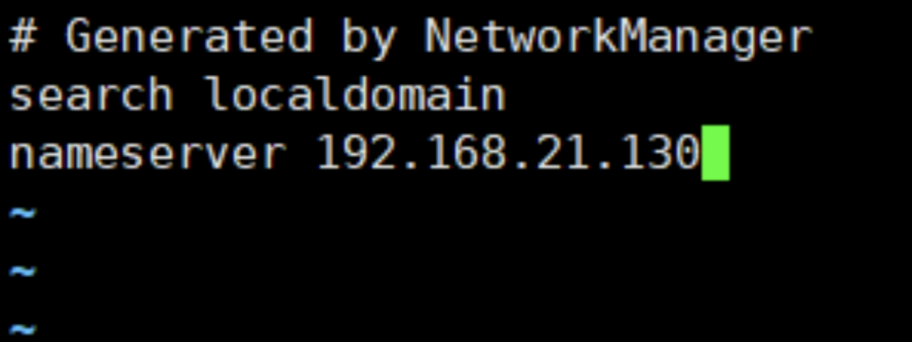
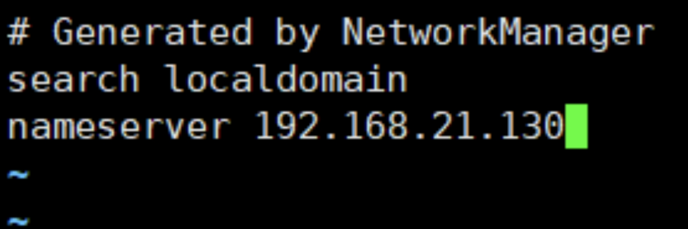

# 基于 bind 的 DNS 解析实验

## 一、实验要求

- 1.支持正向解析（在 DNS 域名解析服务中，正向解析是指根据域名（主机名）查找到对应的 IP 地址，正向解析是 DNS 最基本也是最常用的功能）

- 2.支持反向解析，根据 IP 地址查询域名

- 3.支持递归查找

- 4.需要给出具体步骤，以及实验结果截图

## 二、实验过程

### 1、bind 软件的安装

yum 工具安装：yum -y install bind

### 2、DNS 正向解析

#### 2.1.修改主配置文件

vi /etc/named.conf

修改以下两行：

listen-on port 53

allow-query


#### 2.2.创建域名

vi /etc/named.conf

在后面添加以下代码：（wengmq.com 为我们要解析的域名）

```
zone "wengmq.com." IN {

	type master;

	file "wengmq.com.zone";

	allow-update { none; };

};
```


#### 2.3.创建正向区域配置文件

vi /var/named/wengmq.com.zone

加入以下代码：

```
$TTl 1D

@        IN        SOA www.wengmq.com. admin.wengmq.com (

                      20190311

                      1H

                      5M

                      1W

                      1D )


@    IN    NS    www.wengmq.com.

  IN    MX    10    mail.wengmq.com.

www   IN    A    192.168.21.130

mail   IN    A    192.168.21.130
```


一般写的[MX 记录](https://www.baidu.com/s?wd=MX记录&tn=SE_PcZhidaonwhc_ngpagmjz&rsv_dl=gh_pc_zhidao)前面是空白.
在 ZONE 文件里前面空是指跟上一行同位置的内容一样.

#### 2.4.修改文件属性

chown named:named /var/named/ -R


#### 2.5.重启服务

service named restart


#### 2.6.设置本机使用的 DNS 服务器地址

vi /etc/resolv.conf

把 nameserver 设为本机的 IP 地址



#### 2.7.测试


不想修改本机的 DNS 地址也可以使用 dig 命令测试（@127.0.0.1 表示使用本机作为 DNS 服务器）

dig www.wengmq.com @127.0.0.1


## 3、DNS 逆向解析

#### 3.1.创建反向解析域名

vi /etc/named.conf

这里我们同样可以利用上面的模板进行更改，这里要注意反向区域的文件格式，是由倒序的网络地址和 in-addr.arpa 组合而成，这里的倒序 IP 只需要写前三位，最后一位是在数据文件中进行配置的，这里我将区域数据配置文件名设为 21.168.192.db


#### 3.2.创建反向区域配置文件

vi /var/named/21.168.192.db

输入以下内容：

```
@        IN SOA www.wengmq.com. root.wengmq.com (

                    20190311

                    1H

                    5M

                    1W

                    1D )


@ IN NS www.wengmq.com.

130 IN PTR wengmq.com.

130 IN PTR www.wengmq.com

130 IN PTR mail.wengmq.com
```


#### 3.3.修改文件属性

chown named:named /var/named/ -R


#### 3.4.重启服务

service named restart


#### 3.5.设置本机使用的 DNS 服务器地址

vi /etc/resolv.conf

把 nameserver 设为本机的 IP 地址



#### 3.6.测试

nslookup 192.168.21.130


## 四、支持递归查找

vi /etc/named.conf


