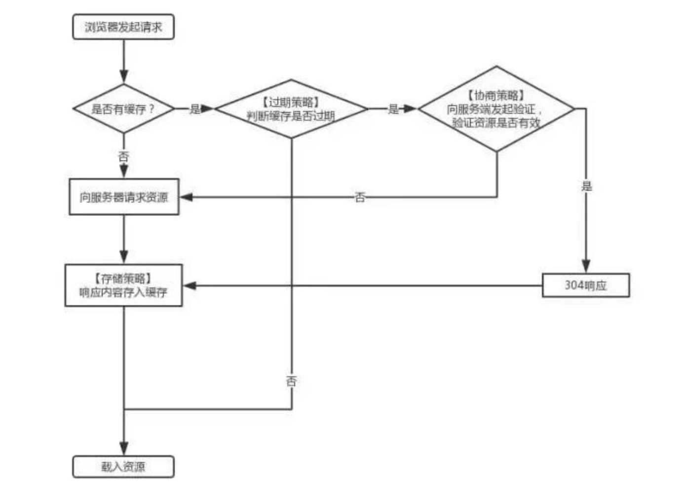
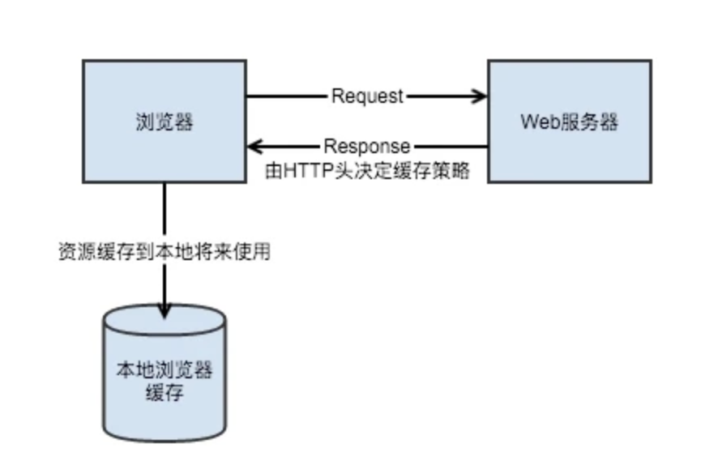

# http 缓存机制

## 一、简介

首先了解下，在浏览器中发起一次请求的过程，对着这张图先发呆 30 秒~

## 二、浏览器的缓存机制

简单来说，浏览器缓存其实就是浏览器保存通过 HTTP 获取的所有资源,是浏览器将网络资源存储在本地的一种行为。

#### 缓存的资源去哪里了?

你可能会有疑问,浏览器存储了资源,那它把资源存储在哪里呢？

#### memory cache

> MemoryCache 顾名思义，就是将资源缓存到内存中，等待下次访问时不需要重新下载资源，而直接从内存中获取。Webkit 早已支持 memoryCache。
> 目前 Webkit 资源分成两类，一类是主资源，比如 HTML 页面，或者下载项，一类是派生资源，比如 HTML 页面中内嵌的图片或者脚本链接，分别对应代码中两个类：MainResourceLoader 和 SubresourceLoader。虽然 Webkit 支持 memoryCache，但是也只是针对派生资源，它对应的类为 CachedResource，用于保存原始数据（比如 CSS，JS 等），以及解码过的图片数据。

#### disk cache

> DiskCache 顾名思义，就是将资源缓存到磁盘中，等待下次访问时不需要重新下载资源，而直接从磁盘中获取，它的直接操作对象为 CurlCacheManager。

|          | memory cache                       | disk cache                          |
| -------- | ---------------------------------- | ----------------------------------- |
| 相同点   | 只能存储一些派生类资源文件         | 只能存储一些派生类资源文件          |
| 不同点   | 退出进程时数据会被清除             | 退出进程时数据不会被清除            |
| 存储资源 | 一般脚本、字体、图片会存在内存当中 | 一般非脚本会存在内存当中，如 css 等 |

**因为 CSS 文件加载一次就可渲染出来,我们不会频繁读取它,所以它不适合缓存到内存中,但是 js 之类的脚本却随时可能会执行,如果脚本在磁盘当中,我们在执行脚本的时候需要从磁盘取到内存中来,这样 IO 开销就很大了,有可能导致浏览器失去响应。**

#### 访问缓存优先级

1. 先在内存中查找,如果有,直接加载。
2. 如果内存中不存在,则在硬盘中查找,如果有直接加载。
3. 如果硬盘中也没有,那么就进行网络请求。
4. 请求获取的资源缓存到硬盘和内存。

## 三、http 缓存的分类

- **强缓存**：强制缓存整体流程比较简单，就是在第一次访问服务器取到数据之后，第二次请求时会根据 header 中的信息的过期时间判断文件是否过期，如果文件不过期则直接使用缓存中的资源不会再向服务器发送请求。
  这里的 header 中的信息指的是 `expires`和 `cahe-control`.
- ## **协商缓存**：当强缓存没有命中的时候，浏览器会发送一个请求到服务器，服务器根据 header 中的部分信息来判断是否命中缓存。如果命中，则返回 304 ，告诉浏览器资源未更新，可使用本地的缓存。这里的 header 中的信息指的是 `Last-Modified & If-Modified-Since`和 `ETag & If-None-Match`，通常 Last-Modified 和 If-Modified-Since 搭配使用，ETag 和 If-None-Match 搭配使用。

### 3.1 强缓存

### [**Expires 响应头**](https://developer.mozilla.org/zh-CN/docs/Web/HTTP/Headers/Expires)

**Expires**字段是 http1.0 时的规范，它的值为一个绝对时间的 GMT 格式的时间字符串，比如 Expires:Mon,18 Oct 2066 23:59:59 GMT。这个时间代表着这个资源的失效时间，在此时间之前，即命中缓存。这种方式有一个明显的缺点，由于失效时间是一个绝对时间，所以当服务器与客户端时间偏差较大时，就会导致缓存混乱。

### [**Cache-Control 响应头**](https://developer.mozilla.org/zh-CN/docs/Web/HTTP/Headers/Cache-Control)

**Cache-Control** 是 http1.1 时出现的 header 信息，主要是利用该字段的 max-age 值来进行判断，它是一个相对时间，例如 Cache-Control:max-age=3600，代表着资源的有效期是 3600 秒。cache-control 除了该字段外，还有下面几个比较常用的设置值：

- no-cache：需要进行协商缓存，发送请求到服务器确认是否使用缓存。
- no-store：禁止使用缓存，每一次都要重新请求数据。
- public：可以被所有的用户缓存，包括终端用户和 CDN 等中间代理服务器。
- private：只能被终端用户的浏览器缓存，不允许 CDN 等中继缓存服务器对其缓存。
- Cache-Control 与 Expires 可以在服务端配置同时启用，同时启用的时候 Cache-Control 优先级高。

如果 Cache-Control 和 Expires 同时出现，则 Cache-Control 有更高的优先级。

## 3.2 协商缓存

#### [Last-Modified 响应头](https://developer.mozilla.org/zh-CN/docs/Web/HTTP/Headers/Last-Modified) & [If-Modified-Since 请求头](https://developer.mozilla.org/zh-CN/docs/Web/HTTP/Headers/If-Modified-Since)

浏览器第一次请求一个资源的时候，服务器返回的 header 中会加上**`Last-Modified`**，**`Last-Modified`** 是一个时间标识该资源的最后修改时间，例如：`Wed, 21 Oct 2015 07:28:00 GMT`，这里 GTM 表示使用的国际标准时间，换成中国的世界还要再+8 个小时。

如果浏览器本地的缓存过期，当浏览器再次请求该资源时，request 的请求头中会包含 **`If-Modified-Since`**，该值为缓存之前返回的 **`If-Modified-Since`**。服务器收到**`If-Modified-Since`** 后，根据资源的最后修改时间判断是否命中缓存。

服务器只在所请求的资源在给定的日期时间之后对内容进行过修改的情况下才会将资源返回，状态码为 [`200`](https://developer.mozilla.org/zh-CN/docs/Web/HTTP/Status/200)

如果请求的资源从那时起未经修改，那么返回一个不带有消息主体的 [`304`](https://developer.mozilla.org/zh-CN/docs/Web/HTTP/Status/304) 响应，而在 [`Last-Modified`](https://developer.mozilla.org/zh-CN/docs/Web/HTTP/Headers/Last-Modified) 首部中会带有上次修改时间

**缺点:**

> 短时间内资源发生了改变，Last-Modified 并不会发生变化。
>
> 周期性变化。如果这个资源在一个周期内修改回原来的样子了，我们认为是可以使用缓存的，但是 Last-Modified 可不这样认为,因此便有了 ETag。

#### [ETag 响应头](https://developer.mozilla.org/zh-CN/docs/Web/HTTP/Headers/ETag) & [If-None-Match 请求头](https://developer.mozilla.org/zh-CN/docs/Web/HTTP/Headers/If-None-Match)

与 `Last-Modified&If-Modified-Since` 不同的是，`Etag&If-None-Match` 返回的是一个校验码（ 没有明确指定生成 ETag 值的方法。 通常，使用内容的散列，最后修改时间戳的哈希值，或简单地使用版本号。），例如起请求的时候携带头部：`If-None-Match: "33a64df551425fcc55e4d42a148795d9f25f89d4"`。ETag 用来保证每一个资源是唯一的，如果给定 URL 中的资源更改，则一定要生成新的 Etag 值。服务器根据浏览器上送的 If-None-Match 值来判断是否命中缓存。

服务器将客户端的 ETag（作为 If-None-Match 字段的值一起发送）与其当前版本的资源的 ETag 进行比较，如果两个值匹配（即资源未更改），服务器将返回不带任何内容的[`304`](https://developer.mozilla.org/zh-CN/docs/Web/HTTP/Status/304)未修改状态，告诉客户端缓存版本可用（新鲜）

Last-Modified 与 ETag 是可以一起使用的，服务器会优先验证 ETag，一致的情况下，才会继续比对 Last-Modified，最后才决定是否返回 304。

## 参考：

- https://segmentfault.com/a/1190000017962411
