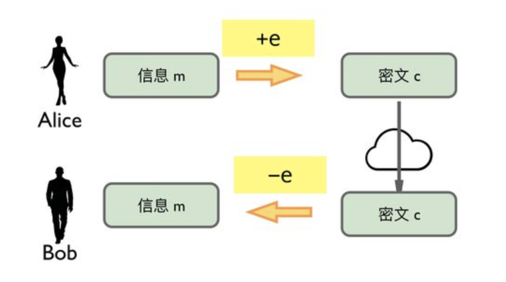
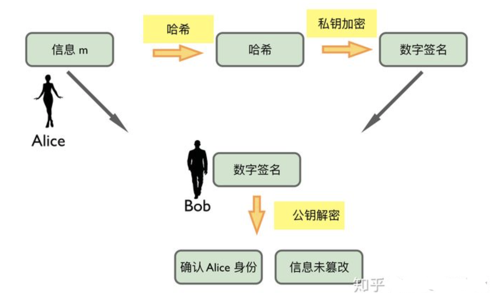

# 对称加密和非对称加密

密码学中有两种技术：一种叫对称加密，另外一种叫非对称加密。

## 对称加密

首先从对称加密说起，这是比较直观的一种加密方式。

基本逻辑是这样。如果 Alice 想把一个信息传递给 Bob 。比如信息是一个数字 m ，Alice 不能把这个数字直接传递给 Bob ，因为互联网是一个不安全的环境，很容易被窃听。所以她可以通过一个加密算法，比如，通过给 m 加上一个数字 e ，得到一个数字 c ，这个 c 就叫做密文。这样 Bob 拿到密文 c ，再减去 e 就可以得到信息 m 了。

比如，想要传递的 m 等于 2，e 等于 1，那么 2+1 得到密文就是 3，3 传递给 Bob 之后，Bob 用 3-1 得到信息 m 了。这个过程中，密文是可以放心的在互联网上传播的，被窃听了也没人能看懂。e 就是密钥，密钥如果一旦泄露了，通信过程就不安全了。当然实际中加密算法以及密钥都必须很复杂，不是简单的加一个数字，因为现在人们的解密手段其实也已经非常高超了。

对称加密的优势是可以加密大段信息，这个是非对称加密做不到的，但是对称加密的问题在于如何能够安全的把密钥传递给对方。因为如果 Alice 不能安全的把密钥传递给 Bob ，那么加密通信就实现不了。而如果不能实现加密通信，那又怎么可能安全的传递密钥呢，所以对称加密在互联网上使用，就有了这个鸡生蛋蛋生鸡的问题。非对称加密被发明出来，就是为了解决对称加密的这个最为致命的痛点。

## 非对称加密

非对称加密之所以不对称，指的就是加密用一个密钥，而解密的时候用的是另外一个密钥。

这个过程是这样的。Bob 作为接收信息的一方，首先要生成一对儿密钥，一个叫做公钥，意思就是可以公开出去的密钥。另外一个叫做私钥，也就是要私密保存的。注意这一对儿密钥是有天然的数学联系的，不然也不可能用公钥加密后能用私钥解密。具体这个联系是什么，可以参考 RSA 算法 [https://learning.nervos.org/crypto-block/8-idea](https://link.zhihu.com/?target=https%3A//learning.nervos.org/crypto-block/8-idea) ，我们这里就不展开了。接下来，Bob 把自己的公钥传递给 Alice ，Alice 用 Bob 的公钥去加密信息 m 得到密文 c 。Bob 拿到密文 c 之后，注意这里就体现出来不对称了，因为 Bob 解密用的不是公钥，而是自己的私钥。

咱们思考一下这个过程里面的安全性。暴露在互联网上的首先是公钥，然后是密文，非对称加密的算法本身是公开的。但是即使公钥密文算法都被攻击者拿到，他也不能解密拿到信息的。所以整个过程是安全的。非对称加密本身没有对称加密的鸡生蛋的问题，所以是当代密码学也就是互联网密码学的核心技术。同时，非对称加密可以帮忙解决对称加密的鸡生蛋问题，那就是先让 Alice 跟 Bob 用非对称加密的方式来互相共享一个对称加密的秘钥，然后再用对称加密的方式来传递大段信息。互联网上通信一般都是把两种加密方式配合起来用的。

## 数字签名

非对称加密还有一个名字叫公钥加密，这种加密算法除了能进行加密通信之外，还能进行数字签名。

数字签名是干啥的呢？密码学要达成的是在一个根本不安全的网络上进行安全的信息传递。不安全的网络具体就是指互联网，安全的信息传递包括两个方面：一方面是加密通信，Alice 跟 Bob 发信息，只有这两个人能看到，没人任何第三方能够窃取到信息。另一方面是数字签名，Bob 收到一条信息号称发送方是 Alice ，那怎么才能确定这个信息就真的是 Alice 发出的呢？我们就可以联想现实世界，同事给我一个文件说是老板发出的，如果文件上的确有老板的签名那就可以证实了。数字签名也是一样的道理，一个信息传递给 Bob ，只要 Bob 也收到了跟信息相关的 Alice 的数字签名，那么就可以确认这个信息的确是 Alice 发出的了。

至于 Bob 如何验证这个私钥签名的确是 Alice 亲自签署的，那要涉及到公钥和私钥的关系了。其实私钥加密的东西也可以用公钥去解密的。所以 Alice 如果用私钥去把信息的哈希 [https://learning.nervos.org/crypto-block/3-hash](https://link.zhihu.com/?target=https%3A//learning.nervos.org/crypto-block/3-hash) 给加密一下，就会得到数字签名，Bob 收到数字签名之后，如果能用 Alice 的公钥去解密这个签名，就可以验证两点：第一，这个签名的确是由私钥的持有者发出的了，第二，也可以证明信息没有被篡改过，因为签名中也包含信息的哈希。

## 总结

非对称加密的基本情况就介绍这些了。非对称加密和对称加密是目前互联网上常用的两种加密方法。非对称加密不太适合加密大段信息，所以一般是和对称加密配合使用。除了完成加密通信，非对称加密还有另外一个功能，那就是数字签名。

## 参考

- https://zhuanlan.zhihu.com/p/53159565
- https://www.youtube.com/watch?v=D_kMadCtKp8
