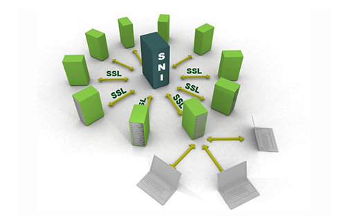
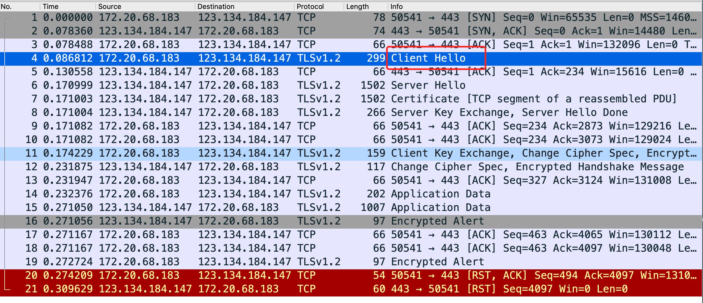
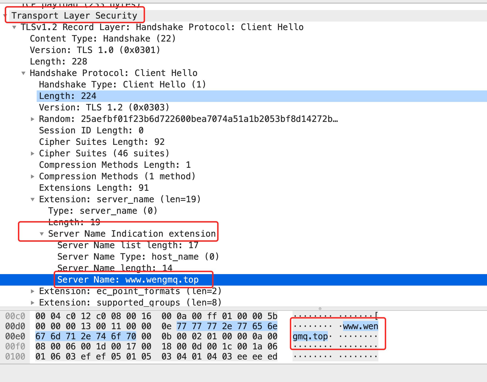

# 什么是 SNI

## 简介

**SNI是什么**？

SNI，即服务器名称指示（Server Name Indication，简称SNI）是TLS协议的扩展，在握手过程开始时通过客户端告诉它正在连接的服务器的主机名称。这允许服务器在相同的IP地址和TCP端口号上呈现多个证书，并且因此允许在相同的IP地址上提供多个安全HTTPS网站（或其他任何基于TLS的服务），而不需要所有这些站点使用相同的证书。

**为什么要有SNI？**

在客户端和服务端建立 HTTPS 的过程中要先进行 TLS 握手，握手后会将 HTTP 报文使用协商好的密钥加密传输。

当使用HTTPS时，TLS握手发生在服务器看到任何HTTP头之前。因此，服务器不可能使用HTTP主机头中的信息来决定呈现哪个证书。这样会导致一个问题，如果一台服务器有多个虚拟主机，且每个主机的域名不一样，使用了不一样的证书，该和哪台虚拟主机进行通信？这便是SNI的所要解决的了。

**SNI是如何工作的？**

和 HTTP 协议用来解决服务器多域名的方案类似：HTTP 在请求头中使用 Host 字段来指定要访问的域名。

TLS 的做法，也是加 Host，在 TLS 握手第一阶段 ClientHello 的报文中添加Server name，在TLS握手时提供主机名的信息。

SNI允许Web服务器通过SSL或TLS握手的扩展在单个IP地址上托管多个站点。此扩展使客户端能够在初始TLS请求中指定所请求的域，从而允许服务器选择适当的SSL证书以发送回客户端进行验证。

SNI 在 TLSv1.2 开始得到支持。从 OpenSSL 0.9.8 版本开始支持。所以基本市场上的终端设备都支持。

## 测试

**使用 WireShark 抓包看一下 Client Hello：**

SNI信息是在握手的过程中，确切说是在客户端发送给服务端的第一个握手包中传递的信息。
这时候SSL连接还未建立起来，因此SNI信息是明文传输的。

TLS握手过程：

 Client Hello包：

