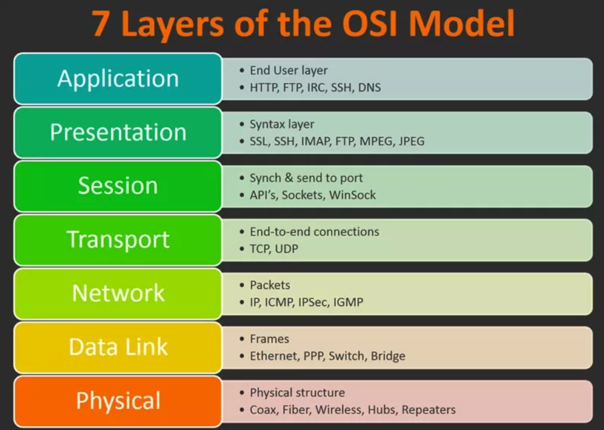
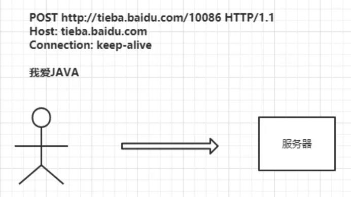
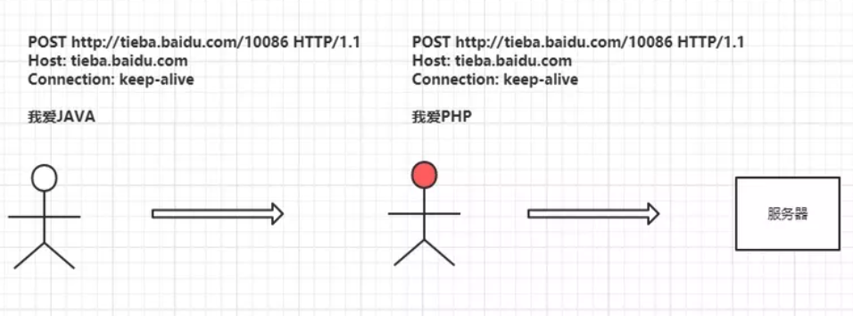
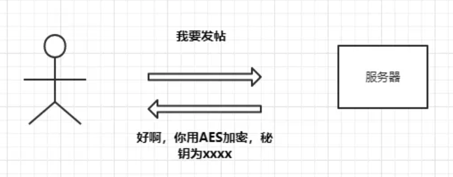
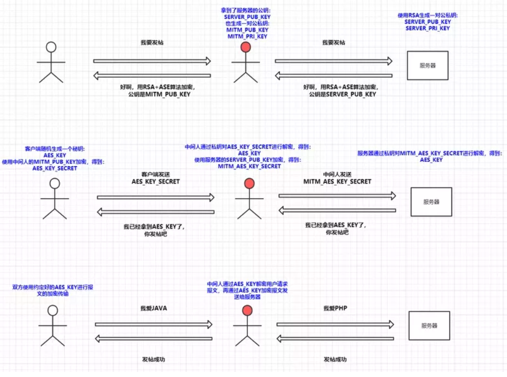
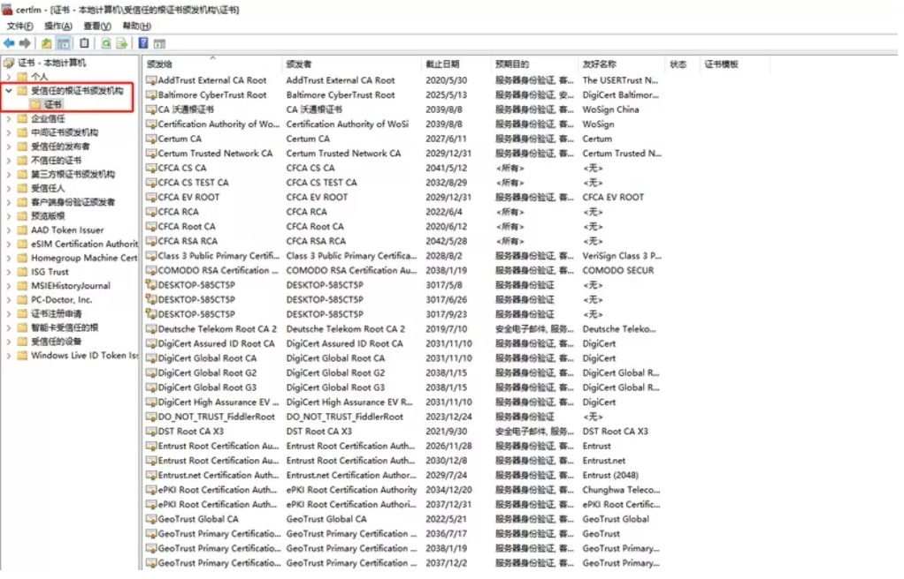

https入门

参考：https://mp.weixin.qq.com/s/A8R4Vk_74ixPBgrOZmTbbQ

# **1. HTTP 协议**

在谈论 HTTPS 协议之前，先来回顾一下 HTTP 协议的概念。

### 1.1 HTTP 协议介绍

HTTP 协议是一种基于文本的传输协议，它位于 OSI 网络模型中的应用层。



HTTP 协议是通过客户端和服务器的请求应答来进行通讯，目前协议由之前的 RFC 2616 拆分成立六个单独的协议说明（RFC 7230、RFC 7231、RFC 7232、RFC 7233、RFC 7234、RFC 7235），通讯报文如下：

请求

```
POST http://www.baidu.com HTTP/1.1Host: www.baidu.comConnection: keep-aliveContent-Length: 7User-Agent: Mozilla/5.0 (Windows NT 10.0; Win64; x64) AppleWebKit/537.36 (KHTML, like Gecko) Chrome/71.0.3578.98 Safari/537.36
wd=HTTP
```

响应

```
HTTP/1.1 200 OKConnection: Keep-AliveContent-Encoding: gzipContent-Type: text/html;charset=utf-8Date: Thu, 14 Feb 2019 07:23:49 GMTTransfer-Encoding: chunked
<html>...</html>
```

### 1.2 HTTP 中间人攻击

HTTP 协议使用起来确实非常的方便，但是它存在一个致命的缺点：不安全。

我们知道 HTTP 协议中的报文都是以明文的方式进行传输，不做任何加密，这样会导致什么问题呢？下面来举个例子：

小明在 JAVA 贴吧发帖，内容为我爱JAVA：



被中间人进行攻击，内容修改为我爱PHP



小明被群嘲
可以看到在 HTTP 传输过程中，中间人能看到并且修改 HTTP 通讯中所有的请求和响应内容，所以使用 HTTP 是非常的不安全的。

### 1.3 防止中间人攻击

这个时候可能就有人想到了，既然内容是明文那我使用对称加密的方式将报文加密这样中间人不就看不到明文了吗，于是如下改造：

双方约定加密方式



使用 AES 加密报文


这样看似中间人获取不到明文信息了，但其实在通讯过程中还是会以明文的方式暴露加密方式和秘钥，如果第一次通信被拦截到了，那么秘钥就会泄露给中间人，中间人仍然可以解密后续的通信：


那么对于这种情况，我们肯定就会考虑能不能将秘钥进行加密不让中间人看到呢？答案是有的，采用非对称加密，我们可以通过 RSA 算法来实现。

在约定加密方式的时候由服务器生成一对公私钥，服务器将公钥返回给客户端，客户端本地生成一串秘钥(AES_KEY)用于对称加密，并通过服务器发送的公钥进行加密得到(AES_KEY_SECRET)，之后返回给服务端，服务端通过私钥将客户端发送的AES_KEY_SECRET进行解密得到AEK_KEY,最后客户端和服务器通过AEK_KEY进行报文的加密通讯，改造如下：


可以看到这种情况下中间人是窃取不到用于AES加密的秘钥，所以对于后续的通讯是肯定无法进行解密了，那么这样做就是绝对安全了吗？

所谓道高一尺魔高一丈，中间人为了对应这种加密方法又想出了一个新的破解方案，既然拿不到AES_KEY，那我就把自己模拟成一个客户端和服务器端的结合体，在用户->中间人的过程中中间人模拟服务器的行为，这样可以拿到用户请求的明文，在中间人->服务器的过程中中间人模拟客户端行为，这样可以拿到服务器响应的明文，以此来进行中间人攻击：



这一次通信再次被中间人截获，中间人自己也伪造了一对公私钥，并将公钥发送给用户以此来窃取客户端生成的AES_KEY，在拿到AES_KEY之后就能轻松的进行解密了。

中间人这样为所欲为，就没有办法制裁下吗，当然有啊，接下来我们看看 HTTPS 是怎么解决通讯安全问题的。

# 2. HTTPS 协议

### 2.1 HTTPS 简介

HTTPS 其实是SSL+HTTP的简称,当然现在SSL基本已经被TLS取代了，不过接下来我们还是统一以SSL作为简称，SSL协议其实不止是应用在HTTP协议上，还在应用在各种应用层协议上，例如：FTP、WebSocket。

其实SSL协议大致就和上一节非对称加密的性质一样，握手的过程中主要也是为了交换秘钥，然后再通讯过程中使用对称加密进行通讯，大概流程如下：


这里我只是画了个示意图，其实真正的 SSL 握手会比这个复杂的多，但是性质还是差不多，而且我们这里需要关注的重点在于 HTTPS 是如何防止中间人攻击的。

通过上图可以观察到，服务器是通过 SSL 证书来传递公钥，客户端会对 SSL 证书进行验证，其中证书认证体系就是确保SSL安全的关键，接下来我们就来讲解下CA 认证体系，看看它是如何防止中间人攻击的。

### 2.2 CA 认证体系

上一节我们看到客户端需要对服务器返回的 SSL 证书进行校验，那么客户端是如何校验服务器 SSL 证书的安全性呢。

权威认证机构

在 CA 认证体系中，所有的证书都是由权威机构来颁发，而权威机构的 CA 证书都是已经在操作系统中内置的，我们把这些证书称之为CA根证书：



签发证书

我们的应用服务器如果想要使用 SSL 的话，需要通过权威认证机构来签发CA证书，我们将服务器生成的公钥和站点相关信息发送给CA签发机构，再由CA签发机构通过服务器发送的相关信息用CA签发机构进行加签，由此得到我们应用服务器的证书，证书会对应的生成证书内容的签名，并将该签名使用CA签发机构的私钥进行加密得到证书指纹，并且与上级证书生成关系链。

这里我们把百度的证书下载下来看看：

可以看到百度是受信于GlobalSign G2，同样的GlobalSign G2是受信于GlobalSign R1，当客户端(浏览器)做证书校验时，会一级一级的向上做检查，直到最后的根证书，如果没有问题说明服务器证书是可以被信任的。

如何验证服务器证书

那么客户端(浏览器)又是如何对服务器证书做校验的呢，首先会通过层级关系找到上级证书，通过上级证书里的公钥来对服务器的证书指纹进行解密得到签名(sign1)，再通过签名算法算出服务器证书的签名(sign2)，通过对比sign1和sign2，如果相等就说明证书是没有被篡改也不是伪造的。


这里有趣的是，证书校验用的 RSA 是通过私钥加密证书签名，公钥解密来巧妙的验证证书有效性。

这样通过证书的认证体系，我们就可以避免了中间人窃取AES_KEY从而发起拦截和修改 HTTP 通讯的报文。

## 总结

首先先通过对 HTTP 中间人攻击的来了解到 HTTP 为什么是不安全的，然后再从安全攻防的技术演变一直到 HTTPS 的原理概括，希望能让大家对 HTTPS 有个更深刻的了解。