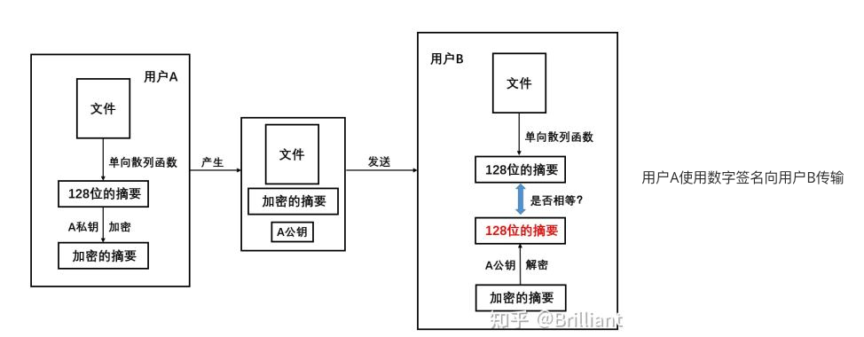
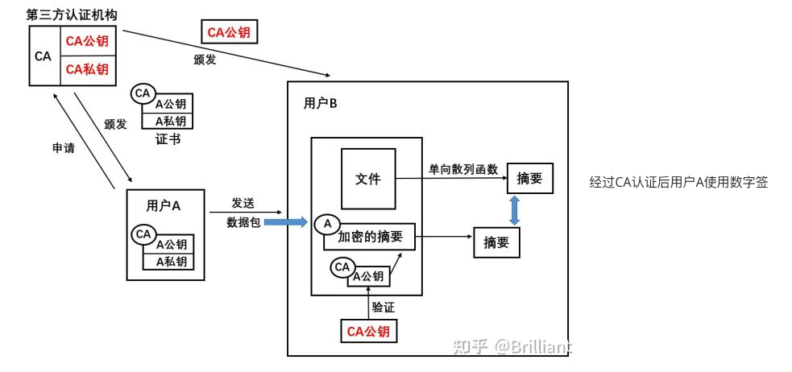

数字签名采用非对称密码体制（公钥密码体制），即发送者 使用 私钥加密数据 ,接收者 使用 对应的公钥 解密数据，它具有以下功能：

**① 报文鉴别 :** 用于 证明来源 , 接收者 可以 通过签名 确定 是哪个发送者 进行的签名 ;

**② 防止抵赖 :** 防止 发送者 否认签名 , 发送者 一旦签名 , 标记就打上了 , 无法抵赖 ;

**③ 防止伪造 :** 防止 接收者 伪造 发送者 的签名 。

数字签名验证过程：

用户 A 使用数字签名向用户 B 传输文件

图中用户 A 使用数字签名向用户 B 传输文件的过程：

1、首先，文件经过单向散列函数的处理得到一份占 128 位的摘要。其中，文件和文件的摘要具有很强的对应关系，只要文件发生改动，经过单向散列函数处理后得到地摘要都会不一样。

2、用户 A 使用自己的私钥对摘要进行加密，得到加密的摘要。

3、用户 A 把文件、加密的摘要和公钥一起发给用户 B。

4、用户 B 收到 A 传过来的信息后，首先将其中的文件也采用单向散列函数处理得出一份 128 位摘要，然后使用 A 的公钥对收到的加密的摘要进行解密得到另一份 128 位摘要。

5、把上一步得到的两份摘要进行比较，如果两份摘要相等，说明文件经过用户 A 签名之后，在传输的过程中没有被更改；若不相等，说明文件在传输过程中被更改了，或者说已经不是原来的文件了，此时用户 A 的签名失效。

上面过程中，用户 A 使用私钥对由文件生成的 128 位摘要进行加密的过程称为**数字签名的过程**，得到的**"加密的摘要"**，称为该文件的**数据签名**。

上面例子传输过程中，用户 A 使用数字签名时给用户 B 发送了一个数据包，数据包中包含了 A 的公钥、文件和加密的摘要。那么问题来了：**用户 B 如何确定收到的公钥是用户 A 发送的，而不是他人冒充用户 A 发送的呢？**这时就需要有一个双方都信任的第三方证书颁发机构来协调。

证书颁发机构，即认证中心**CA** (Certification Authority)，将公钥与其对应的实体（人或机器）进行**绑定**(binding)；即给公司或个人颁发证书。

认证中心一般由政府出资建立。每个实体都有 CA 发来的**证书**(certificate)，里面有公钥及其拥有者的标识信息。此证书被 CA 进行了数字签名。任何用户都可从可信的地方获得认证中心 CA 的公钥，此公钥用来验证某个公钥是否为某个实体所拥有。

CA 认证后用户 A 使用数字签名向用户 B 传输文件

1. 用户 A 向证书颁发机构提交个人信息，申请证书。通过 CA 审核后，CA 生成用户 A 的证书，证书中包括了 A 的公钥和私钥还有 CA 的数字签名。证书颁发机构 CA 本身拥有一对密钥，这是对 CA 所颁发的证书进行数字签名和保密的基础，绝不能泄露。
2. 用户 A 收到的证书中包括了带有 CA 数字签名的，专属 A 的公钥和私钥，CA 的数字签名确保了别人不能伪造用户 A 的公钥和私钥。
3. 同时，用户 B 也必须信任给用户 A 颁发证书的第三方认证机构 CA，即用户 B 拥有 CA 颁发的"CA 公钥"。
4. 通信时，用户 A 向用户 B 发送的数据包中的"加密的摘要"上有用户 A 的数字签名，“A 公钥” 上有认证机构 CA 的数字签名。用户 B 收到数据包之后，先要验证收到的 “A 公钥” 是否来源合法：是认证机构颁发的带有 CA 签名的公钥吗？用户 B 并不信任用户 A，但是用户 B 信任第三方认证机构 CA。所以，用户 B 先使用证书颁发机构颁发的 "CA 公钥" 验证收到的 "A 公钥" 是否由同一认证机构颁发，是否在颁发之后更改过。
5. 上一步验证通过后，用户 B 便相信收到的 "A 公钥" 确实来自真实的用户 A。随后再使用 "A 公钥" 对 "加密的摘要" 进行解密得到另一份 128 位摘要，再将收到信息中的文件也采用单向散列函数处理得出一份 128 位摘要，然后将得到的两份摘要进行对比操作，以判断文件是否更改。
