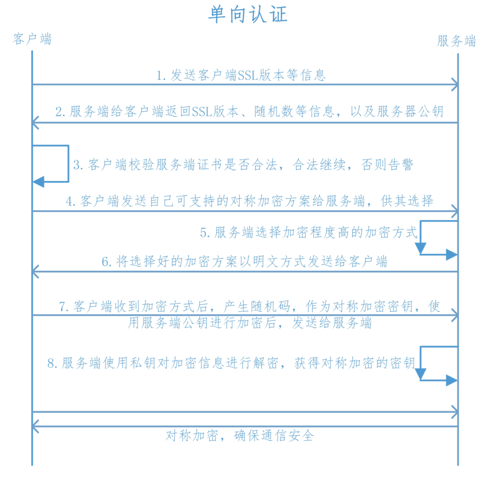
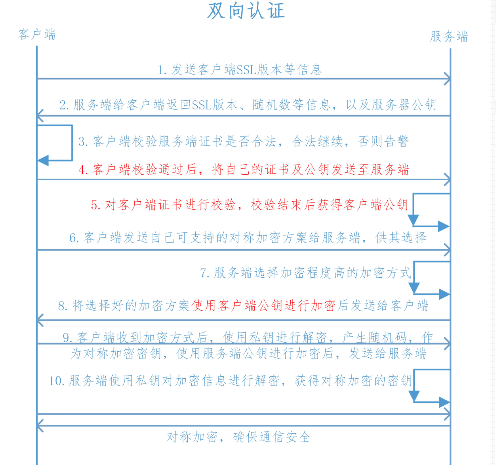

# Https单向认证和双向认证 认识和区别

### **一、Http**

HyperText Transfer Protocol，超文本传输协议，是互联网上使用最广泛的一种协议，所有WWW文件必须遵循的标准。HTTP协议传输的数据都是未加密的，也就是明文的，因此使用HTTP协议传输隐私信息非常不安全。

使用TCP端口为：80

### **二、Https**

Hyper Text Transfer Protocol over Secure Socket Layer，安全的超文本传输协议，网景公式设计了SSL(Secure Sockets Layer)协议用于对Http协议传输的数据进行加密，保证会话过程中的安全性。

使用TCP端口默认为443

### **三、SSL协议加密方式**

SSL协议即用到了对称加密也用到了非对称加密(公钥加密)，在建立传输链路时，SSL首先对对称加密的密钥使用公钥进行非对称加密，链路建立好之后，SSL对传输内容使用对称加密。

1. 对称加密
   速度高，可加密内容较大，用来加密会话过程中的消息
2. 公钥加密
   加密速度较慢，但能提供更好的身份认证技术，用来加密对称加密的密钥

### **四、单向认证**

Https在建立Socket连接之前，需要进行握手，具体过程如下：

1. 客户端向服务端发送SSL协议版本号、加密算法种类、随机数等信息。

2. 服务端给客户端返回SSL协议版本号、加密算法种类、随机数等信息，同时也返回服务器端的证书，即公钥证书

3. 客户端使用服务端返回的信息验证服务器的合法性，包括：

   - 证书是否过期
   - 发型服务器证书的CA是否可靠
   - 返回的公钥是否能正确解开返回证书中的数字签名
   - 服务器证书上的域名是否和服务器的实际域名相匹配

   验证通过后，将继续进行通信，否则，终止通信

4. 客户端向服务端发送自己所能支持的对称加密方案，供服务器端进行选择

5. 服务器端在客户端提供的加密方案中选择加密程度最高的加密方式。

6. 服务器将选择好的加密方案通过明文方式返回给客户端

7. 客户端接收到服务端返回的加密方式后，使用该加密方式生成产生随机码，用作通信过程中对称加密的密钥，使用服务端返回的公钥进行加密，将加密后的随机码发送至服务器

8. 服务器收到客户端返回的加密信息后，使用自己的私钥进行解密，获取对称加密密钥。
   在接下来的会话中，服务器和客户端将会使用该密码进行对称加密，保证通信过程中信息的安全。

### **五、双向认证**

双向认证和单向认证原理基本差不多，只是除了客户端需要认证服务端以外，增加了服务端对客户端的认证，具体过程如下：

1. 客户端向服务端发送SSL协议版本号、加密算法种类、随机数等信息。

2. 服务端给客户端返回SSL协议版本号、加密算法种类、随机数等信息，同时也返回服务器端的证书，即公钥证书

3. 客户端使用服务端返回的信息验证服务器的合法性，包括：

   - 证书是否过期
   - 发型服务器证书的CA是否可靠
   - 返回的公钥是否能正确解开返回证书中的数字签名
   - 服务器证书上的域名是否和服务器的实际域名相匹配

   验证通过后，将继续进行通信，否则，终止通信

4. 服务端要求客户端发送客户端的证书，客户端会将自己的证书发送至服务端

5. 验证客户端的证书，通过验证后，会获得客户端的公钥

6. 客户端向服务端发送自己所能支持的对称加密方案，供服务器端进行选择

7. 服务器端在客户端提供的加密方案中选择加密程度最高的加密方式

8. 将加密方案通过使用之前获取到的公钥进行加密，返回给客户端

9. 客户端收到服务端返回的加密方案密文后，使用自己的私钥进行解密，获取具体加密方式，而后，产生该加密方式的随机码，用作加密过程中的密钥，使用之前从服务端证书中获取到的公钥进行加密后，发送给服务端

10. 服务端收到客户端发送的消息后，使用自己的私钥进行解密，获取对称加密的密钥，在接下来的会话中，服务器和客户端将会使用该密码进行对称加密，保证通信过程中信息的安全。

1、单向验证中，如果是你客户端，你需要拿到服务器的证书，并放到你的信任库中；如果是服务端，你要生成私钥和证书，并将这两个放到你的密钥库中，并且将证书发给所有客户端。

2、双向验证中，如果你是客户端，你要生成客户端的私钥和证书，将它们放到密钥库中，并将证书发给服务端，同时，在信任库中导入服务端的证书。如果你是服务端，除了在密钥库中保存服务器的私钥和证书，还要在信任库中导入客户端的证书。

3、再次强调，使用单向验证还是双向验证，是服务器决定的。

4、https的验证过程，不管是单向还是双向，只有**四步**，网上很多关于https验证过程的文章中，写了来来回回七八上十步。要真是这样，访问一个https地址，时间全花在了交互上了

