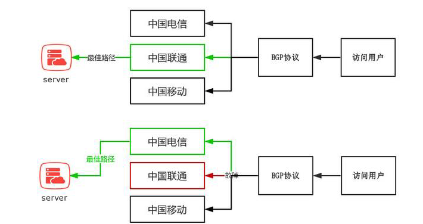
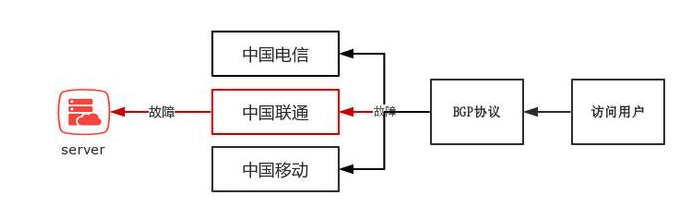
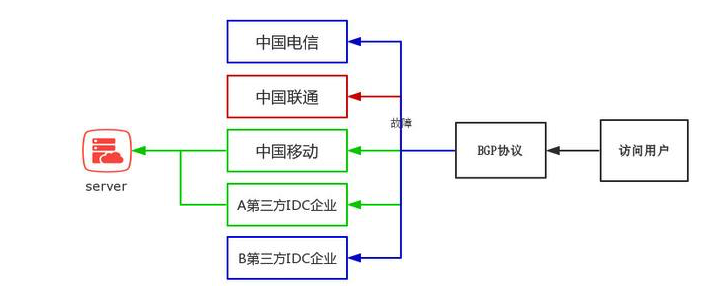

# **什么是BGP?**

边界网关协议（BGP）是运行于 TCP 上的一种自治系统（AS）的路由协议，是唯一能够妥善处理不相关路由域间的多路连接的协议。

通俗点讲

中国电信 、中国联通、中国移动和一些拥有AS自治域的大型民营IDC运营商就可以通过BGP协议来实现多线互联。

简单打个比喻

出差去上海（网站） 可以选择公路（电信）、飞机（联通）、高铁（移动）等多种方式

BGP就好比一个智能APP

可以帮助用户选择最佳的交通形式，并且可以在出现临时问题时，自动帮用户选择最佳的交通方式。

### 具体实现方案

国内IDC机房需要在CNNIC(中国互联网信息中心)或APNIC(亚太网络信息中心)申请自己的IP地址段和AS号，然后将自己的IP地址广播到其它网络运营商的AS中，并通过BGP协议将多个AS进行连接，从而实现可自动跨网访问。此时，当用户发出访问请求后，将根据BGP协议的机制自动在已建立连接的多个AS之间为用户提供最佳路由，从而实现不同网络运营商用户的高速访问同一机房资源。

# **BGP的优点**

自动最优网络路径的选择线路冗余网络可靠稳定实现多网接入

既然BGP有辣么多的优点，本着好货不便宜的原则，市面上BGP的价格是多少？

80-400元/M（北京地区）

价格为什么会有这么大的差距！

这就要提到大家关心的真伪BGP的问题

### 1.真伪BGP在价格上有什么差异？

上面我们提到，建设BGP网络的企业首先需要拥有自己的AS号码和IP地址段，然后将自己IP地址段广播到所有的运营商AS网络中并将自身的AS与多个对应的AS进行BGP连接，然后通过BGP协议引导用户通过最佳路径访问服务器。

真BGP成本=AS+IP地址段+设备成本+动态（BGP）带宽

伪BGP成本=AS+IP地址段+设备成本+静态带宽

价格在这一动一静之间产生了巨大的差异

### 2 真伪BGP在使用效果上有什么差异？

真BGP实现了用户最佳路径的自动选择，即使遇到单条线路故障，BGP依然可以自动引导用户选择最佳的访问路径。

伪BGP虽然也实现了多线接入，但并不具备真BGP动态最佳路径切换的功能，因此，一旦线路出现故障就会造成用户无法访问的情况，只能通过人工手动切换访问线路。

当然除了上面3种情况，市场还有一种半真半假的BGP机房

### 混合式BGP

比如一个号称五线BGP的机房，其中联通、移动、A企业为BGP动态带宽，而中国电信和B企业为静态带宽，一旦联通或其它动态带宽线路出现故障，用户只可以自动被分配到移动和A企业的动态带宽线路上，依然实现了BGP的效果，但中国电信或B企业的静态带宽出现故障，则用户不会被自动分配到其他静态或动态网路中，并在静态带宽所在AS中形成路由黑洞，该AS内的用户将出现无法访问情况，需要人为介入进行手动修复且修复时间较长。

### “借鸡生蛋”式BGP

除了混合式BGP，目前市面上还有一种更廉价的BGP实现方式，如上图，企业采购中国电信单线机房并广播自身IP地址的同时，与另外一个第三方IDC服务商的伪BGP机房进行专线互联，同时将自己的IP地址在第三方IDC服务商AS域中进行广播，这样就可以变相的在单线机房基础上实现了BGP效果，但同上一案例一样，一旦出现静态带宽故障，路由黑洞出现，必须人工进行介入，且修复时间较长。