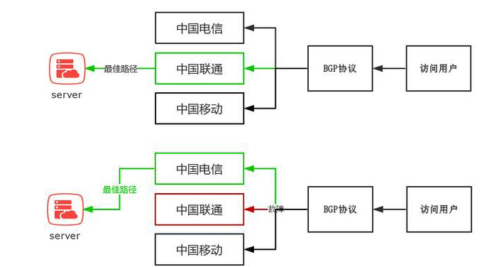
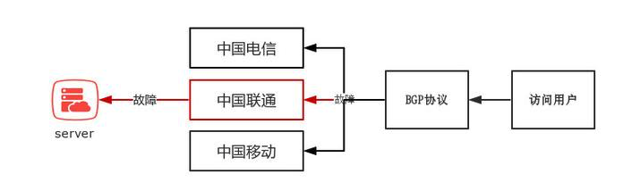
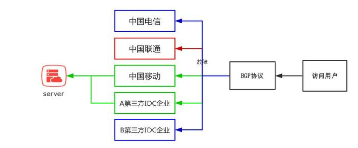

# **什么是 BGP?**

边界网关协议（BGP）是运行于 TCP 上的一种自治系统（AS）的路由协议，是唯一能够妥善处理不相关路由域间的多路连接的协议。

通俗点讲

中国电信 、中国联通、中国移动和一些拥有 AS 自治域的大型民营 IDC 运营商就可以通过 BGP 协议来实现多线互联。

简单打个比喻

出差去上海（网站） 可以选择公路（电信）、飞机（联通）、高铁（移动）等多种方式

BGP 就好比一个智能 APP

可以帮助用户选择最佳的交通形式，并且可以在出现临时问题时，自动帮用户选择最佳的交通方式。

### 具体实现方案

国内 IDC 机房需要在 CNNIC(中国互联网信息中心)或 APNIC(亚太网络信息中心)申请自己的 IP 地址段和 AS 号，然后将自己的 IP 地址广播到其它网络运营商的 AS 中，并通过 BGP 协议将多个 AS 进行连接，从而实现可自动跨网访问。此时，当用户发出访问请求后，将根据 BGP 协议的机制自动在已建立连接的多个 AS 之间为用户提供最佳路由，从而实现不同网络运营商用户的高速访问同一机房资源。

# **BGP 的优点**

自动最优网络路径的选择线路冗余网络可靠稳定实现多网接入

既然 BGP 有辣么多的优点，本着好货不便宜的原则，市面上 BGP 的价格是多少？

80-400 元/M（北京地区）

价格为什么会有这么大的差距！

这就要提到大家关心的真伪 BGP 的问题

### 1.真伪 BGP 在价格上有什么差异？

上面我们提到，建设 BGP 网络的企业首先需要拥有自己的 AS 号码和 IP 地址段，然后将自己 IP 地址段广播到所有的运营商 AS 网络中并将自身的 AS 与多个对应的 AS 进行 BGP 连接，然后通过 BGP 协议引导用户通过最佳路径访问服务器。

真 BGP 成本=AS+IP 地址段+设备成本+动态（BGP）带宽

伪 BGP 成本=AS+IP 地址段+设备成本+静态带宽

价格在这一动一静之间产生了巨大的差异

### 2 真伪 BGP 在使用效果上有什么差异？

真 BGP 实现了用户最佳路径的自动选择，即使遇到单条线路故障，BGP 依然可以自动引导用户选择最佳的访问路径。

伪 BGP 虽然也实现了多线接入，但并不具备真 BGP 动态最佳路径切换的功能，因此，一旦线路出现故障就会造成用户无法访问的情况，只能通过人工手动切换访问线路。

当然除了上面 3 种情况，市场还有一种半真半假的 BGP 机房

### 混合式 BGP

比如一个号称五线 BGP 的机房，其中联通、移动、A 企业为 BGP 动态带宽，而中国电信和 B 企业为静态带宽，一旦联通或其它动态带宽线路出现故障，用户只可以自动被分配到移动和 A 企业的动态带宽线路上，依然实现了 BGP 的效果，但中国电信或 B 企业的静态带宽出现故障，则用户不会被自动分配到其他静态或动态网路中，并在静态带宽所在 AS 中形成路由黑洞，该 AS 内的用户将出现无法访问情况，需要人为介入进行手动修复且修复时间较长。

### “借鸡生蛋”式 BGP

除了混合式 BGP，目前市面上还有一种更廉价的 BGP 实现方式，如上图，企业采购中国电信单线机房并广播自身 IP 地址的同时，与另外一个第三方 IDC 服务商的伪 BGP 机房进行专线互联，同时将自己的 IP 地址在第三方 IDC 服务商 AS 域中进行广播，这样就可以变相的在单线机房基础上实现了 BGP 效果，但同上一案例一样，一旦出现静态带宽故障，路由黑洞出现，必须人工进行介入，且修复时间较长。
