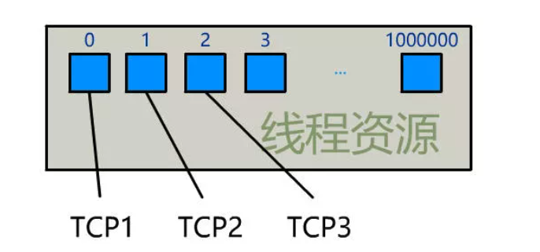
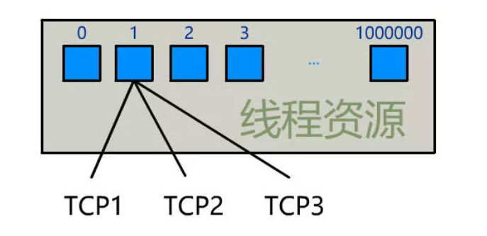
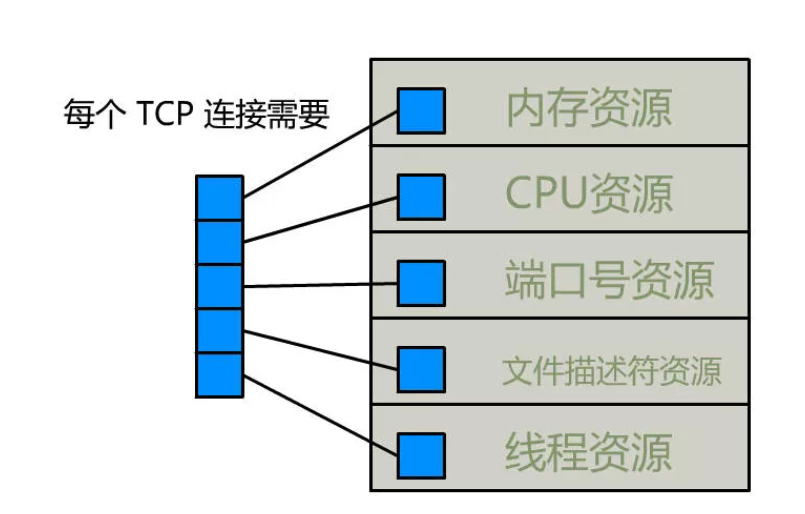

## 最多能创建多少个 TCP 连接

我是一个 Linux 服务器上的进程，名叫小进。

老是有人说我最多只能创建 65535 个 TCP 连接。

我不信这个邪，今天我要亲自去实践一下。

我走到操作系统老大的跟前，说：

"老操，我要建立一个 TCP 连接！"

老操不慌不忙，拿出一个表格递给我，"小进，先填表吧"


我一看这个表，这不就是经典的 **socket 四元组**嘛。我只有一块网卡，其 IP 地址是 **123.126.45.68**，我想要与 **110.242.68.3** 的 80 端口建立一个 TCP 连接，我将这些信息填写在了表中。


源端口号填什么呢？我记得端口号是 16 位的，可以有 0 ~ 65535 这个范围的数字，那我随便选一个吧！

正当我犹豫到底选什么数字的时候，老操一把抢过我的表格。

"你墨迹个啥呢小进？源端口号不用你填，我会给你分配一个可用的数字。源 IP 也不用你填，我知道都有哪些网卡，并且会帮你选个合适的。真是个新手，回去等消息吧。"

"哦"

老操带着我的表格，走了。

过了很长时间，老操终于回来了，并且带着一个纸条。


"小进，你把这个收好了。"

我问道，"这是啥呀？"

老操不耐烦地说道，"刚刚说你是新手你还不服，这个 5 表示文件描述符，linux 下一切皆文件，你待会和你那个目标 IP 进行 TCP 通信的时候，就对着这个文件描述符读写就好啦。"

"这么方便！好的，谢谢老操。"

我拿着这个文件描述符，把它放到属于我的内存中裱起来了，反正我只是想看看最多能创建多少 TCP 连接，又不是去真的用它，嘻嘻。

## **端口号**

过了一分钟，我又去找老操了。

"老操，我要建立一个 TCP 连接！"

老操不慌不忙，拿出一个表格递给我，"小进，先填表吧"


这回我熟悉了，只把目标 IP 和目标端口填好。


老操办好事之后，又带着一个纸条回来，上面写着数字"6"。

就这样，我每隔一分钟都去找老操建立一个新的 TCP 连接，目标 IP 都是 110.242.68.3，目标端口都是 80。

老操也很奇怪，不知道我在这折腾啥，他虽然权力大，但无权拒绝我的指令，每次都兢兢业业地把事情办好，并给我一张一张写着文件描述符的纸条。

直到有一次，我收到的纸条有些不同。


我带着些许责怪的语气问，"老操，这是怎么回事呀？"

老操也没好气地说，"这表示端口号不够用啦！早就觉得你小子不对劲了，一个劲地对着同一个 IP 和端口创建 TCP 连接，之前没办法必须执行你给的指令，现在不行了，端口号不够用了，源端口那里我没法给你填了。"

我也不是那么好骗的，质疑道。"老操，你也别欺负我这个新手，我可是知道端口号是 16 位的，范围是 1~65535，一共可以创建 65535 个 TCP 连接，我现在才创建了 63977 个，怎么就不够了！"

老操鄙视地看了我一眼，"你小子可真是闲的蛋疼啊，还真一个个数，来我告诉你吧，Linux 对可使用的端口范围是有具体限制的，具体可以用如下命令查看。"

```
[root]# cat /proc/sys/net/ipv4/ip_local_port_range
1024 65000
```

"看到没，当前的限制是 1024~65000，所以你就只能有 63977 个端口号可以使用。"


我赶紧像老操道歉，"哎哟真是抱歉，还是我见识太少，那这个数可以修改么？"

老操也没跟我一般见识，还是耐心地回答我，"可以的，具体可以 vim /etc/sysctl.conf 这个文件进行修改，我们在这个文件里添加一行记录"

```
net.ipv4.ip_local_port_range = 60000 60009
```

"保存好后执行 sysctl -p /etc/sysctl.conf 使其生效。这样你就只有 10 个端口号可以用了，就会更快报出端口号不够用的错误"

"原来如此，谢谢老操又给我上了一课。"

哎不对，建立一个 TCP 连接，需要将通信两端的套接字（socket）进行绑定，如下：

**源 IP 地址：源端口号 <----> 目标 IP 地址：目标端口号**

只要这套绑定关系构成的四元组不重复即可，刚刚端口号不够用了，是因为我一直对同一个目标 IP 和端口建立连接，那我换一个目标端口号试试。


我又把这个表交给老操，老操一眼就看破了我的小心思，可是也没办法，马上去给我建立了一个新的 TCP 连接，并且成功返回给我一个新的文件描述符纸条。

看来成功了，只要源端口号不用够用了，就不断变换目标 IP 和目标端口号，保证四元组不重复，我就能创建好多好多 TCP 连接啦！

这也证明了有人说最多只能创建 65535 个 TCP 连接是多么荒唐。

## **文件描述符**

找到了突破端口号限制的办法，我不断找老操建立 TCP 连接，老操也拿我没有办法。

直到有一次，我又收到了一张特殊的纸条，上面写的不是文件描述符。


我又没好气地问老操，"这又是咋回事？"

老操幸灾乐祸地告诉我，"呵呵，你小子以为突破端口号限制就无法无天了？现在文件描述符不够用啦！"

"怎么啥啥都有限制啊？你们操作系统给我们的限制也太多了吧？"

"废话，你看看你都建了多少个 TCP 连接了！每建立一个 TCP 连接，我就得分配给你一个文件描述符，linux 对可打开的文件描述符的数量分别作了三个方面的限制。"

**系统级**：当前系统可打开的最大数量，通过 cat /proc/sys/fs/file-max 查看

**用户级**：指定用户可打开的最大数量，通过 cat /etc/security/limits.conf 查看

**进程级**：单个进程可打开的最大数量，通过 cat /proc/sys/fs/nr_open 查看


天呢，真是人在屋檐下呀，我赶紧看了看这些具体的限制。

```
[root ~]# cat /proc/sys/fs/file-max
100000
[root ~]# cat /proc/sys/fs/nr_open
100000
[root ~]# cat /etc/security/limits.conf
...
* soft nproc 100000
* hard nproc 100000
```

原来如此，我记得刚刚收到的最后一张纸条是。


再之后就收到文件描述符不够的错误了。

我又请教老操，"老操，那这个限制可以修改么？"

老操仍然耐心地告诉我，"当然可以，比如你想修改单个进程可打开的最大文件描述符限制为 100，可以这样。"

```
echo 100 > /proc/sys/fs/nr_open
```

"原来如此，我这就去把各种文件描述符限制都改大一点，也不多，就在后面加个 0 吧"

"额，早知道不告诉你小子了。"老操再次用鄙视的眼睛看着我。

## **线程**

突破了文件描述符限制，我又开始肆无忌惮地创建起了 TCP 连接。

但我发现，老操的办事效率越来越慢，建立一个 TCP 连接花的时间越来越久。

有一次，我忍不住责问老操，"你是不是在偷懒啊？之前找你建一个 TCP 连接就花不到一分钟时间，你看看最近我哪次不是等一个多小时你才搞好？"

老操也忍不住了，"小进啊你还好意思说我，你知不知道你每建一个 TCP 连接都需要消耗一个线程来为你服务？现在我和 CPU 老大那里都忙得不可开交了，一直在为你这好几十万个线程不停地进行上下文切换，我们精力有限啊，自然就没法像以前那么快为你服务了。"



听完老操的抱怨，我想起了之前似乎有人跟我说过 **C10K** 问题，就是当服务器连接数达到 1 万且每个连接都需要消耗一个线程资源时，操作系统就会不停地忙于线程的上下文切换，最终导致系统崩溃，这可不是闹着玩的。

我赶紧像操作系统老大请教，"老操，实在不好意思，一直以为你强大无比，没想到也有忙得不可开交的时候呀，那我们现在应该怎么办呀？"

老操无奈地说，"我劝你还是别再继续玩了，没什么意义，不过我想你也不会听我的，那我跟你说两句吧。"

你现在这种每建一个 TCP 连接就创建一个线程的方式，是最传统的多线程并发模型，早期的操作系统也只支持这种方式。但现在我进化了，我还支持 IO 多路复用的方式，简单说就是一个线程可以管理多个 TCP 连接的资源，这样你就可以用少量的线程来管理大量的 TCP 连接了。



我一脸疑惑，"啥是 IO 多路复用啊？"。

老操一脸鄙视，"你这... 你去看看闪客的[《你管这破玩意叫 IO 多路复用》](http://mp.weixin.qq.com/s?__biz=Mzk0MjE3NDE0Ng==&mid=2247494866&idx=1&sn=0ebeb60dbc1fd7f9473943df7ce5fd95&chksm=c2c5967ff5b21f69030636334f6a5a7dc52c0f4de9b668f7bac15b2c1a2660ae533dd9878c7c&scene=21#wechat_redirect)，就明白了。"

这次真是大开眼界了，我赶紧把代码改成了这种 IO 多路复用的模型，将原来的 TCP 连接销毁掉，改成同一个线程管理多个 TCP 连接，很快，操作系统老大就恢复了以往的办事效率，同时我的 TCP 连接数又多了起来。

## **内存**

突破了端口号、文件描述符、线程数等重重限制的我，再次肆无忌惮地创建起了 TCP 连接。

直到有一次，我又收到了一张红牌。


嗨，又是啥东西限制了呀，改了不就完了。我不耐烦地问老操，"这回又是啥毛病？"

老操说道。"这个错误叫内存溢出，每个 TCP 连接本身，以及这个连接所用到的缓冲区，都是需要占用一定内存的，现在内存已经被你占满了，不够用了，所以报了这个错。"


我看这次老操特别耐心，也没多说什么，但想着被内存限制住了，有点不太开心，于是我让老操帮我最后一个忙。

"老操呀，帮小进我最后一个忙吧，你权利大，你看看把那些特别占内存的进程给杀掉，给我腾出点地方，我今天要完成我的梦想，看看 TCP 连接数到底能创建多少个！"

老操见我真的是够拼的，便答应了我，杀死了好多进程，我很是感动。

## **CPU**

有了老操为我争取的内存资源，我又开始日以继日地创建 TCP 连接。

老操也不再说什么，同样日以继日地执行着我的指令。

有一次，老操语重心长地对我说，"差不多了，我劝你就此收手吧，现在 CPU 的占用率已经快到 100% 了。"


我觉得老操这人真的可笑，经过这几次的小挫折，我明白了只要思想不滑坡，方法总比苦难多，老操这人就是太谨慎了，我岂能半途而废，不管他。

我仍然继续创建着 TCP 连接。

直到有一天，老操把我请到一个小饭馆，一块吃了顿饭，吃好后说道。"咱哥俩也算是配合了很久啦，今天我是来跟你道个别的。"

我很不解地问，"怎么了老操，发生什么事了？。"

老操说，"由于你的 TCP 连接，CPU 占用率已经很长时间维持在 100%，我们的使用者，也就是我们的上帝，几乎什么事情都做不了了，连鼠标动一下都要等好久，所以他给我下达了一个重启的指令，我执行这个指令后，你，以及像你一样的所有进程，包括我这个操作系统本身，一切都就消失了。"

我大惊失色，"啊，这么突然么？这条指令什么时候执行？"

老操缓缓起身，"就现在了，刚刚这条指令还没得到 CPU 运行的机会，不过现在到了。"

突然，我眼前一黑，一切都没了。

## **总结**



**资源\*\***一台 Linux 服务器的资源\***\*一个 TCP 连接占用的资源\*\***占满了会发生什么\***\*CPU**看你花多少钱买的看你用它干嘛电脑卡死**内存**看你花多少钱买的取决于缓冲区大小 OOM**临时端口号**ip_local_port_range1cannot assign requested address**文件描述符**fs.file-max1too many open files**进程\线程数**ulimit -n 看 IO 模型系统崩溃

## 参考：https://mp.weixin.qq.com/s/X6c_H5_4OInR8nFQVn7IMA
